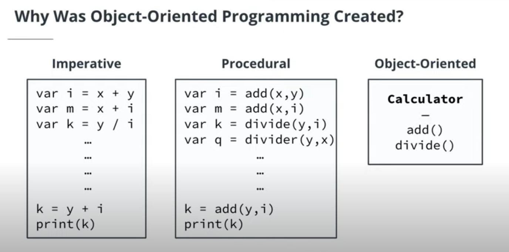

# Java Programming Nanodegree 

## Java Fundamentals 

### Java Programming Basics


* `native`: A native method is a Java method (either an instance method or a class method) whose implementation is also written in another programming language such as C/C++.
    * Example:
        ```java
        public class DateTimeUtils {
            public native String getSystemTime();

            static {
                System.loadLibrary("nativedatetimeutils");
            }
        }
        ```

* `strictfp`: is a modifier in the Java programming language that restricts **floating-point calculations to ensure portability**. The `strictfp` command was introduced into Java with the Java virtual machine (JVM) version 1.2 and is available for use on all currently updated Java VMs.

* `synchronized`: Synchronization in java is the capability to control the access of multiple threads to any shared resource. In the Multithreading concept, multiple threads try to access the shared resources at a time to produce inconsistent results. The synchronization is necessary for reliable communication between threads.

* `throw` and `throws`: The throw keyword is used to `throw` an exception explicitly. It can throw only one exception at a time. The `throws` keyword can be used to declare multiple exceptions, separated by a comma.

* `transient`: 
    * Serialization is the process of converting an object into a `byte stream`, and deserialization is the opposite of it.
    * When we mark any variable as `transient`, then that variable is not serialized. Since transient fields aren't present in the serialized form of an object, the deserialization process would use the default values for such fields when creating an object out of the serialized form.
    * Example: 
        ```java
        public class Book implements Serializable {
            private static final long serialVersionUID = -2936687026040726549L;
            private String bookName;
            private transient String description;
            private transient int copies;
            // getters and setters
        }
        ```

* Compiling and Running the Code

    * When you want to test your program, you cannot simply run it—you must first compile the code. You can do this by using the `javac` command, followed by the name of the file you want to compile. In the below example, our file is called `Main.java`. So in this case, we will compile the code by running:

    * `javac Main.java`

    * Once the code is compiled, we can run it. To do this, we simply enter java followed by the name of the file. In this exercise it will be:

    * `java Main.java`

* Primitive Values vs Reference Values

    * In Java, there are two general kinds of values we can assign to a variable:

        * A **primitive value** is simply a value, by itself, with no additional data.
        * A **reference value** is a value that refers to an object stored in another location in memory.

    * Objects bundle the primitive value up with additional useful information and behavior. We'll get into how to create and use objects more later on.

    *  

    * Object Reference Types
        * `Integer age = 42;`

        *  Notice that the keywords for creating object variables begin with an uppercase letter (String and Integer) rather than the lowercase used for primitives (e.g. int and long).

        * Again, one of the benefits of creating an object is that it can include additional data and behavior. For example, String objects are bundled with a method called length that lets us get the length of the string. 

* Type Casting

    * Type casting is changing one type into another type. There are two kinds of type casting: Automatic and manual.

    * Automatic Type Casting

        * Automatic type casting converts a smaller type into a larger type. For example:

        * ```java
            int intNumber = 3;
            double doubleNumber = intNumber;
            System.out.println(doubleNumber);
            ```
        
        * When we print `doubleNumber`, the value will be `3.0`. Notice that there is **no precision lost** going from a smaller type into a larger type. We started with `3` and ended up with `3.0`.
    
    * Manual Type Casting

        * `Manual` type casting is necessary when we want to do either of these things:
            * Convert a larger type into a smaller type
            * Convert one object type into another

        * For example, here we are converting from a larger type (double) to a smaller type (int):

        * ```java
            double doubleNumber = 3.5;
            int intNumber = (int)doubleNumber;
            System.out.println(intNumber);
            ```
        
        * The resulting value will be `3`, not `3.5`. When we go from a larger type into a smaller type, precision is lost. Java cuts off additional data that will not fit in the casted type. So when we go from a double to an int, any values that are not integers will be removed. This is called **truncation**.

* Stack vs Heap

    * Java uses two different memory regions when running an application: The stack and the heap.

        * **The stack is used to store primitives and object references, while the heap is used to store the objects themselves.**
        * Items in the stack get added and removed as a given method executes, while objects in the heap stay until the application is done (or at least, until there are no object references using them from anywhere in the program, at which point they are removed by the garbage collector).
        * Items are removed from the stack in a Last-In-First-Out (LIFO) order, meaning that the last element you added to the stack is the first that gets popped off the stack.
        * Remember that the items in a stack are only maintained as long as the related method is running. By the time a given method has finished running, all of the items on the stack for that method will have been removed.
        * Objects in the heap are accessible from anywhere in the program, while items on a given stack can only be accessed by the related method.

    *  

* Access Modifiers

    * When we are writing our code, we sometimes need to restrict access to certain data in the application in order to ensure it doesn't get modified in an unintended or harmful way.

    * Classes, Subclasses, and Packages

        * Access modifiers control things like whether the data inside of a class can be accessed only by other code inside of the class or also by code elsewhere in the application.

    * Types of Access Modifiers

        * Public means the class can be accessed from everywhere. If you have a method on a class that you want to expose to all other classes, then use this access modifier.

        * Private means only the defining class can access the data. This provides security, by not allowing other classes to change the data directly. Instead, they must make changes to the data via the provided methods only.
            * Private classes are allowed, but only as inner or nested classes. If you have a private inner or nested class, then access is restricted to the scope of that outer class.

        * Protected means that access is restricted to the defining class, package, or subclass. This will be useful when we get into subclasses and inheritance in a later lesson, as it will allow our subclasses to use variables and methods from the parent class.

        * Default means access is restricted to the defining class or the package. This can be used when we have classes inside the same package that we may want to expose data and methods too.
    
    * 

    * ```java
        private void methodName()
        void methodName()  // The default is no access modifier
        protected void methodName()
        public void methodName()
        ```
    
    * Access Modifiers on Variables

        * And we can apply access modifiers to variables as well! We will get into this in detail in the lessons on object-oriented programming. Here are some examples—again, just so you can get the idea:

        * ```java
            private int number;
            int number3;  // Default is no access modifier
            protected int number2;
            public int number1;
            ```

* Array
    * An array is a fixed-sized data structure that is used to store multiple values—such as a series of phone numbers, as we saw in the video.

    * `int [] numbers  = {1, 2, 3, 4};`

    * Here's another way we can create an array and add values to it:

    * `int [] numbers = new int[4];`

    * This approach uses the `new` keyword to create a new array object of size 4, and then we assign values to the four spaces created in the array. This style will feel more normal to you after we have worked with classes and objects later in the course.

* JavaDoc

    * JavaDoc is a documentation generator that produces a searchable HTML document defining the classes and interfaces of an application. This makes it easy for you and other developers to understand the API of an application.

    * JavaDoc Comments

        * The JavaDoc tool reads through Java files and parses certain parts of the code to automatically generate useful documentation. One part of the code that will be picked up by JavaDoc is a JavaDoc comment (or simply doc comment).

        * JavaDoc comments are typically added:

            * At the top of a class, right before the class name
            * For each method in a class We'll get some practice with this when we start defining classes later in the course.
    
    * And here's an example:
        * ```java
            /** This program HelloWorld produces a standard output
            *  displaying "Hello World"
            * 
            * @author The author of the class
            * @see A reference to another class
            */
            ```
    
    * Parts of a JavaDoc Comment
        * Notice that JavaDoc comments are broken down into two parts:
            * The description
            * Block tags  

    * In the above example, the description is the first part of the comment, and the block tags are the last part (`@author` and `@see`).

    * In this example, we have a doc comment for a method:

    * ```java
        /**
        * This method displays a simple text output to a provided name
        * 
        *
        * @param name The name of the person we want to say “Hi” too
        * @return results Returns true if the name was printed or
        * false if it failed 
        */
        ```
    
    * Example:
        * ```java
            /**
            * @author jeff.phillips
            *
            */
            public class JavaDocExample {

                /**
                * 
                * @param string
                * @param number
                * @return
                */
                public String sampleMethod(String string, int number) {
                    return "Result";
                }

            }
            ```

### Defining Classes

* 

* 

* ```java
    public class Student {

        private final String id;
        private final String firstName;
        private final String lastName;

        public Student(String id, String firstName,String lastName){
            this.id = id;
            this.firstName = firstName;
            this.lastName = lastName;
        }

        public String getId(){
            return id;
        }

        public String getFirstName(){
            return lastName;
        }

        public String getLastName(){
            return lastName;
        }
    }
    ```

    * Instance Variables vs Class Variables

        * Note the difference between instance variables and class variables.

        * Instance Variables are state variables that can have unique values for each object.

        * Class Variables are state variables that belong to the class itself, and are the same for every object. The static keyword identifies this variable as belonging to the class (not to individual objects).

    * ```java
        public class Dog {

            private String dogType;
            private String dogName;
            private String dogColor;
            private int dogAge;

            public Dog(String dogType, String dogName, String dogColor, int dogAge) {
                super();
                this.dogType = dogType;
                this.dogName = dogName;
                this.dogColor = dogColor;
                this.dogAge = dogAge;
            }

            public String getDogType() {
                return dogType;
            }

            public void setDogType(String dogType) {
                this.dogType = dogType;
            }

            public String getDogName() {
                return dogName;
            }

            public void setDogName(String dogName) {
                this.dogName = dogName;
            }

            public String getDogColor() {
                return dogColor;
            }

            public void setDogColor(String dogColor) {
                this.dogColor = dogColor;
            }

            public int getDogAge() {
                return dogAge;
            }

            public void setDogAge(int dogAge) {
                this.dogAge = dogAge;
            }

            @Override
            public String toString() {
                return "Dog type:" + dogType + " Dog name:" + dogName + " Dog Color:" + dogColor + "  Dog age" + dogAge;
            }
        }
        ```

* Garbage Collection

    * Every new object that we instantiate is added to the heap and consumes memory. In programming languages like C or C++, developers are responsible for creating and destroying objects. In contrast, Java has a background process called Garbage Collection (GC) that checks all instantiated objects, and destroys them if they do not have any references—thus freeing up memory, even without any active management on the part of the developer.

### Object-Oriented Programming

* Packages, which are essentially like folders you can use to organize your code and identify exactly which file (or class) you are referring to.
* Inheritance, where one class acquires properties and methods from another class.
* Abstract classes, which cannot be directly instantiated themselves, but that allow us to define the behavior for each of the subclasses.
* Interfaces, which support decoupling and allow us to avoid hardcoding features in an application.
* Polymorphism, which is the ability for an object to take on many forms.

* Packages

    * In Java, we use packages to organize and manage our Java files:

        * If you are used to the concept of namespaces, packages serve essentially the same purpose in Java.
        * Packages are not unlike the traditional folders that you use every day on your computer for organizing your files.
        * By nesting packages and files, we can create a hierarchy that allows us to identify specific files and avoid naming conflicts.

    * The `package` keyword will be located at the top of a Java file, typically on the first line of the file, before the imports and class name. For example:
        * `package project.src.api`

* Inheritance
    * Inheritance is one class acquiring properties and methods from another class. Here are some key points you should remember about inheritance:

        * We want to go from general to specific. The parent or superclass is the most general and the child or subclass is the more specific.

        * By extending the superclass you are stating that the subclass is of the superclass type. When we're not sure if a subclass is inheriting from a parent class, we can use the “is a” test (e.g. a car is a vehicle).

        * The relationship between superclass and subclasses is only one way. The subclasses need to know about the superclass, but the superclass should never know anything about its subclasses.

    * The `Object` Superclass

        * Every class inherits from the superclass Object. Because all objects inherit from the Object class, there are some methods that all objects have, no matter what types they are. For example, all objects have:

            * `clone()`, so that we can clone or make a copy of any object.
            * `equals()`, which we can use to determine if two objects are the same.
            * `hashCode()`, which provides a unique hash code for each object. This is something we'll make use of later on when we need to store and retrieve objects in specific data sets.
            * `toString()`, which we can use to get a description of the current state of an object.

* Polymorphism

    * Polymorphism is the ability of an object to take on many forms.

    * In Java, any kind of inheritance can be used to support polymorphism. In our vehicle example, each of the vehicles has two forms—for instance, a Car object is both a Car and also a Vehicle (since it inherits from the Vehicle class). Any Car object thus has two forms. This is polymorphism.

    * If we wanted to get the speed of all the Car, Boat, and Plane objects, we can easily do this because of polymorphism—we simply create a list containing all objects that are of type Vehicle and get the speed on every Vehicle object, regardless of whatever other types that object might be.

    * ```java
        // Create an array of size 3 and type Vehicle
        Vehicle [] vehicles = new Vehicle[3];

        // Instantiate three new objects and add them to the array.
        // It looks like these are all different types (Car, Plane, and Boat),
        // but they all inherit from the Vehicle class, so in addition to the types
        // they get from their subclasses, they are also all Vehicle objects.
        vehicles[0] = new Car(); 
        vehicles[1] = new Plane();
        vehicles[2] = new Boat();

        // Iterate over the array and print the speed
        // of each of the Vehicle objects.
        for (int i = 0; i < vehicles.length; i++) {
            vehicles[i].speed();
        }
        ```

* Abstract Classes

    * An abstract class has the following key characteristics:

        * It defines the behavior for each of the subclasses, but we cannot directly instantiate the abstract class itself.
        * It allows us to create abstract methods.
            * An abstract method is a method that does not contain an implementation body. Instead, it simply provides a header for the method.
            * Subclasses that extend an abstract class are required to override all abstract methods and provide a specific implementation.
    
    * ```java
        public abstract class Vehicle {
            protected String start;
            protected String stop;
            protected String direction;

            public Vehicle(String start, String stop,
                                        String direction) {
                this.start = start;
                this.stop = stop;
                this.direction = direction;
            }

            public abstract void speed();    

        }

        public class Car extends Vehicle {

        public Car() {
            super("Car start", "Car stop", "Car direction");
            }
            @Override
            public void speed() {
                System.out.println("55");
            }
        }
        ```

* Interfaces

    * Interfaces allow us to avoid hardcoding features in an application. We can move specific implementation details into subclasses, and then use an interface to communicate between the application and the subclasses.

    * Interfaces vs Abstract Classes


        * Here are some of the similarities and differences between abstract classes and interfaces:

        * Abstract class

            * Can have class variables.
            * Can have both **abstract** methods and **concrete** methods that are shared with the subclasses.
            * Can have instance variables, i.e. variables that are specific to individual subclasses.
            * Subclasses can only extend one class.
        
        * Interfaces
            * Can have class variables.
            * Every method in an interface is abstract.
            * **Cannot have instance variables**. Variables in an interface must be the same for every class implementing the interface.
            * Classes can implement more than one interface and **have multiple inheritance**.
    
    * When to Use an Interface
        
        * We use an interface when:

            * We expect unrelated classes will be implementing our interface.
            * We want to support multiple inheritance.
            * We want to specify the behavior for a data type, but we do not care about the implementation.


### Common Types

* Exceptions, which help us handle errors.
* Enums, which help us set variables from a list of predefined values.
* Dates and Calendar, which help us store and retrieve dates.
* Regular Expressions (RegEx) which help us look for string patterns.
* Advanced String features, which will help us manipulate and process strings more efficiently.

* The **Error Class** and the **Exception Class**
* The Java error-handling framework uses two different classes to identify abnormal software events:
    * The **Error class** is used to indicate a serious problem that the application should not try to handle.
    * The **Exception class** is used when there is a less catastrophic event that the application should try to handle.

* The Throwable Class

    * Both Error and Exception classes inherit from the abstract class **throwable**. This means that both errors and exceptions will contain:

        * The **type of problem** – the class type, either **Exception** or **Error**

        * The **problem message** – whatever description you've provided within the class, such as "out of memory"

        * The **stack trace** where the exception occurred – the order in which things ran and the place in that sequence where the problem occurred (this information is used by developers to track down issues and resolve problems in the code)

* Checked vs Unchecked

    * Unchecked Exceptions

        * Unchecked exceptions are exceptions that are unknown to the compiler.
        * Because these exceptions are only known at runtime, they are also referred to as runtime exceptions.
        * They are a result of a programming error, typically arithmetic errors (such as division by 0).
        * Unchecked exceptions are used when when we expect that the caller of the method cannot recover from the exception.
    
    * Checked Exceptions

        * Checked exceptions are known to the compiler.
        * If we are calling a method that potentially throws a checked exception, it must be handled (or we will get an error from the compiler).
        * Checked exceptions are used when we expect that the caller of the method can recover from the exception.

    *  

    * Example: 
        * ```java
            try {
                read();
            }
            catch (FileNotFoundException ex){
                ex.getLocalizedMessage();
            }
            finally {
            }
            ```
    
    * Remember, `FileNotFoundException` is a class and—as with all exceptions—it inherits from the `Throwable` class.

    * **Exception handlers handle one specific Exception class type.**

    * You can create and throw your own exceptions by **extending the Exception classes**

    *  There are two types of exceptions in Java: Checked and unchecked. Checked exceptions will get caught at compile time and will not allow the code to build until they are either in a catch block or thrown. Unchecked (or runtime) exceptions are not checked by the compiler.

* What is an Enum?

    * In many cases when developing software we need to provide a predefined value for a single variable type. Enumerations (or Enums for short) are a special data type of constants that allow a variable to be set from an enumerated list.

    * An Enum is a Class

        * In Java, **the declaration of an Enum defines a class**. This class can exist within another class or as a standalone class.

    * Example:
        * ```java
            enum Stoplight {
                RED,
                YELLOW,
                GREEN
            }
            Stoplight myStoplight = Stoplight.RED;
            ```
        * ```java
            public class Main {
                enum StopLight {
                    RED,
                    YELLOW,
                    GREEN
                }

                public static void main(String[] args) {
                    StopLight myStoplight = Stoplight.RED; 
                    System.out.println(myStoplight);
                }
            }
            ```

* Scanner

    * The `Scanner` class can read and parse simple text. Here are some key points to keep in mind:

        * It parses primitive types and `String` types into tokens.

        * By default it uses whitespaces to delimitate each word. However, it can also use regular expressions.

        * The Scanner class can read from several different types of sources, like strings, files and `System.in` (to get input from the command line).

        * ```java
            Scanner scanner = new Scanner(System.in);
            ```
        
        * ```java
            Scanner scanner = new Scanner("This is a line");
            System.out.println(scanner.nextLine());
            // This is a line
            ```
        
        * ```java
            Scanner scanner = new Scanner("This is a line");

            while(scanner.hasNext()) {
                // In this next example, we are using the next method to read the first token. The next method finds and returns the next complete token.
                System.out.println(scanner.next());
            }
            ```

* Dates and Calendar

    * The Date Class

        * The Date class represents a specific instance in time. We can instantiate a new Date object like so: `Date date = new Date();`
    
    * The Calendar Class

        * The Calendar class is an abstract class that provides methods for manipulating date and time. The basic syntax for instantiating a new Calendar object looks like this: `Calendar calendar = Calendar.getInstance();`


* RegEx

    * Regular expressions (often abbreviated as `RegEx`) are used to match or find strings based on a specialized syntax.

    * The `regEx` package in Java contains three classes to support these operations

        * Pattern
        * Matcher
        * PatternSyntaxException.
    
    * To use RegEx in Java, we have to do two main theings:

        * Create a `Pattern` based on a specialized syntax
        * Use the `Matcher` to determine if the pattern exists in the String provided
    
    * Helpful RegEx Resources

        * As a Java developer, do you need to thoroughly learn and memorize RegEx syntax? Not necessarily. Unless you're using it very heavily, it will probably suffice to look up the expression you need when you need it. Along those lines, here are some handy resources that you may want to bookmark for later reference:

            * For use of the `RegEx` class in Java, see the official Java docs on regular expression syntax.
            
            * For coming up with the regular expression itself, try playing with [`RegExr.com`](https://regexr.com/). You can enter some text and then try out different expressions; when there is a match, the text will be highlighted. The page also has a handy cheatsheet for commonly needed RegEx characters.
    
    * ```java
        String emailRegex = "^(.+)@(.+).(.+)$"
        Pattern pattern = Pattern.compile(emailRegex)

        Matcher matcher = pattern.matcher("jeff@example.com")

        ```
    
* String Methods

    * Java provides advanced memory management for `String` objects by using a `String pool`. A String pool is a way of storing only **one copy of a String**.

    * To understand this, we have to look at what is happening in memory when we create Strings and assign them to variables. Strings in Java are **immutable**, meaning they cannot be changed after they are created. When we "change" the String in a variable, what actually happens is that, behind the scenes, Java creates a **new String** in the String pool—and changes the variable's reference value to point to this new String. The old String object may remain in place, unchanged.

    * Also note that **multiple variables may use the same String reference**. This means that if we have two variables with exactly the same String (e.g., "Hello") they will all reference the same String object.

    * 

    * 

    * 

    * 

### Generics and Collections

* Generics allow us to write methods that handle a whole group of different data types—in other words, to write methods that are generic.

    * The benefits of using Generics are:

        * Stronger type checks at compile time.
        * They remove the need to cast objects.
        * They allow developers to implement generic algorithms.

    * Put another way, generics are a way to parameterize class types into classes, methods, and variables.

    * `List<String> strings = new ArrayList<String>();`

        * ArrayList is `non-synchronized`. Vector is `synchronized`. ArrayList increments 50% of its current size if element added exceeds its capacity. Vector increments 100% of its current size if element added exceeds its capacity

* Collections

    * 
        * TreeMap is a map implementation that keeps its entries sorted according to the natural ordering of its keys or better still using a comparator if provided by the user at construction time.

    * Collections are a set of data structures that were introduced in Java 5.0 to solve problems with consistency between data structures and to address performance issues. They were developed with the following goals in mind:

        * High performance/efficiency.
        * High degree of interoperability. The new data structures all needed to behave similarly to each other. In practice, this means that Collections data structures implement similar interfaces and extend similar abstract classes.
        * Integrate with existing APIs seamlessly. The Java framework had to extend and adapt to the new data structures easily. They needed to integrate the new data structures seamlessly with little disruption to the existing API.
    
    * The Collections framework consists of several different data structure classes like `List`, `Set`, `Maps` and `Queues`. In addition, there are utility classes like `Collections` and `Arrays` that provide methods for sorting and creating empty lists. Below is an example in which we create a List of type `String` and then add and remove data.

    * ```java
        List<String> myList = new ArrayList<String>();

        myList.add("one");
        myList.add("two");
        myList.add("three");

        //We could also remove the element "one" by using the index 0 instead of the value "one".
        myList.remove("one");
        ```
    
    * ```java
        List<String> names = new LinkedList<String>();
        names.add("Mike");
        names.add("Bob");
        names.add("Alice");

        Iterator<String> iterator = names.iterator();

        while(iterator.hasNext()){
            System.out.println(iterator.next());
        }
        ```

    * ```java
        public class CollectionsExercise {

            public static void main(String[] args) {

                List<String> listOfItems = new LinkedList<String>();
                listOfItems.add("Mike");
                listOfItems.add("Bob");
                listOfItems.add("Alice");

                for (String name : listOfItems) {
                    System.out.println(name);
                }
            }
        }
        ```

* Sorting Collections

    * The collections framework provides a sort method that can be used to sort lists containing the following types of objects:

        * Strings
        * Wrapper objects
        * User-defined classes
    
    * Strings
        * A list of Strings can be sorted by simply passing the list to the `Collections.sort()` method. In the example bellow, the names will be sorted in ascending order.
        
        * ```java
            List<String> names = new LinkedList<String>();

            names.add("Mike");
            names.add("Bob");
            names.add("Alice");

            Collections.sort(names);
            ```
    
    * Wrapper Objects
        * Wrapper objects were introduced in Java to wrap primitive variable types into objects. In the example below, the primitive `int` values are being converted to `Integer` objects and then sorted.

        * ```java
            List<Integer> numbers = new LinkedList<Integer>();

            numbers.add(201);
            numbers.add(100);
            numbers.add(101);

            Collections.sort(numbers);
            ```
    
    * User-Defined Classes

        * User-defined classes will need to implement the `Comparable Interface` in order to use the `Collections.sort()` method. The Comparable Interface provides a method, `compareTo`, which is used to compare two objects of the same type. In the example below we are using the Person object's name field to compare `Person` objects. This line of code, `name.compareTo(person.name)`, handles all of the hard work.

        * ```java
            import java.util.*;  

            class Person implements Comparable<Person> {  
                public String name;  
                public Person(String name) {  
                    this.name = name;  
                }  
                public int compareTo(Person person) {  
                    return name.compareTo(person.name);  
                }   
            }  
            public class PersonSort {
                public static void main(String[] args) {
                    ArrayList<Person> people = new ArrayList<Person>();
                    people.add(new Person("Same"));
                    people.add(new Person("Mike"));
                    people.add(new Person("Apple"));

                    // This implementation is a stable, adaptive, iterative mergesort ... This implementation dumps the specified list into an array, sorts the array, and iterates over the list resetting each element from the corresponding position in the array.
                    Collections.sort(people);
                    for (Person person : people) {
                    System.out.println(person.name);
                    }
                }
            }
            ```

### Advanced Collections

* Maps

    * Without Maps: Linear Lookup Time

    * When we have a list of objects and need to search for an item in that list, the time required to search will grow linearly with the number of objects. The more items added to the list, the longer it will take to iterate over all of the items. Processing a list of items like this is said to take linear time, because a graph of the relationship looks like a straight line.

    * With Maps: Constant Lookup Time
        * Maps provide a solution. Maps are data structures that use `key-value pairs`. That is, every value in the map is paired with a key. When we want to retrieve a value, we simply provide the corresponding key.

        * Importantly, this retrieval is performed in constant time, meaning that the amount of time required to retrieve an item from the map takes a certain, fixed (constant) amount of time, and this time doesn't change based on how many items we add.
    
    * **Map is an Interface**

        * The Java Map is an Interface that provides three different distinct views of the data:

            * A list of the keys
            * A list of the values
            * A set of key-value mappings
    
    * ```java
        Map<String, Person> mapOfPeople = new HashMap<String, Person>();

        Person mike = new Person("Mike", "mike@email.com");
        Person shaun = new Person("Shaun", "shaun@email.com");
        Person sally = new Person("Sally", "sally@email.com");
        Person cesar = new Person("Cesar", "cesar@email.com");

        mapOfPeople.put(mike.getEmail(), mike);
        mapOfPeople.put(shaun.getEmail(), shaun);
        mapOfPeople.put(sally.getEmail(), sally);
        mapOfPeople.put(cesar.getEmail(), cesar);

        mapOfPeople.get("mike@email.com");

        for (String email : mapOfPeople.keySet()) {
            System.out.println(email);
        }
        ```

* Sets

    * Sometimes, as with the example of a list of phone numbers, it's important for the values in a collection to be unique. Fortunately, we have `Sets`. A Set is a collection type that has no duplicate values.

    * Note that Set extends the `Collection` interface and therefore provides the same methods as other `Collection` data structures do.

    * Concrete Implementations
        * There are three concrete implementations for the Set interface:
            * HashSet
            * TreeSet
            * LinkedHashSet
    
    * **Each of these implementations vary, but all of them enforce the no-duplicate-values requirement of the Set interface.**

    * In the Collections framework, the Set is an interface and cannot be directly used to instantiate a class. In the example below we are creating a Set of strings. Notice, we are using the concrete class HashSet to instantiate our Set object.

    * ```java
        Set<String> mySet = new HashSet<String>();

        mySet.add("Hello");
        mySet.add("Hello");
        mySet.add("Hellos");

        String foundObject;

        for (String text : mySet) {
            if(text.equals("Hello"){
                foundObject  = text;
            }
        }
        ```

* Queues

    * Sometimes we need to process items in a `First-In, First-Out (FIFO)` order.

    * Queues are data structures that allow us to process items in a `First-In, First-Out (FIFO)` order. The first item placed in a queue is also the first one removed from the queue.

    * Some key points about Queues in Java:

        * `Queue` is an interface that implements the `Collection` interface
        * We put newly added elements at the end of the queue
        * We pop elements off the front of the queue
    
    * In the collections framework the Queue is an interface and cannot be directly used to instantiate a class. In the example below, we are creating a Queue of strings. Notice that we are using the concrete class `LinkedList` to instantiate our `Queue`.

    * ```java
        Queue<String> myQueue = new LinkedList<String>();
        // Queue queueB = new PriorityQueue();

        myQueue.add("Hi");
        myQueue.add("There");

        while (!myQueue.isEmpty()) {
            System.out.println(myQueue.poll());
        }
        ```

## Java Fundamentals 

### Functional Programming in Java

* Imperative Code

    * Early Java programs were usually programmed in the imperative style. Imperative code usually focuses on how a task is performed. Each line of code gives a specific procedure or operation:

    * ```java
        int getTopScore(List<Student> students) {
            int topScore = 0;
            for (Student s : students) {
                if (s == null) continue;
                topScore = Math.max(topScore, s.getScore());
            }
            return topScore;
        }
        ```

* Functional Code

    * Starting with version 8, Java added language features to support a more functional style of programming. You might also hear some people call it declarative programming.

    * Functional code focuses on what happens to inputs in order to produce outputs. You can think of it as describing how to get from the input to the output:

    * ```java
        int getTopScore(List<Student> students) {
        return students.stream()
            .filter(Objects::nonNull)
            .mapToInt(Student::getScore)
            .max()
            .orElse(0);
        }
        ```
    
* Lambda Expressions

    * Lambdas are a Java language feature that make it very easy to **implement certain kinds of interfaces** in Java. When you compare lambda expressions to the traditional way to of implementing a Java interface, lambdas usually result in much cleaner and easier to understand code.

    * ```java
        import java.util.List;
        import java.util.function.Predicate;

        public final class LambdasMain {

            /**
            * Returns the number of strings that match a given condition.
            *
            * @param input the strings that should be tested.
            * @param condition the condition that strings should be tested against.
            * @return the number of strings in the input that match the condition.
            */
            public static long countMatchingStrings(List<String> input, Predicate<String> condition) {
                return input.stream().filter(condition).count();
            }

            public static void main(String[] args) {

                List<String> input = List.of("hello", "\t   ", "world", "", "\t", " ", "goodbye", "  ");

                long numberOfWhitespaceStrings =
                        countMatchingStrings(input, s -> s.trim().isEmpty());

                System.out.println(numberOfWhitespaceStrings + " whitespace strings");
            }
        }
        ```
    
    * ```java
        BinaryOperator<Integer> add =
        (Integer a, Integer b) -> { return a + b; };

        System.out.println(add.apply(1, 2));
        ```

* Functional Interfaces

    * Define what lambda functions and functional interfaces are.
    * Identify when lambda functions and functional interfaces can be used.

    * **A functional interface is a Java interface with exactly one abstract method, called the functional method**.

    * ```java
        @FunctionalInterface
        public interface Predicate<T> {
            boolean test(T t);
            default Predicate<T> negate() { return (t) -> !test(t); }

            // Other methods left out of this example
        }
        ```
    
    * The `Predicate` interface from the demo you saw earlier was a functional interface.

    * Notice that functional interfaces are Java interfaces, and just like a non-functional Java interface, they are allowed to have type parameters. Here, Predicate has one type parameter T, which is the type being tested.

    * Predicate's one abstract method is `test()`. `test()` is known as the functional method. "Abstract" means the method is not implemented, so in order to be a `functional method`, it cannot have a default implementation. However, functional interfaces can have other default methods. In this case, the Predicate interface has a default method called negate() that returns another Predicate.

    * The `@FunctionalInterface` annotation at the top serves two important purposes:

        * If that annotation is added to any interface that is not a valid functional interface, the Java compiler will report a compilation error.
        * It tells whoever is reading the code that this is interface is designed to be used with lambdas.
    
    * ```java
        @FunctionalInterface
        public interface Function<T, R> {
            static <T> Function<T, T> identity() {
                return t -> t;
            }

            R apply(T t);

            default <V> Function<V, R> compose(Function<? super V, ? extends T> before) {
                Objects.requireNonNull(before);
                return (V v) -> apply(before.apply(v));
            }

            default <V> Function<T, V> andThen(Function<? super R, ? extends V> after) {
                Objects.requireNonNull(after);
                return (T t) -> after.apply(apply(t));
            }
        }
        ```

* Binary Operations

    * In this exercise, you will define a functional interface that represents a binary operation between two integers.
        * Binary operation is a fancy term that refers to a method that takes two arguments.
    
    * ```java
        @FunctionalInterface
        public interface BinaryOperation {
            int apply(int a, int b);
        }

        public final class Main {
            public static void main(String[] args) {
                BinaryOperation add = (a, b) -> a + b;
                // Or you could use:
                //
                //  BinaryOperation add = Integer::sum;
                //
                // More on method references later!

                assert 5 == add.apply(2, 3);
            }
        }
        ```

* Anonymous Subclasses

    * What is an Anonymous Class?
        * An anonymous class is a class that is defined "in-line" and has no name, and so it is called "anonymous".

        * Nowadays, many anonymous classes can be replaced by lambdas, but there are still some important differences you should know about.

    * Anonymous Class vs. Lambda

        * ```java
            Predicate<String> anonymousSubclass =
                new Predicate<String>() {
                    @Override
                    public boolean test(String s) {
                        return s.trim().isEmpty();
                    }
                };
            ```
        
        * does the same thing as this lambda expresssion:

        * ```java
            Predicate<String> lambdaInstead = s -> s.trim().isEmpty();
            ```

        * 
    
    * What's `this` all about?

        * ```java
            public final class ThisExample {
                private final Runnable withLambda =
                    () -> System.out.println("From lambda: " + this.getClass());
                private final Runnable withSubclass = new Runnable() {
                    @Override
                    public void run() {
                        System.out.println("From subclass: " + this.getClass());
                    }
                };

                public static void main(String[] args) {
                    ThisExample thisExample = new ThisExample();
                    thisExample.withLambda.run();
                    thisExample.withSubclass.run();
                }
            }
            ```
        
        * **The main purpose of using a class being declared as final is to prevent the class from being subclassed**.
        
        * ```bash
            From lambda: class com.udacitydemo.lambdas.ThisExample
            From subclass: class com.udacitydemo.lambdas.ThisExample$1
            ```
        
        * Inside the lambda, `this.getClass()` returns the class object representing `ThisExample`. We'll cover class objects in more detail in the lesson on reflection, but for now the important part is that the this keyword inside the lambda references the enclosing class, which is `com.udacitydemo.lambdas.ThisExample`.

        * For the `Runnable` subclass, on the other hand, the program printed `com.udacitydemo.lambdas.ThisExample$1`. You can see that the Java compiler generated a class called `com.udacitydemo.lambdas.ThisExample$1` for the anonymous lambda (yes, the class name contains a `dollar sign`), and the `this` keyword refers to that generated class! If you compile this program yourself, you'll even notice the Java compiler produces a file called `ThisExample$1.class`, which contains the compiled byte code for the anonymous class.

        * ```java
            public final class Main {
                public static void main(String[] args) {
                    Runnable r = () -> System.out.println(this.getClass());
                    r.run();
                }
            }
            ```
            * Right, this program actually does not compile! It was a little bit of a trick question —sorry about that!

            * Inside a lambda, the `this` keyword only means anything if there is an **enclosing class**. In this code, the lambda is defined inside a `static` function, so there _is_ no enclosing class.
    

* Shortcomings of Lambdas
    * Lambdas are very useful, but they do have some shortcomings:

        * They can only be used to implement functional interfaces, not classes.
        * Lambdas cannot implement any interface that has multiple abstract methods.
        * Lambdas cannot throw checked exceptions (any subclass of `Exception`, such as `IOException`).

    * ```java
        import java.io.IOException;
        import java.nio.charset.StandardCharsets;
        import java.nio.file.Files;
        import java.nio.file.Path;
        import java.util.Arrays;
        import java.util.List;

        public final class ReadFilesMain {
            public static void main(String[] args) throws IOException {
                List<String> fileNames = Arrays.asList("file-a.txt", "file-b.txt", "file-c.txt");

                fileNames.stream()
                    .map(Path::of)
                    .map(p -> {
                        try {
                            return Files.readAllLines(p, StandardCharsets.UTF_8)
                        } catch (IOException e) {
                            return List.of();
                        }
                    })
                    .flatMap(List::stream)
                    .forEach(System.out::println);
            }
        }
        ```

        * or

        * ```java
            import java.io.IOException;
            import java.nio.charset.StandardCharsets;
            import java.nio.file.Files;
            import java.nio.file.Paths;
            import java.util.Arrays;
            import java.util.Collection;
            import java.util.List;
            import java.util.stream.Stream;

            public final class ReadFilesMain {
                public static void main(String[] args) throws IOException {
                    List<String> fileNames = Arrays.asList("file-a.txt", "file-b.txt", "file-c.txt");

                    for (String fileName : fileNames) {
                        for (String line : Files.readAllLines(Paths.get(fileName), StandardCharsets.UTF_8)) {
                            System.out.println(line);
                        }
                    }
                }
            }
            ```
        
        * The double colon (`::`) operator, also known as `method reference operator` in Java, is used to call a method by referring to it with the help of its class directly. They behave exactly as the lambda expressions. The only difference it has from lambda expressions is that this uses direct reference to the method by name instead of providing a delegate to the method.

* Edge Case: Capturing Variables

    * Captured Variables

    * Lambdas can capture variables from the surrounding code. If a lambda uses any variables from the surrounding code, those variables are captured. Variables can only be captured if they are effectively final.

    * An **effectively final variable** is a variable whose value **does not change after it is initialized**.

    * A good test to figure out if a variable is effectively final is to add the `final` keyword to it. If the code still compiles, that variable is effectively final!

    * ```java
        List<Runnable> runnables = new ArrayList<>(10);
        for (int i = 0; i < 10; i++) {
            runnables.add(() -> System.out.println(i));
        }
        ```
    
    * One way to get around this would be to use an IntStream:
        * `List<Runnable> runnables = IntStream.range(1, 10).map(i -> () -> System.out.println(i)).collect(Collectors.toList());`

* Method References

    * A **method reference** is a short lambda expression that refers to a method that is already named.

    * **If a method with the right parameters and return values is already defined, you can use that instead of writing a new lambda**. If this sounds confusing, don't worry — the next code demo should demonstrate how simple method references are to use.

    * 

    * When to Use Method References

        * Generally speaking, if a method is already defined that you can use, you should use a method reference instead of writing a brand new lambda. It's usually a good idea in software development to not write new code if there's already existing code that does the same thing you're trying to do!
    
    * ```java
        import java.util.List;
        import java.util.function.Predicate;

        public final class LambdasMain {
            /**
            * Returns the number of strings that match a given condition.
            *
            * @param input the strings that should be tested.
            * @param condition the condition that strings should be tested against.
            * @return the number of strings in the input that match the condition.
            */
            public static long countMatchingStrings(List<String> input, Predicate<String> condition) {
                return input.stream().filter(condition).count();
            }

            public static void main(String[] args) {

                List<String> input = List.of("hello", "\t   ", "world", "", "\t", " ", "goodbye", "  ");

                long numberOfWhitespaceStrings = countMatchingStrings(input, String::isBlank);

                System.out.println(numberOfWhitespaceStrings + " whitespace strings");
            }
        }
        ```

* Stream API

    * What is a Stream?

        * **A stream is a sequence of elements**.

        * Streams are useful because they allow us to process collection, one element at a time. They can process elements in many ways, such as (but not limited to) filtering or transforming elements, sorting elements, or computing statistics such as the sum or average.

        
    
    * A stream pipeline consists of creating a stream, calling intermediate operations on the stream, and then terminating the stream using a terminal operation.   
        * Streams are `single-use`. Once you do an operation on a Stream, you cannot to any more operations on that same stream. This means intermediate operations always return a brand new Stream, never the original.
        * Streams are `lazily evaluated`. **No computation happens until the very end**, when the terminal operation is called.
    
    * ```java
        void printScores(List<Student> students) {
        return students.stream()
            .filter(Objects::nonNull)
            .mapToInt(Student::getScore)
            .forEach(System.out::println);
        }
        ```

    * First, the `stream()` method creates a stream from the students list.

    * This stream pipeline has two intermediate methods: the `filter()` method removes the elements of the stream that are null, and `mapToInt()` transforms each student into an `int`. Notice that each of these methods returns another Stream: `filter()` returns a `Stream<Student>`, and `mapToInt()` returns an `IntStream`.

    * ```java
        Stream.of("hello", "world")
            .map(String::toUpperCase)
            .collect(Collectors.joining(" ", "", "!"));
        ```

* Stream API: Collectors

    * What is a Collector?

        * A `Collector` is a **terminal stream operation that accumulates stream elements into a container**.
    
    * The `collect()` method is a terminal operation that aggregates streams of elements. `Collectors` can be passed to `collect()` to determine what kind of collection is created.

    * ```java
        Set<String> s = stringList.stream().collect(Collectors.toSet());
        ```

    * Here, the collector aggregates the elements into a `Set`. There are collectors for all the common data structures such as lists, sets, and maps.

    * ```java
        Map<Year, Long> graduatingClassSizes = studentList.stream()
        .collect(Collectors.groupingBy(
        Student::getGraduationYear, Collectors.counting());
        ```

    * Here, `groupingBy()` is used to collect elements into a `Map`. `Collectors.counting()` counts the number of values for each key, so, in this example, it will count how many students there are for each graduation year.

* Optional Type

    * `java.util.Optional` is a container object that may or may not contain a single, non-null value.
    * Optional is an alternative to using null to represent the absence of a value.

    * ```java
        int getTopScore(List<Student> students) {
            return students.stream()
            .filter(Objects::nonNull)
            .mapToInt(Student::getScore)
            .max()
            .orElse(0);
        }
        ```

    * Here, the `max()` method actually returns an `OptionalInt`, not an int. If the students list is empty, the `max()` method will return an empty optional.

    * If `max()` returns an `OptionalInt` with a value, that value will be used. However, if `max()` returns `OptionalInt.empty()`, the call to `orElse()` makes sure that a default value of `0` will be returned.

    * This example also shows you how, in addition to `Optional<T>`, Java also has optional types that are specialized for `int, long, and double` primitives. These classes avoid the need for auto-boxing and auto-unboxing of their values.

    * When you're designing Java APIs, you should consider using `Optional` instead of null to represent the absence of values.

    * `Optional` can have methods invoked on it without throwing `NullPointerException`. The Stream API uses optional types for many of its terminal operations.

* ```java
    import java.time.LocalDate;
    import java.time.Year;
    import java.time.ZoneId;
    import java.util.Comparator;
    import java.util.List;
    import java.util.Map;
    import java.util.stream.Collectors;

    public final class SummarizeClients {
        public static void main(String[] args) {

            List<UdacisearchClient> clients = ClientStore.getClients();
            int numClients = clients.size();
            int totalQuarterlySpend =
                clients
                    .stream()
                    .mapToInt(UdacisearchClient::getQuarterlyBudget)
                    .sum();

            double averageBudget =
                clients
                    .stream()
                    .mapToDouble(UdacisearchClient::getQuarterlyBudget)
                    .average()
                    .orElse(0);

            long nextExpiration =
                clients
                    .stream()
                    .min(Comparator.comparing(UdacisearchClient::getContractEnd))
                    .map(UdacisearchClient::getId)
                    .orElse(-1L);

            List<ZoneId> representedZoneIds =
                clients
                    .stream()
                    .flatMap(c -> c.getTimeZones().stream())
                    .distinct()  // Or use Collectors.toSet()
                    .collect(Collectors.toList());

            Map<Year, Long> contractsPerYear =
                clients
                    .stream()
                    .collect(Collectors.groupingBy(SummarizeClients::getContractYear, Collectors.counting()));

            System.out.println("Num clients: " + numClients);
            System.out.println("Total quarterly spend: " + totalQuarterlySpend);
            System.out.println("Average budget: " + averageBudget);
            System.out.println("ID of next expiring contract: " + nextExpiration);
            System.out.println("Client time zones: " + representedZoneIds);
            System.out.println("Contracts per year: " + contractsPerYear);
        }

        private static Year getContractYear(UdacisearchClient client) {
            LocalDate contractDate =
                LocalDate.ofInstant(client.getContractStart(), client.getTimeZones().get(0));
            return Year.of(contractDate.getYear());
        }
    }
    ```

### Working with Files & I/O

* Files API

    * The Files API is Java's Swiss Army knife for file operations. It contains static methods for doing all sorts of file operations. (70 static methods)

    * File Open Options

        * When you create, read, or write a file, there are standard modes that you can use to do so. Java uses the `StandardOpenOptions` class to encapsulate all these modes.

        * Here are some of the common modes:

        *  


    * Path API

        * A `Path` is Java's way to refer to a file on a file system:

        * `Path p = Path.of("your/path/here");`

        * All paths either refer to files or directories.

            * A file contains stored data or bytes.
            * A directory contains zero or more files.
        
        * All paths are either absolute or relative.

            * Absolute paths start with a forward-slash (/) (known as the root directory on Mac and Linux), or a drive name on Windows.
            * Relative paths are only meaningful relative to some other starting point. They do not start with a forward slash or drive name.

* Input and Output Streams

    * Reading and Writing Data in Java

        * In Java, the utilities for reading and writing data are built on top of each other. This diagram shows you what that means. When you use a `BufferedReader` to read lines of text, that buffered reader is reading from another underlying `Reader` that provides characters of text. That `Reader`, in turn, is itself using an `InputStream` behind the scenes to read the raw data.

    * 

    * **Input and output streams are the lowest level utilities Java provides**. They give you access to the raw data, in the form of bytes. This data can come from a file, from user input on the command-line, or from a network or other source. These are the lowest level APIs Java offers for reading or writing a stream of bytes.

    * We use them to:

        * access low-level bytes of data from input

        * write bytes to output
    
    * ```java
        InputStream in =
        Files.newInputStream(Path.of("test"), StandardOpenOption.READ);
        byte[] data = new byte[10];
        while (in.read(data) != -1) {  
            //Returns the number of bytes read
            useData(data);
        }
        in.close();  // Close the "test" file
        ```
    
    * This code creates a file called "test" using `newInputStream()` method of the `Files API`. The code calls the `read()` method, which reads the data into a `byte[]` and returns the number of bytes that were read. If no bytes were read, it returns `-1`. This code will read the entire file, `10 bytes` at a time, until the loop reaches the end of the file.
    
    * ```java
        OutputStream out = Files.newOutputStream(Path.of("test"));
        out.write("Hello, world!".getBytes());
        out.close();  // Close the "test" file
        ```
    
    * The basic `write()` method only deals with bytes. It's pretty self-explanatory: you give the `write()` method a `byte[]`, and it writes those bytes to the output stream.

    * ```java
        import java.io.IOException;
        import java.io.InputStream;
        import java.io.OutputStream;
        import java.nio.file.Files;
        import java.nio.file.Path;

        public class CopyFile {
            public static void main(String[] args) throws IOException {

                InputStream in = Files.newInputStream(Path.of(args[0]));;
                OutputStream out = Files.newOutputStream(Path.of(args[1]));;

                byte[] data = new byte[10];
                while (in.read(data) != -1) {
                    out.write(data);
                }
                in.close();
                out.close();
            }
        }
        ```
    
    * ```java
        import java.io.IOException;
        import java.io.InputStream;
        import java.io.OutputStream;
        import java.nio.file.Files;
        import java.nio.file.Path;

        public class InputOutputStreams {
            public static void main(String[] args) throws IOException {

                InputStream in = Files.newInputStream(Path.of(args[0]));;
                OutputStream out = Files.newOutputStream(Path.of(args[1]));;
                // Reads all bytes from this input stream and writes the bytes to the given output stream in the order that they are read.
                in.transferTo(out);
                in.close();
                out.close();
            }
        }
        ```
    
    * ```java
        import java.io.IOException;
        import java.nio.file.Path;

        public final class CopyFile {
            public static void main(String[] args) throws IOException {
                Files.copy(Path.of(args[0]), Path.of(args[1]));
            }
        }
        ```

* Readers and Writers

    * Readers and Writers are the next level of abstraction built on top of input and output streams. These interfaces read and write text characters.

    * 

    * ```java
        char[] data = new char[10];
        Reader reader =
        Files.newBufferedReader(Path.of("test"), StandardCharsets.UTF_8);
        while (reader.read(data) != -1) {
            useData(data);
        }
        reader.close();
        ```
    
    * Just like input streams, Readers are usually created with the `Files API`. But instead of reading bytes, we are reading chars. There's also a `StandardCharset`.
    
    * ```java
        Writer writer =
        Files.newBufferedWriter(Path.of("test"),
                                StandardCharsets.UTF_8);
        writer.write("hello, world");
        writer.close();  // Close the "test" file
        ```
    
    * The `Writer` is pretty much what you would expect. This time we are writing encoded Strings of data instead of raw bytes.

    * If you're just itching to see a coding demo using readers and writers, rest assured there's one on the very next page! I decided to save the demo for the discussion on character encodings.

* Why Do We Need Character Encodings?

    * When you open a text file on your PC, you see readable text. To a computer though, that file contains only binary data (1s and 0s). All files are stored as bits. By the way, "bit", which stands for "binary digit", but it's more common to talk about bytes. A byte is equal to 8 bits.

    * Thankfully, computers can translate that binary data into readable text for us to read. Character sets enumerate all possible characters that can be represented by an encoding. **Unicode is the most common character set, and it can represent 143,859 characters and symbols in many different languages. There's also a character set called ASCII, which can only represent characters that are common in the English language.**

* What Are Character Encodings?

    * A character encoding is a way to convert between binary data and human-readable text characters in a character set.

    * You saw in the previous section that `Readers` and `Writers` use standard character encodings to convert between bytes and text.

* Different Unicode Encodings

    * UTF-8
        * Generally speaking, you should use UTF-8. Most HTML documents use this encoding.

        * It uses at least 8 bits of data to store each character. This can lead to more efficient storage, especially when the text contains mostly English ASCII characters. But higher-order characters, such as non-ASCII characters, may require up to 24 bits each!

    * UTF-16.
        * This encoding uses at least 16 bits to encode characters, including lower-order ASCII characters and higher-order non-ASCII characters.

        * If you are encoding text consisting of mostly non-English or non-ASCII characters, UTF-16 may result in a smaller file size. But if you use UTF-16 to encode mostly ASCII text, it will use up more space.

* ```java
    import java.io.IOException;
    import java.io.Writer;
    import java.nio.charset.StandardCharsets;
    import java.nio.file.Files;
    import java.nio.file.Path;

    public class Encode {
        public static void main(String[] args) throws IOException {
            try (Writer writer = Files.newBufferedWriter(Path.of("L2-demo3-encodings/test_utf8.txt"),
                    StandardCharsets.UTF_8)) {
                writer.write("hello, world");
            }

            try (Writer writer = Files.newBufferedWriter(Path.of("L2-demo3-encodings/test_utf16.txt"),
                    StandardCharsets.UTF_16)) {
                writer.write("hello, world");
            }
        }
    }
    ```

* 

* What Are Buffered Streams?

    * The most common buffered streams are BufferedReaders and BufferedWriters, which read and write lines of text.

    *  

* Why Do We Use Buffered Streams?
    
    * Buffered streams reduce the number of I/O operations performed by your program. This can significantly shrink the amount of time your program spends doing I/O!

    * 
    
    * When your code calls `BufferedReader.read()`, the `BufferedReader` reads ahead, and fetches more data than you asked for. Whatever it reads is stored in an array, which is also called a buffer.

    * The next time you call `read()`, if the data you requested is already in the buffer, the `BufferedReader` **will give you that cached data, without having to do another read from disk!**

    * ```java
        BufferedReader reader =
        Files.newBufferedReader(Path.of("test"), StandardCharsets.UTF_8);
        String line;
        while ((line = reader.readLine()) != null) {
            useString(line);
        }
        reader.close();
        ```
    
    * From an API perspective, you already know how to create `BufferedReaders`. In fact, the `Files API` only returns buffered readers.

    * The main difference between this API and the `Reader API` is the addition of the `readLine()` method, which returns a full line of text. Reading lines this way is a lot easier than reading the individual characters one by one!

    * ```java
        BufferedWriter writer =
        Files.newBufferedWriter(Path.of("test"),
                                StandardCharsets.UTF_8);
        writer.write("Hello, ");
        writer.write("world!");
        writer.flush();  // Writes the contents of the buffer
        writer.close();  // Flushes the buffer and closes "test"
        ```
    
    * `BufferedWriter` also uses an in-memory buffer to store writes, and then periodically writes contents of the buffer in batches.

    * In this code, the `write()` method is called twice, but there is only one actual write to the underlying output stream.

    * Flushing

        * Emptying out the buffer is called flushing. You can force this to happen immediately by calling the `flush()` method. If you are writing a file, **flushing the buffer will write its contents to the file so that any changed become visible**.

* Exercise

    * ```java
        import java.io.BufferedReader;
        import java.io.Writer;
        import java.nio.file.Files;
        import java.nio.file.Path;
        import java.util.ArrayList;
        import java.util.List;

        public final class MakeShards {
        private static final int SHARD_SIZE = 100;

        public static void main(String[] args) throws Exception {
            if (args.length != 2) {
            System.out.println("Usage: MakeShards [input file] [output folder]");
            return;
            }

            Path input = Path.of(args[0]);
            Path outputFolder = Files.createDirectory(Path.of(args[1]));

            try (BufferedReader reader = Files.newBufferedReader(input)) {
            int shardNum = 0;
            String word = reader.readLine();
            while (word != null) {
                List<String> shard = new ArrayList<>(SHARD_SIZE);
                while (shard.size() < SHARD_SIZE && word != null) {
                    shard.add(word);
                    word = reader.readLine();
                }
                shard.sort(String::compareTo);
                Path output = Path.of(outputFolder.toString(), getOutputFileName(shardNum));
                try (Writer writer = Files.newBufferedWriter(output)) {
                    for (int i = 0; i < shard.size(); i++) {
                        writer.write(shard.get(i));
                        if (i < shard.size() - 1) {
                        writer.write(System.lineSeparator());
                        }
                    }
                }
                shardNum++;
            }
            }
        }

        private static String getOutputFileName(int shardNum) {
            return String.format("shard%02d.txt", shardNum);
        }
        }
        ```

* Preventing Resource Leaks

    * Leaving files open wastes memory and other system resources.
    * Most operating systems limit the number of files that can be open at one time, so, when you leave a file open after you're done using it, you're potentially depriving programs of the ability to open other files in the future.
    * **If you are using a buffered writer and forget to close it, the buffered writes might never actually be written to disk.**

    * `try-catch-finally` can be very useful for preventing resource leaks.

    * ```java
        Writer writer;
        try {
            writer = Files.newBufferedWriter(Path.of("test"));
            writer.write("Hello, world!");
        } catch (IOException e) {
            e.printStackTrace();
        } finally {
            if (writer != null) {
                try {
                    writer.close();
                } catch (IOException e) {
                    e.printStackTrace();
                }
            }
        }
        ```

* The code in the finally block is guaranteed to execute after the code in the try block, even if the try block returns a value or throws an exception. This code also has a catch block, but that is optional.

* **try-with-resources Example**

    * ```java
        try (Writer writer = Files.newBufferedWriter(Path.of("test"))) {
            writer.write("Hello, world!");
        } catch (IOException e) {
            e.printStackTrace();
        }
        ```
    
    * Java 7 introduced the `try-with-resources` syntax. This new syntax allows you to initialize your resources in parenthesis right before the start of the try block. **Resources initialized in this way are guaranteed to be closed after the try block finishes executing.**

    * Although try-with-resources has removed the need for the finally block in a lot of modern Java code, there are still some use cases where the finally block is useful.

    * ```java
        // Copy the contents of "foo" to "bar"
        try (InputStream in   = Files.newInputStream(Path.of("foo"));
            OutputStream out = Files.newOutputStream(Path.of("bar"))) {
            out.write(in.readAllBytes());
        }
        ```

* `Closeable` and `AutoCloseable`

    * Only `Closeable` or `AutoCloseable` objects can be used in the try statement.

    * Most of the I/O classes we've talked about, including `Stream`, `Reader`, `Writer`, `InputStream`, and `OutputStream`, already implement the `Closeable` interface, whose `close()` method can throw an `IOException`.

    * `AutoCloseable.close()` does not throw `IOException`.

    * `Closeable` and `AutoCloseable` are just regular Java interfaces, which means you can write your own implementations and then use them in a `try-with-resources` block!

* Exercise

    * ```java
        import java.io.BufferedReader;
        import java.io.Writer;
        import java.nio.file.Files;
        import java.nio.file.Path;
        import java.util.ArrayList;
        import java.util.List;
        import java.util.Objects;
        import java.util.PriorityQueue;
        import java.util.stream.Collectors;

        public final class MergeShards {
            public static void main(String[] args) throws Exception {
                if (args.length != 2) {
                    System.out.println("Usage: MergeShards [input folder] [output file]");
                    return;
                }

                List<Path> inputs = Files.walk(Path.of(args[0]), 1).skip(1).collect(Collectors.toList());
                List<BufferedReader> readers = new ArrayList<>(inputs.size());
                Path outputPath = Path.of(args[1]);

                try {
                    for (Path input : inputs) {
                        readers.add(Files.newBufferedReader(input));
                    }
                    PriorityQueue<WordEntry> words = new PriorityQueue<>();
                    for (BufferedReader reader : readers) {
                        String word = reader.readLine();
                        if (word != null) {
                            words.add(new WordEntry(word, reader));
                        }
                    }

                    try (Writer writer = Files.newBufferedWriter(outputPath)) {
                        while (!words.isEmpty()) {
                            WordEntry entry = words.poll();
                            writer.write(entry.word);
                            writer.write(System.lineSeparator());
                            String word = entry.reader.readLine();
                            if (word != null) {
                                words.add(new WordEntry(word, entry.reader));
                            }
                        }
                    }
                } finally {
                    for (BufferedReader reader : readers) {
                        try {
                            reader.close();
                        } catch (Exception e) {
                            e.printStackTrace();
                        }
                    }
                }
            }

            private static final class WordEntry implements Comparable<WordEntry> {
                private final String word;
                private final BufferedReader reader;

                private WordEntry(String word, BufferedReader reader) {
                    this.word = Objects.requireNonNull(word);
                    this.reader = Objects.requireNonNull(reader);
                }

                @Override
                public int compareTo(WordEntry other) {
                    return word.compareTo(other.word);
                }
            }
        }
        ```

* Representing Data

    * In many programming contexts, programmers need to be able to represent custom data types. Java is no different.

    * ```java
        public class Client {
            private int id;
            private String name;
            private List<String> emails;
            public int getId() { return id; }
            public String getName() { return name; }
            public List<String> getEmails() { return emails; }
            public void setId(int id) { this.id = id; }
            public void setName(String name) { this.name = name; }
            public void setEmails(List<String> emails) { 
                this.emails = emails; 
            }
        }
        ```
    
    * Each piece of information is stored in an instance field, with a getter and setter method. The method names are prefixed by `"get"` and `"set"`, respectively. followed by the name of the property.

    * A data class that follows this naming convention is called a **Java Bean**.

* Java Object Serialization

    * What is Serialization?
        * **Serialization** is the process of converting an object into a data format that can later be deserialized back into the original object.

        *   


    * To serialize the Java object, create an `ObjectOutputStream`, and pass the object to the streams `writeObject()` method. The `ObjectOutputStream` writes a sequence of bytes, and its constructor takes another stream as an argument.

    * To recreate the original Java object from the serialized bytes, read the bytes back into a `ObjectInputStream`.

    * ```java
        import java.io.ObjectInputStream;
        import java.io.ObjectOutputStream;
        import java.nio.file.Files;
        import java.nio.file.Path;
        import java.util.List;

        public final class Main {
            public static void main(String[] args) throws Exception {
                Path path = Path.of("list.bin");
                try (var out = new ObjectOutputStream(Files.newOutputStream(path))) {
                    out.writeObject(List.of("Hello", " ", "World!"));
                }
                try (var in = new ObjectInputStream(Files.newInputStream(path))) {
                    List<String> deserialized = (List<String>) in.readObject();
                    System.out.println(deserialized);
                }
            }
        }
        ```
    
    * This was kind of a silly example, though, because you would never serialize a list of strings like this — instead, you would probably write the strings to a regular text file with one line per string.

* Exercise

    * ```java
        public final class UdacisearchClient implements Serializable {
            ... // Everything else stays the same!
        }
        ```
    
    * ```java
        import java.io.ObjectInputStream;
        import java.io.ObjectOutputStream;
        import java.nio.file.Files;
        import java.nio.file.Path;
        import java.time.Duration;
        import java.time.Instant;
        import java.time.ZoneId;

        public final class Main {
            public static void main(String[] args) throws Exception {
                if (args.length != 1) {
                    System.out.println("Usage: Main [file path]");
                    return;
                }

                UdacisearchClient client =
                    new UdacisearchClient(
                        "CatFacts LLC",
                        17,
                        8000,
                        5,
                        Instant.now(),
                        Duration.ofDays(180),
                        ZoneId.of("America/Los_Angeles"),
                        "555 Meowmers Ln, Riverside, CA 92501");

                Path outputPath = Path.of(args[0]);
                try (ObjectOutputStream out = new ObjectOutputStream(Files.newOutputStream(outputPath))) {
                    out.writeObject(client);
                }
                System.out.println("Wrote to " + outputPath.toAbsolutePath().toString());

                try (ObjectInputStream in = new ObjectInputStream(Files.    newInputStream(outputPath))) {
                    UdacisearchClient deserialized = (UdacisearchClient) in.readObject();
                    System.out.println("Deserialized " + deserialized);
                }
            }
        }
        ```

* It's valuable to understand that Java's built-in object serialization exists, and how to use it, but most of the time you should avoid using it due to critical security issues.

*  

* Working with JSON and XML

    * What are JSON and XML?

        * `JSON` (JavaScript Object Notation) and `XML` (Extensible Markup Language) are two common text formats for serializing data.
    
* JSON Serialization / Deserialization with Jackson

    * In Java, the most popular library for doing this is called Jackson. Jackson uses Java annotations to help it get the metadata needed for serialization and deserialization.

    * To serialize the annotated Java object, you call the `ObjectMapper.writeObject()` method, passing in the annotated Java object. Jackson will convert the object to a JSON string.

    * To deserialize the JSON string, pass it into the `ObjectMapper.readValue()` method. This method also has an argument for the type of Java class that should be created. Jackson will create an instance of that class and fill it in using the information from the JSON string.

* XML Serialization / Deserialization with JAXB

    * Just like Jackson, JAXB uses Java annotations to tell it how to serialize and deserialize Java objects. The only difference is the format of the output — XML in this case instead of JSON — and the methods used to do the conversions.

    * In JAXB, you use the `Marshaller.marshal` method to serialize to XML, and you use the `Unmarshaller.unmarshal` method to deserialize back into a Java class.

    * By the way "marshal" is another way of saying "serialize".

* ```java
    import com.fasterxml.jackson.databind.ObjectMapper;
    import com.fasterxml.jackson.datatype.jsr310.JavaTimeModule;

    import java.nio.file.Files;
    import java.nio.file.Path;
    import java.time.Duration;
    import java.time.Instant;
    import java.time.ZoneId;

    public final class Main {
        public static void main(String[] args) throws Exception {
            if (args.length != 1) {
                System.out.println("Usage: Main [file path]");
                return;
            }

            UdacisearchClient client =
                new UdacisearchClient(
                    "CatFacts LLC",
                    17,
                    8000,
                    5,
                    Instant.now(),
                    Duration.ofDays(180),
                    ZoneId.of("America/Los_Angeles"),
                    "555 Meowmers Ln, Riverside, CA 92501");

            Path outputPath = Path.of(args[0]);
            ObjectMapper objectMapper = new ObjectMapper();
            objectMapper.registerModule(new JavaTimeModule());
            objectMapper.writeValue(Files.newBufferedWriter(outputPath), client);

            System.out.println("Wrote to " + outputPath.toAbsolutePath().toString());

            UdacisearchClient deserialized =
                objectMapper.readValue(Files.newBufferedReader(outputPath), UdacisearchClient.class);
            System.out.println("Deserialized " + deserialized);
        }
    }
    ```

* 

* How does it work?

    * You may be wondering how Jackson works. After all, you didn't even have to change the `UdacisearchClient` like you did in the Java Object Serialization exercise!

    * The secret is sauce **Java Reflection**. **Jackson uses Java's Reflection APIs to examine the UdacisearchClient class structure at run time, and make serialization/deserialization decisions based on what it finds.**.

