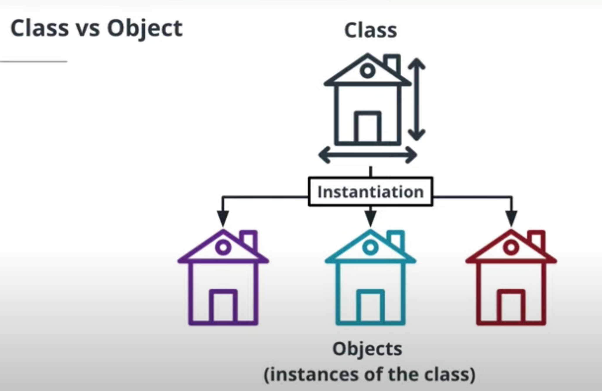
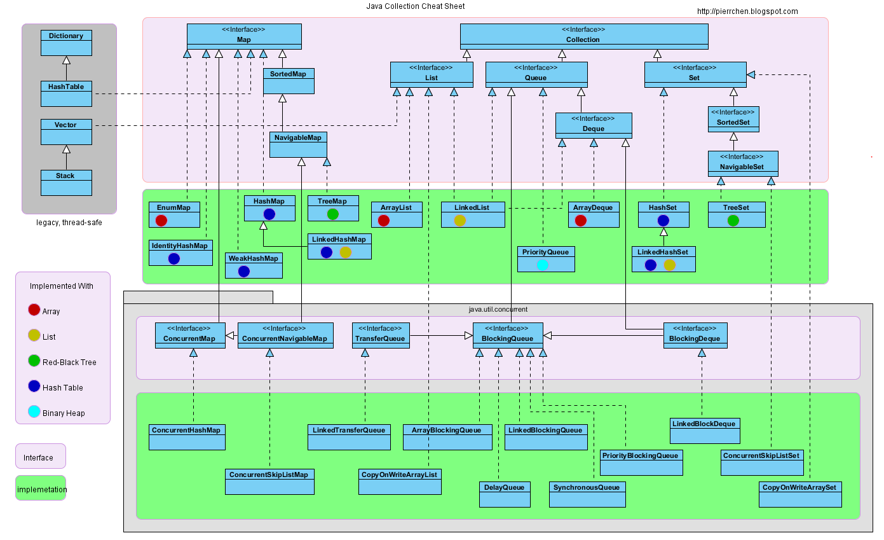
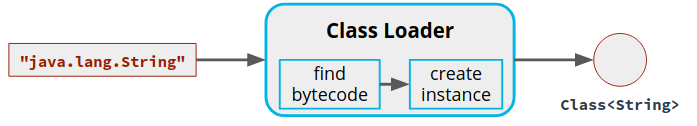
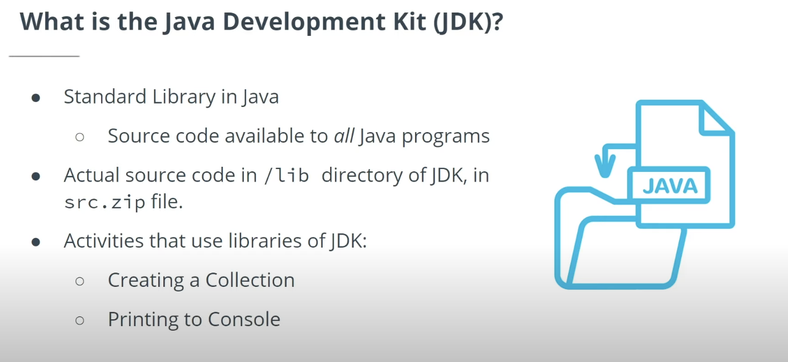
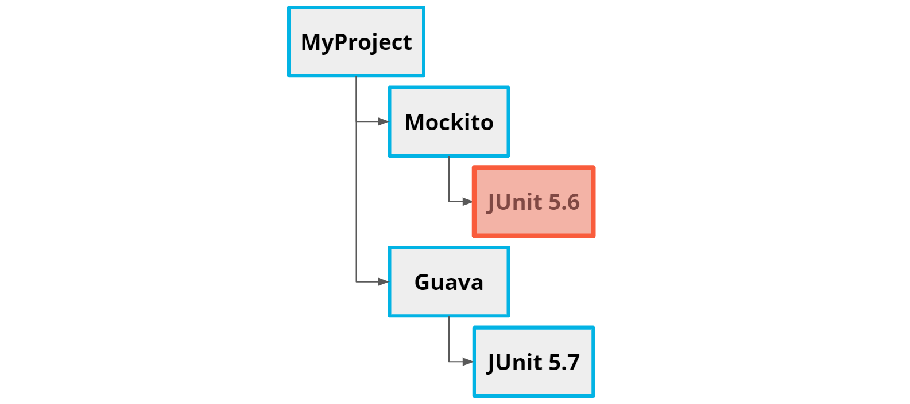

# Java Programming Nanodegree 

## Java Fundamentals 

### Java Programming Basics


* `native`: A native method is a Java method (either an instance method or a class method) whose implementation is also written in another programming language such as C/C++.
    * Example:
        ```java
        public class DateTimeUtils {
            public native String getSystemTime();

            static {
                System.loadLibrary("nativedatetimeutils");
            }
        }
        ```

* `strictfp`: is a modifier in the Java programming language that restricts **floating-point calculations to ensure portability**. The `strictfp` command was introduced into Java with the Java virtual machine (JVM) version 1.2 and is available for use on all currently updated Java VMs.

* `synchronized`: Synchronization in java is the capability to control the access of multiple threads to any shared resource. In the Multithreading concept, multiple threads try to access the shared resources at a time to produce inconsistent results. The synchronization is necessary for reliable communication between threads.

* `throw` and `throws`: The throw keyword is used to `throw` an exception explicitly. It can throw only one exception at a time. The `throws` keyword can be used to declare multiple exceptions, separated by a comma.

* `transient`: 
    * Serialization is the process of converting an object into a `byte stream`, and deserialization is the opposite of it.
    * When we mark any variable as `transient`, then that variable is not serialized. Since transient fields aren't present in the serialized form of an object, the deserialization process would use the default values for such fields when creating an object out of the serialized form.
    * Example: 
        ```java
        public class Book implements Serializable {
            private static final long serialVersionUID = -2936687026040726549L;
            private String bookName;
            private transient String description;
            private transient int copies;
            // getters and setters
        }
        ```

* Compiling and Running the Code

    * When you want to test your program, you cannot simply run it—you must first compile the code. You can do this by using the `javac` command, followed by the name of the file you want to compile. In the below example, our file is called `Main.java`. So in this case, we will compile the code by running:

    * `javac Main.java`

    * Once the code is compiled, we can run it. To do this, we simply enter java followed by the name of the file. In this exercise it will be:

    * `java Main.java`

* Primitive Values vs Reference Values

    * In Java, there are two general kinds of values we can assign to a variable:

        * A **primitive value** is simply a value, by itself, with no additional data.
        * A **reference value** is a value that refers to an object stored in another location in memory.

    * Objects bundle the primitive value up with additional useful information and behavior. We'll get into how to create and use objects more later on.

    *  

    * Object Reference Types
        * `Integer age = 42;`

        *  Notice that the keywords for creating object variables begin with an uppercase letter (String and Integer) rather than the lowercase used for primitives (e.g. int and long).

        * Again, one of the benefits of creating an object is that it can include additional data and behavior. For example, String objects are bundled with a method called length that lets us get the length of the string. 

* Type Casting

    * Type casting is changing one type into another type. There are two kinds of type casting: Automatic and manual.

    * Automatic Type Casting

        * Automatic type casting converts a smaller type into a larger type. For example:

        * ```java
            int intNumber = 3;
            double doubleNumber = intNumber;
            System.out.println(doubleNumber);
            ```
        
        * When we print `doubleNumber`, the value will be `3.0`. Notice that there is **no precision lost** going from a smaller type into a larger type. We started with `3` and ended up with `3.0`.
    
    * Manual Type Casting

        * `Manual` type casting is necessary when we want to do either of these things:
            * Convert a larger type into a smaller type
            * Convert one object type into another

        * For example, here we are converting from a larger type (double) to a smaller type (int):

        * ```java
            double doubleNumber = 3.5;
            int intNumber = (int)doubleNumber;
            System.out.println(intNumber);
            ```
        
        * The resulting value will be `3`, not `3.5`. When we go from a larger type into a smaller type, precision is lost. Java cuts off additional data that will not fit in the casted type. So when we go from a double to an int, any values that are not integers will be removed. This is called **truncation**.

* Stack vs Heap

    * Java uses two different memory regions when running an application: The stack and the heap.

        * **The stack is used to store primitives and object references, while the heap is used to store the objects themselves.**
        * Items in the stack get added and removed as a given method executes, while objects in the heap stay until the application is done (or at least, until there are no object references using them from anywhere in the program, at which point they are removed by the garbage collector).
        * Items are removed from the stack in a Last-In-First-Out (LIFO) order, meaning that the last element you added to the stack is the first that gets popped off the stack.
        * Remember that the items in a stack are only maintained as long as the related method is running. By the time a given method has finished running, all of the items on the stack for that method will have been removed.
        * Objects in the heap are accessible from anywhere in the program, while items on a given stack can only be accessed by the related method.

    *  

* Access Modifiers

    * When we are writing our code, we sometimes need to restrict access to certain data in the application in order to ensure it doesn't get modified in an unintended or harmful way.

    * Classes, Subclasses, and Packages

        * Access modifiers control things like whether the data inside of a class can be accessed only by other code inside of the class or also by code elsewhere in the application.

    * Types of Access Modifiers

        * Public means the class can be accessed from everywhere. If you have a method on a class that you want to expose to all other classes, then use this access modifier.

        * Private means only the defining class can access the data. This provides security, by not allowing other classes to change the data directly. Instead, they must make changes to the data via the provided methods only.
            * Private classes are allowed, but only as inner or nested classes. If you have a private inner or nested class, then access is restricted to the scope of that outer class.

        * Protected means that access is restricted to the defining class, package, or subclass. This will be useful when we get into subclasses and inheritance in a later lesson, as it will allow our subclasses to use variables and methods from the parent class.

        * Default means access is restricted to the defining class or the package. This can be used when we have classes inside the same package that we may want to expose data and methods too.
    
    * 

    * ```java
        private void methodName()
        void methodName()  // The default is no access modifier
        protected void methodName()
        public void methodName()
        ```
    
    * Access Modifiers on Variables

        * And we can apply access modifiers to variables as well! We will get into this in detail in the lessons on object-oriented programming. Here are some examples—again, just so you can get the idea:

        * ```java
            private int number;
            int number3;  // Default is no access modifier
            protected int number2;
            public int number1;
            ```

* Array
    * An array is a fixed-sized data structure that is used to store multiple values—such as a series of phone numbers, as we saw in the video.

    * `int [] numbers  = {1, 2, 3, 4};`

    * Here's another way we can create an array and add values to it:

    * `int [] numbers = new int[4];`

    * This approach uses the `new` keyword to create a new array object of size 4, and then we assign values to the four spaces created in the array. This style will feel more normal to you after we have worked with classes and objects later in the course.

* JavaDoc

    * JavaDoc is a documentation generator that produces a searchable HTML document defining the classes and interfaces of an application. This makes it easy for you and other developers to understand the API of an application.

    * JavaDoc Comments

        * The JavaDoc tool reads through Java files and parses certain parts of the code to automatically generate useful documentation. One part of the code that will be picked up by JavaDoc is a JavaDoc comment (or simply doc comment).

        * JavaDoc comments are typically added:

            * At the top of a class, right before the class name
            * For each method in a class We'll get some practice with this when we start defining classes later in the course.
    
    * And here's an example:
        * ```java
            /** This program HelloWorld produces a standard output
            *  displaying "Hello World"
            * 
            * @author The author of the class
            * @see A reference to another class
            */
            ```
    
    * Parts of a JavaDoc Comment
        * Notice that JavaDoc comments are broken down into two parts:
            * The description
            * Block tags  

    * In the above example, the description is the first part of the comment, and the block tags are the last part (`@author` and `@see`).

    * In this example, we have a doc comment for a method:

    * ```java
        /**
        * This method displays a simple text output to a provided name
        * 
        *
        * @param name The name of the person we want to say “Hi” too
        * @return results Returns true if the name was printed or
        * false if it failed 
        */
        ```
    
    * Example:
        * ```java
            /**
            * @author jeff.phillips
            *
            */
            public class JavaDocExample {

                /**
                * 
                * @param string
                * @param number
                * @return
                */
                public String sampleMethod(String string, int number) {
                    return "Result";
                }

            }
            ```

### Defining Classes

* 

* 

* ```java
    public class Student {

        private final String id;
        private final String firstName;
        private final String lastName;

        public Student(String id, String firstName,String lastName){
            this.id = id;
            this.firstName = firstName;
            this.lastName = lastName;
        }

        public String getId(){
            return id;
        }

        public String getFirstName(){
            return lastName;
        }

        public String getLastName(){
            return lastName;
        }
    }
    ```

    * Instance Variables vs Class Variables

        * Note the difference between instance variables and class variables.

        * Instance Variables are state variables that can have unique values for each object.

        * Class Variables are state variables that belong to the class itself, and are the same for every object. The static keyword identifies this variable as belonging to the class (not to individual objects).

    * ```java
        public class Dog {

            private String dogType;
            private String dogName;
            private String dogColor;
            private int dogAge;

            public Dog(String dogType, String dogName, String dogColor, int dogAge) {
                super();
                this.dogType = dogType;
                this.dogName = dogName;
                this.dogColor = dogColor;
                this.dogAge = dogAge;
            }

            public String getDogType() {
                return dogType;
            }

            public void setDogType(String dogType) {
                this.dogType = dogType;
            }

            public String getDogName() {
                return dogName;
            }

            public void setDogName(String dogName) {
                this.dogName = dogName;
            }

            public String getDogColor() {
                return dogColor;
            }

            public void setDogColor(String dogColor) {
                this.dogColor = dogColor;
            }

            public int getDogAge() {
                return dogAge;
            }

            public void setDogAge(int dogAge) {
                this.dogAge = dogAge;
            }

            @Override
            public String toString() {
                return "Dog type:" + dogType + " Dog name:" + dogName + " Dog Color:" + dogColor + "  Dog age" + dogAge;
            }
        }
        ```

* Garbage Collection

    * Every new object that we instantiate is added to the heap and consumes memory. In programming languages like C or C++, developers are responsible for creating and destroying objects. In contrast, Java has a background process called Garbage Collection (GC) that checks all instantiated objects, and destroys them if they do not have any references—thus freeing up memory, even without any active management on the part of the developer.

### Object-Oriented Programming

* Packages, which are essentially like folders you can use to organize your code and identify exactly which file (or class) you are referring to.
* Inheritance, where one class acquires properties and methods from another class.
* Abstract classes, which cannot be directly instantiated themselves, but that allow us to define the behavior for each of the subclasses.
* Interfaces, which support decoupling and allow us to avoid hardcoding features in an application.
* Polymorphism, which is the ability for an object to take on many forms.

* Packages

    * In Java, we use packages to organize and manage our Java files:

        * If you are used to the concept of namespaces, packages serve essentially the same purpose in Java.
        * Packages are not unlike the traditional folders that you use every day on your computer for organizing your files.
        * By nesting packages and files, we can create a hierarchy that allows us to identify specific files and avoid naming conflicts.

    * The `package` keyword will be located at the top of a Java file, typically on the first line of the file, before the imports and class name. For example:
        * `package project.src.api`

* Inheritance
    * Inheritance is one class acquiring properties and methods from another class. Here are some key points you should remember about inheritance:

        * We want to go from general to specific. The parent or superclass is the most general and the child or subclass is the more specific.

        * By extending the superclass you are stating that the subclass is of the superclass type. When we're not sure if a subclass is inheriting from a parent class, we can use the “is a” test (e.g. a car is a vehicle).

        * The relationship between superclass and subclasses is only one way. The subclasses need to know about the superclass, but the superclass should never know anything about its subclasses.

    * The `Object` Superclass

        * Every class inherits from the superclass Object. Because all objects inherit from the Object class, there are some methods that all objects have, no matter what types they are. For example, all objects have:

            * `clone()`, so that we can clone or make a copy of any object.
            * `equals()`, which we can use to determine if two objects are the same.
            * `hashCode()`, which provides a unique hash code for each object. This is something we'll make use of later on when we need to store and retrieve objects in specific data sets.
            * `toString()`, which we can use to get a description of the current state of an object.

* Polymorphism

    * Polymorphism is the ability of an object to take on many forms.

    * In Java, any kind of inheritance can be used to support polymorphism. In our vehicle example, each of the vehicles has two forms—for instance, a Car object is both a Car and also a Vehicle (since it inherits from the Vehicle class). Any Car object thus has two forms. This is polymorphism.

    * If we wanted to get the speed of all the Car, Boat, and Plane objects, we can easily do this because of polymorphism—we simply create a list containing all objects that are of type Vehicle and get the speed on every Vehicle object, regardless of whatever other types that object might be.

    * ```java
        // Create an array of size 3 and type Vehicle
        Vehicle [] vehicles = new Vehicle[3];

        // Instantiate three new objects and add them to the array.
        // It looks like these are all different types (Car, Plane, and Boat),
        // but they all inherit from the Vehicle class, so in addition to the types
        // they get from their subclasses, they are also all Vehicle objects.
        vehicles[0] = new Car(); 
        vehicles[1] = new Plane();
        vehicles[2] = new Boat();

        // Iterate over the array and print the speed
        // of each of the Vehicle objects.
        for (int i = 0; i < vehicles.length; i++) {
            vehicles[i].speed();
        }
        ```

* Abstract Classes

    * An abstract class has the following key characteristics:

        * It defines the behavior for each of the subclasses, but we cannot directly instantiate the abstract class itself.
        * It allows us to create abstract methods.
            * An abstract method is a method that does not contain an implementation body. Instead, it simply provides a header for the method.
            * Subclasses that extend an abstract class are required to override all abstract methods and provide a specific implementation.
    
    * ```java
        public abstract class Vehicle {
            protected String start;
            protected String stop;
            protected String direction;

            public Vehicle(String start, String stop,
                                        String direction) {
                this.start = start;
                this.stop = stop;
                this.direction = direction;
            }

            public abstract void speed();    

        }

        public class Car extends Vehicle {

        public Car() {
            super("Car start", "Car stop", "Car direction");
            }
            @Override
            public void speed() {
                System.out.println("55");
            }
        }
        ```

* Interfaces

    * Interfaces allow us to avoid hardcoding features in an application. We can move specific implementation details into subclasses, and then use an interface to communicate between the application and the subclasses.

    * Interfaces vs Abstract Classes


        * Here are some of the similarities and differences between abstract classes and interfaces:

        * Abstract class

            * Can have class variables.
            * Can have both **abstract** methods and **concrete** methods that are shared with the subclasses.
            * Can have instance variables, i.e. variables that are specific to individual subclasses.
            * Subclasses can only extend one class.
        
        * Interfaces
            * Can have class variables.
            * Every method in an interface is abstract (in Java 7 and bellow).Java 8+ support default methods.
            * **Cannot have instance variables**. Variables in an interface must be the same for every class implementing the interface.
            * Classes can implement more than one interface and **have multiple inheritance**.
    
    * When to Use an Interface
        
        * We use an interface when:

            * We expect unrelated classes will be implementing our interface.
            * We want to support multiple inheritance.
            * We want to specify the behavior for a data type, but we do not care about the implementation.


### Common Types

* Exceptions, which help us handle errors.
* Enums, which help us set variables from a list of predefined values.
* Dates and Calendar, which help us store and retrieve dates.
* Regular Expressions (RegEx) which help us look for string patterns.
* Advanced String features, which will help us manipulate and process strings more efficiently.

* The **Error Class** and the **Exception Class**
* The Java error-handling framework uses two different classes to identify abnormal software events:
    * The **Error class** is used to indicate a serious problem that the application should not try to handle.
    * The **Exception class** is used when there is a less catastrophic event that the application should try to handle.

* The Throwable Class

    * Both Error and Exception classes inherit from the abstract class **throwable**. This means that both errors and exceptions will contain:

        * The **type of problem** – the class type, either **Exception** or **Error**

        * The **problem message** – whatever description you've provided within the class, such as "out of memory"

        * The **stack trace** where the exception occurred – the order in which things ran and the place in that sequence where the problem occurred (this information is used by developers to track down issues and resolve problems in the code)

* Checked vs Unchecked

    * Unchecked Exceptions

        * Unchecked exceptions are exceptions that are unknown to the compiler.
        * Because these exceptions are only known at runtime, they are also referred to as runtime exceptions.
        * They are a result of a programming error, typically arithmetic errors (such as division by 0).
        * Unchecked exceptions are used when when we expect that the caller of the method cannot recover from the exception.
    
    * Checked Exceptions

        * Checked exceptions are known to the compiler.
        * If we are calling a method that potentially throws a checked exception, it must be handled (or we will get an error from the compiler).
        * Checked exceptions are used when we expect that the caller of the method can recover from the exception.

    *  

    * Example: 
        * ```java
            try {
                read();
            }
            catch (FileNotFoundException ex){
                ex.getLocalizedMessage();
            }
            finally {
            }
            ```
    
    * Remember, `FileNotFoundException` is a class and—as with all exceptions—it inherits from the `Throwable` class.

    * **Exception handlers handle one specific Exception class type.**

    * You can create and throw your own exceptions by **extending the Exception classes**

    *  There are two types of exceptions in Java: Checked and unchecked. Checked exceptions will get caught at compile time and will not allow the code to build until they are either in a catch block or thrown. Unchecked (or runtime) exceptions are not checked by the compiler.

* What is an Enum?

    * In many cases when developing software we need to provide a predefined value for a single variable type. Enumerations (or Enums for short) are a special data type of constants that allow a variable to be set from an enumerated list.

    * An Enum is a Class

        * In Java, **the declaration of an Enum defines a class**. This class can exist within another class or as a standalone class.

    * Example:
        * ```java
            enum Stoplight {
                RED,
                YELLOW,
                GREEN
            }
            Stoplight myStoplight = Stoplight.RED;
            ```
        * ```java
            public class Main {
                enum StopLight {
                    RED,
                    YELLOW,
                    GREEN
                }

                public static void main(String[] args) {
                    StopLight myStoplight = Stoplight.RED; 
                    System.out.println(myStoplight);
                }
            }
            ```

* Scanner

    * The `Scanner` class can read and parse simple text. Here are some key points to keep in mind:

        * It parses primitive types and `String` types into tokens.

        * By default it uses whitespaces to delimitate each word. However, it can also use regular expressions.

        * The Scanner class can read from several different types of sources, like strings, files and `System.in` (to get input from the command line).

        * ```java
            Scanner scanner = new Scanner(System.in);
            ```
        
        * ```java
            Scanner scanner = new Scanner("This is a line");
            System.out.println(scanner.nextLine());
            // This is a line
            ```
        
        * ```java
            Scanner scanner = new Scanner("This is a line");

            while(scanner.hasNext()) {
                // In this next example, we are using the next method to read the first token. The next method finds and returns the next complete token.
                System.out.println(scanner.next());
            }
            ```

* Dates and Calendar

    * The Date Class

        * The Date class represents a specific instance in time. We can instantiate a new Date object like so: `Date date = new Date();`
    
    * The Calendar Class

        * The Calendar class is an abstract class that provides methods for manipulating date and time. The basic syntax for instantiating a new Calendar object looks like this: `Calendar calendar = Calendar.getInstance();`


* RegEx

    * Regular expressions (often abbreviated as `RegEx`) are used to match or find strings based on a specialized syntax.

    * The `regEx` package in Java contains three classes to support these operations

        * Pattern
        * Matcher
        * PatternSyntaxException.
    
    * To use RegEx in Java, we have to do two main theings:

        * Create a `Pattern` based on a specialized syntax
        * Use the `Matcher` to determine if the pattern exists in the String provided
    
    * Helpful RegEx Resources

        * As a Java developer, do you need to thoroughly learn and memorize RegEx syntax? Not necessarily. Unless you're using it very heavily, it will probably suffice to look up the expression you need when you need it. Along those lines, here are some handy resources that you may want to bookmark for later reference:

            * For use of the `RegEx` class in Java, see the official Java docs on regular expression syntax.
            
            * For coming up with the regular expression itself, try playing with [`RegExr.com`](https://regexr.com/). You can enter some text and then try out different expressions; when there is a match, the text will be highlighted. The page also has a handy cheatsheet for commonly needed RegEx characters.
    
    * ```java
        String emailRegex = "^(.+)@(.+).(.+)$"
        Pattern pattern = Pattern.compile(emailRegex)

        Matcher matcher = pattern.matcher("jeff@example.com")

        ```
    
* String Methods

    * Java provides advanced memory management for `String` objects by using a `String pool`. A String pool is a way of storing only **one copy of a String**.

    * To understand this, we have to look at what is happening in memory when we create Strings and assign them to variables. Strings in Java are **immutable**, meaning they cannot be changed after they are created. When we "change" the String in a variable, what actually happens is that, behind the scenes, Java creates a **new String** in the String pool—and changes the variable's reference value to point to this new String. The old String object may remain in place, unchanged.

    * Also note that **multiple variables may use the same String reference**. This means that if we have two variables with exactly the same String (e.g., "Hello") they will all reference the same String object.

    * 

    * 

    * 

    * 

### Generics and Collections

* Generics allow us to write methods that handle a whole group of different data types—in other words, to write methods that are generic.

    * The benefits of using Generics are:

        * Stronger type checks at compile time.
        * They remove the need to cast objects.
        * They allow developers to implement generic algorithms.

    * Put another way, generics are a way to parameterize class types into classes, methods, and variables.

    * `List<String> strings = new ArrayList<String>();`

        * ArrayList is `non-synchronized`. Vector is `synchronized`. ArrayList increments 50% of its current size if element added exceeds its capacity. Vector increments 100% of its current size if element added exceeds its capacity

* Collections

    * 
        * Check `code/JavaCollectionsDemo.java` for an end-to-end example

    *  
        * TreeMap is a map implementation that keeps its entries sorted according to the natural ordering of its keys or better still using a comparator if provided by the user at construction time.

    * Collections are a set of data structures that were introduced in Java 5.0 to solve problems with consistency between data structures and to address performance issues. They were developed with the following goals in mind:

        * High performance/efficiency.
        * High degree of interoperability. The new data structures all needed to behave similarly to each other. In practice, this means that Collections data structures implement similar interfaces and extend similar abstract classes.
        * Integrate with existing APIs seamlessly. The Java framework had to extend and adapt to the new data structures easily. They needed to integrate the new data structures seamlessly with little disruption to the existing API.
    
    * The Collections framework consists of several different data structure classes like `List`, `Set`, `Maps` and `Queues`. In addition, there are utility classes like `Collections` and `Arrays` that provide methods for sorting and creating empty lists. Below is an example in which we create a List of type `String` and then add and remove data.

    * ```java
        List<String> myList = new ArrayList<String>();

        myList.add("one");
        myList.add("two");
        myList.add("three");

        //We could also remove the element "one" by using the index 0 instead of the value "one".
        myList.remove("one");
        ```
    
    * ```java
        List<String> names = new LinkedList<String>();
        names.add("Mike");
        names.add("Bob");
        names.add("Alice");

        Iterator<String> iterator = names.iterator();

        while(iterator.hasNext()){
            System.out.println(iterator.next());
        }
        ```

    * ```java
        public class CollectionsExercise {

            public static void main(String[] args) {

                List<String> listOfItems = new LinkedList<String>();
                listOfItems.add("Mike");
                listOfItems.add("Bob");
                listOfItems.add("Alice");

                for (String name : listOfItems) {
                    System.out.println(name);
                }
            }
        }
        ```

* Sorting Collections

    * The collections framework provides a sort method that can be used to sort lists containing the following types of objects:

        * Strings
        * Wrapper objects
        * User-defined classes
    
    * Strings
        * A list of Strings can be sorted by simply passing the list to the `Collections.sort()` method. In the example bellow, the names will be sorted in ascending order.
        
        * ```java
            List<String> names = new LinkedList<String>();

            names.add("Mike");
            names.add("Bob");
            names.add("Alice");

            Collections.sort(names);
            ```
    
    * Wrapper Objects
        * Wrapper objects were introduced in Java to wrap primitive variable types into objects. In the example below, the primitive `int` values are being converted to `Integer` objects and then sorted.

        * ```java
            List<Integer> numbers = new LinkedList<Integer>();

            numbers.add(201);
            numbers.add(100);
            numbers.add(101);

            Collections.sort(numbers);
            ```
    
    * User-Defined Classes

        * User-defined classes will need to implement the `Comparable Interface` in order to use the `Collections.sort()` method. The Comparable Interface provides a method, `compareTo`, which is used to compare two objects of the same type. In the example below we are using the Person object's name field to compare `Person` objects. This line of code, `name.compareTo(person.name)`, handles all of the hard work.

        * ```java
            import java.util.*;  

            class Person implements Comparable<Person> {  
                public String name;  
                public Person(String name) {  
                    this.name = name;  
                }  
                public int compareTo(Person person) {  
                    return name.compareTo(person.name);  
                }   
            }  
            public class PersonSort {
                public static void main(String[] args) {
                    ArrayList<Person> people = new ArrayList<Person>();
                    people.add(new Person("Same"));
                    people.add(new Person("Mike"));
                    people.add(new Person("Apple"));

                    // This implementation is a stable, adaptive, iterative mergesort ... This implementation dumps the specified list into an array, sorts the array, and iterates over the list resetting each element from the corresponding position in the array.
                    Collections.sort(people);
                    for (Person person : people) {
                    System.out.println(person.name);
                    }
                }
            }
            ```

### Advanced Collections

* Maps

    * Without Maps: Linear Lookup Time

    * When we have a list of objects and need to search for an item in that list, the time required to search will grow linearly with the number of objects. The more items added to the list, the longer it will take to iterate over all of the items. Processing a list of items like this is said to take linear time, because a graph of the relationship looks like a straight line.

    * With Maps: Constant Lookup Time
        * Maps provide a solution. Maps are data structures that use `key-value pairs`. That is, every value in the map is paired with a key. When we want to retrieve a value, we simply provide the corresponding key.

        * Importantly, this retrieval is performed in constant time, meaning that the amount of time required to retrieve an item from the map takes a certain, fixed (constant) amount of time, and this time doesn't change based on how many items we add.
    
    * **Map is an Interface**

        * The Java Map is an Interface that provides three different distinct views of the data:

            * A list of the keys
            * A list of the values
            * A set of key-value mappings
    
    * ```java
        Map<String, Person> mapOfPeople = new HashMap<String, Person>();

        Person mike = new Person("Mike", "mike@email.com");
        Person shaun = new Person("Shaun", "shaun@email.com");
        Person sally = new Person("Sally", "sally@email.com");
        Person cesar = new Person("Cesar", "cesar@email.com");

        mapOfPeople.put(mike.getEmail(), mike);
        mapOfPeople.put(shaun.getEmail(), shaun);
        mapOfPeople.put(sally.getEmail(), sally);
        mapOfPeople.put(cesar.getEmail(), cesar);

        mapOfPeople.get("mike@email.com");

        for (String email : mapOfPeople.keySet()) {
            System.out.println(email);
        }
        ```

* Sets

    * Sometimes, as with the example of a list of phone numbers, it's important for the values in a collection to be unique. Fortunately, we have `Sets`. A Set is a collection type that has no duplicate values.

    * Note that Set extends the `Collection` interface and therefore provides the same methods as other `Collection` data structures do.

    * Concrete Implementations
        * There are three concrete implementations for the Set interface:
            * HashSet
            * TreeSet
            * LinkedHashSet
    
    * **Each of these implementations vary, but all of them enforce the no-duplicate-values requirement of the Set interface.**

    * In the Collections framework, the Set is an interface and cannot be directly used to instantiate a class. In the example below we are creating a Set of strings. Notice, we are using the concrete class HashSet to instantiate our Set object.

    * ```java
        Set<String> mySet = new HashSet<String>();

        mySet.add("Hello");
        mySet.add("Hello");
        mySet.add("Hellos");

        String foundObject;

        for (String text : mySet) {
            if(text.equals("Hello"){
                foundObject  = text;
            }
        }
        ```

* Queues

    * Sometimes we need to process items in a `First-In, First-Out (FIFO)` order.

    * Queues are data structures that allow us to process items in a `First-In, First-Out (FIFO)` order. The first item placed in a queue is also the first one removed from the queue.

    * Some key points about Queues in Java:

        * `Queue` is an interface that implements the `Collection` interface
        * We put newly added elements at the end of the queue
        * We pop elements off the front of the queue
    
    * In the collections framework the Queue is an interface and cannot be directly used to instantiate a class. In the example below, we are creating a Queue of strings. Notice that we are using the concrete class `LinkedList` to instantiate our `Queue`.

    * ```java
        Queue<String> myQueue = new LinkedList<String>();
        // Queue queueB = new PriorityQueue();

        myQueue.add("Hi");
        myQueue.add("There");

        while (!myQueue.isEmpty()) {
            System.out.println(myQueue.poll());
        }
        ```

## Advanced Java Programming Techniques

### Functional Programming in Java

* Imperative Code

    * Early Java programs were usually programmed in the imperative style. Imperative code usually focuses on how a task is performed. Each line of code gives a specific procedure or operation:

    * ```java
        int getTopScore(List<Student> students) {
            int topScore = 0;
            for (Student s : students) {
                if (s == null) continue;
                topScore = Math.max(topScore, s.getScore());
            }
            return topScore;
        }
        ```

* Functional Code

    * Starting with version 8, Java added language features to support a more functional style of programming. You might also hear some people call it declarative programming.

    * Functional code focuses on what happens to inputs in order to produce outputs. You can think of it as describing how to get from the input to the output:

    * ```java
        int getTopScore(List<Student> students) {
        return students.stream()
            .filter(Objects::nonNull)
            .mapToInt(Student::getScore)
            .max()
            .orElse(0);
        }
        ```
    
* Lambda Expressions

    * Lambdas are a Java language feature that make it very easy to **implement certain kinds of interfaces** in Java. When you compare lambda expressions to the traditional way to of implementing a Java interface, lambdas usually result in much cleaner and easier to understand code.

    * ```java
        import java.util.List;
        import java.util.function.Predicate;

        public final class LambdasMain {

            /**
            * Returns the number of strings that match a given condition.
            *
            * @param input the strings that should be tested.
            * @param condition the condition that strings should be tested against.
            * @return the number of strings in the input that match the condition.
            */
            public static long countMatchingStrings(List<String> input, Predicate<String> condition) {
                return input.stream().filter(condition).count();
            }

            public static void main(String[] args) {

                List<String> input = List.of("hello", "\t   ", "world", "", "\t", " ", "goodbye", "  ");

                long numberOfWhitespaceStrings =
                        countMatchingStrings(input, s -> s.trim().isEmpty());

                System.out.println(numberOfWhitespaceStrings + " whitespace strings");
            }
        }
        ```
    
    * ```java
        BinaryOperator<Integer> add =
        (Integer a, Integer b) -> { return a + b; };

        System.out.println(add.apply(1, 2));
        ```

* Functional Interfaces

    * Define what lambda functions and functional interfaces are.
    * Identify when lambda functions and functional interfaces can be used.

    * **A functional interface is a Java interface with exactly one abstract method, called the functional method**.

    * ```java
        @FunctionalInterface
        public interface Predicate<T> {
            boolean test(T t);
            default Predicate<T> negate() { return (t) -> !test(t); }

            // Other methods left out of this example
        }
        ```
    
    * The `Predicate` interface from the demo you saw earlier was a functional interface.

    * Notice that functional interfaces are Java interfaces, and just like a non-functional Java interface, they are allowed to have type parameters. Here, Predicate has one type parameter T, which is the type being tested.

    * Predicate's one abstract method is `test()`. `test()` is known as the functional method. "Abstract" means the method is not implemented, so in order to be a `functional method`, it cannot have a default implementation. However, functional interfaces can have other default methods. In this case, the Predicate interface has a default method called `negate()` that returns another Predicate.

    * The `@FunctionalInterface` annotation at the top serves two important purposes:

        * If that annotation is added to any interface that is not a valid functional interface, the Java compiler will report a compilation error.
        * It tells whoever is reading the code that this is interface is designed to be used with lambdas.
    
    * ```java
        @FunctionalInterface
        public interface Function<T, R> {
            static <T> Function<T, T> identity() {
                return t -> t;
            }

            R apply(T t);

            default <V> Function<V, R> compose(Function<? super V, ? extends T> before) {
                Objects.requireNonNull(before);
                return (V v) -> apply(before.apply(v));
            }

            default <V> Function<T, V> andThen(Function<? super R, ? extends V> after) {
                Objects.requireNonNull(after);
                return (T t) -> after.apply(apply(t));
            }
        }
        ```

* Binary Operations

    * In this exercise, you will define a functional interface that represents a binary operation between two integers.
        * Binary operation is a fancy term that refers to a method that takes two arguments.
    
    * ```java
        @FunctionalInterface
        public interface BinaryOperation {
            int apply(int a, int b);
        }

        public final class Main {
            public static void main(String[] args) {
                BinaryOperation add = (a, b) -> a + b;
                // Or you could use:
                //
                //  BinaryOperation add = Integer::sum;
                //
                // More on method references later!

                assert 5 == add.apply(2, 3);
            }
        }
        ```

* Anonymous Subclasses

    * What is an Anonymous Class?
        * An anonymous class is a class that is defined "in-line" and has no name, and so it is called "anonymous".

        * Nowadays, many anonymous classes can be replaced by lambdas, but there are still some important differences you should know about.

    * Anonymous Class vs. Lambda

        * ```java
            Predicate<String> anonymousSubclass =
                new Predicate<String>() {
                    @Override
                    public boolean test(String s) {
                        return s.trim().isEmpty();
                    }
                };
            ```
        
        * does the same thing as this lambda expresssion:

        * ```java
            Predicate<String> lambdaInstead = s -> s.trim().isEmpty();
            ```

        * 
    
    * What's `this` all about?

        * ```java
            public final class ThisExample {
                private final Runnable withLambda =
                    () -> System.out.println("From lambda: " + this.getClass());
                private final Runnable withSubclass = new Runnable() {
                    @Override
                    public void run() {
                        System.out.println("From subclass: " + this.getClass());
                    }
                };

                public static void main(String[] args) {
                    ThisExample thisExample = new ThisExample();
                    thisExample.withLambda.run();
                    thisExample.withSubclass.run();
                }
            }
            ```
        
        * **The main purpose of using a class being declared as final is to prevent the class from being subclassed**.
        
        * ```bash
            From lambda: class com.udacitydemo.lambdas.ThisExample
            From subclass: class com.udacitydemo.lambdas.ThisExample$1
            ```
        
        * Inside the lambda, `this.getClass()` returns the class object representing `ThisExample`. We'll cover class objects in more detail in the lesson on reflection, but for now the important part is that the this keyword inside the lambda references the enclosing class, which is `com.udacitydemo.lambdas.ThisExample`.

        * For the `Runnable` subclass, on the other hand, the program printed `com.udacitydemo.lambdas.ThisExample$1`. You can see that the Java compiler generated a class called `com.udacitydemo.lambdas.ThisExample$1` for the anonymous lambda (yes, the class name contains a `dollar sign`), and the `this` keyword refers to that generated class! If you compile this program yourself, you'll even notice the Java compiler produces a file called `ThisExample$1.class`, which contains the compiled byte code for the anonymous class.

        * ```java
            public final class Main {
                public static void main(String[] args) {
                    Runnable r = () -> System.out.println(this.getClass());
                    r.run();
                }
            }
            ```
            * Right, this program actually does not compile! It was a little bit of a trick question —sorry about that!

            * Inside a lambda, the `this` keyword only means anything if there is an **enclosing class**. In this code, the lambda is defined inside a `static` function, so there _is_ no enclosing class.
    

* Shortcomings of Lambdas
    * Lambdas are very useful, but they do have some shortcomings:

        * They can only be used to implement functional interfaces, not classes.
        * Lambdas cannot implement any interface that has multiple abstract methods.
        * Lambdas cannot throw checked exceptions (any subclass of `Exception`, such as `IOException`).

    * ```java
        import java.io.IOException;
        import java.nio.charset.StandardCharsets;
        import java.nio.file.Files;
        import java.nio.file.Path;
        import java.util.Arrays;
        import java.util.List;

        public final class ReadFilesMain {
            public static void main(String[] args) throws IOException {
                List<String> fileNames = Arrays.asList("file-a.txt", "file-b.txt", "file-c.txt");

                fileNames.stream()
                    .map(Path::of)
                    .map(p -> {
                        try {
                            return Files.readAllLines(p, StandardCharsets.UTF_8)
                        } catch (IOException e) {
                            return List.of();
                        }
                    })
                    .flatMap(List::stream)
                    .forEach(System.out::println);
            }
        }
        ```

        * or

        * ```java
            import java.io.IOException;
            import java.nio.charset.StandardCharsets;
            import java.nio.file.Files;
            import java.nio.file.Paths;
            import java.util.Arrays;
            import java.util.Collection;
            import java.util.List;
            import java.util.stream.Stream;

            public final class ReadFilesMain {
                public static void main(String[] args) throws IOException {
                    List<String> fileNames = Arrays.asList("file-a.txt", "file-b.txt", "file-c.txt");

                    for (String fileName : fileNames) {
                        for (String line : Files.readAllLines(Paths.get(fileName), StandardCharsets.UTF_8)) {
                            System.out.println(line);
                        }
                    }
                }
            }
            ```
        
        * The double colon (`::`) operator, also known as `method reference operator` in Java, is used to call a method by referring to it with the help of its class directly. They behave exactly as the lambda expressions. The only difference it has from lambda expressions is that this uses direct reference to the method by name instead of providing a delegate to the method.

* Edge Case: Capturing Variables

    * Captured Variables

    * Lambdas can capture variables from the surrounding code. If a lambda uses any variables from the surrounding code, those variables are captured. Variables can only be captured if they are effectively final.

    * An **effectively final variable** is a variable whose value **does not change after it is initialized**.

    * A good test to figure out if a variable is effectively final is to add the `final` keyword to it. If the code still compiles, that variable is effectively final!

    * ```java
        List<Runnable> runnables = new ArrayList<>(10);
        for (int i = 0; i < 10; i++) {
            runnables.add(() -> System.out.println(i));
        }
        ```
    
    * One way to get around this would be to use an IntStream:
        * `List<Runnable> runnables = IntStream.range(1, 10).map(i -> () -> System.out.println(i)).collect(Collectors.toList());`

* Method References

    * A **method reference** is a short lambda expression that refers to a method that is already named.

    * **If a method with the right parameters and return values is already defined, you can use that instead of writing a new lambda**. If this sounds confusing, don't worry — the next code demo should demonstrate how simple method references are to use.

    * 

    * When to Use Method References

        * Generally speaking, if a method is already defined that you can use, you should use a method reference instead of writing a brand new lambda. It's usually a good idea in software development to not write new code if there's already existing code that does the same thing you're trying to do!
    
    * ```java
        import java.util.List;
        import java.util.function.Predicate;

        public final class LambdasMain {
            /**
            * Returns the number of strings that match a given condition.
            *
            * @param input the strings that should be tested.
            * @param condition the condition that strings should be tested against.
            * @return the number of strings in the input that match the condition.
            */
            public static long countMatchingStrings(List<String> input, Predicate<String> condition) {
                return input.stream().filter(condition).count();
            }

            public static void main(String[] args) {

                List<String> input = List.of("hello", "\t   ", "world", "", "\t", " ", "goodbye", "  ");

                long numberOfWhitespaceStrings = countMatchingStrings(input, String::isBlank);

                System.out.println(numberOfWhitespaceStrings + " whitespace strings");
            }
        }
        ```

* Stream API

    * What is a Stream?

        * **A stream is a sequence of elements**.

        * Streams are useful because they allow us to process collection, one element at a time. They can process elements in many ways, such as (but not limited to) filtering or transforming elements, sorting elements, or computing statistics such as the sum or average.

        
    
    * A stream pipeline consists of creating a stream, calling intermediate operations on the stream, and then terminating the stream using a terminal operation.   
        * Streams are `single-use`. Once you do an operation on a Stream, you cannot do any more operations on that same stream. This means intermediate operations always return a brand new Stream, never the original.
        * Streams are `lazily evaluated`. **No computation happens until the very end**, when the terminal operation is called.
    
    * ```java
        void printScores(List<Student> students) {
        return students.stream()
            .filter(Objects::nonNull)
            .mapToInt(Student::getScore)
            .forEach(System.out::println);
        }
        ```

    * First, the `stream()` method creates a stream from the students list.

    * This stream pipeline has two intermediate methods: the `filter()` method removes the elements of the stream that are null, and `mapToInt()` transforms each student into an `int`. Notice that each of these methods returns another Stream: `filter()` returns a `Stream<Student>`, and `mapToInt()` returns an `IntStream`.

    * ```java
        Stream.of("hello", "world")
            .map(String::toUpperCase)
            .collect(Collectors.joining(" ", "", "!"));
        ```

* Stream API: Collectors

    * What is a Collector?

        * A `Collector` is a **terminal stream operation that accumulates stream elements into a container**.
    
    * The `collect()` method is a terminal operation that aggregates streams of elements. `Collectors` can be passed to `collect()` to determine what kind of collection is created.

    * ```java
        Set<String> s = stringList.stream().collect(Collectors.toSet());
        ```

    * Here, the collector aggregates the elements into a `Set`. There are collectors for all the common data structures such as lists, sets, and maps.

    * ```java
        Map<Year, Long> graduatingClassSizes = studentList.stream()
        .collect(Collectors.groupingBy(
        Student::getGraduationYear, Collectors.counting());
        ```

    * Here, `groupingBy()` is used to collect elements into a `Map`. `Collectors.counting()` counts the number of values for each key, so, in this example, it will count how many students there are for each graduation year.

* Optional Type

    * `java.util.Optional` is a container object that may or may not contain a single, non-null value.
    * Optional is an alternative to using null to represent the absence of a value.

    * ```java
        int getTopScore(List<Student> students) {
            return students.stream()
            .filter(Objects::nonNull)
            .mapToInt(Student::getScore)
            .max()
            .orElse(0);
        }
        ```

    * Here, the `max()` method actually returns an `OptionalInt`, not an int. If the students list is empty, the `max()` method will return an empty optional.

    * If `max()` returns an `OptionalInt` with a value, that value will be used. However, if `max()` returns `OptionalInt.empty()`, the call to `orElse()` makes sure that a default value of `0` will be returned.

    * This example also shows you how, in addition to `Optional<T>`, Java also has optional types that are specialized for `int, long, and double` primitives. These classes avoid the need for auto-boxing and auto-unboxing of their values.

    * When you're designing Java APIs, you should consider using `Optional` instead of null to represent the absence of values.

    * `Optional` can have methods invoked on it without throwing `NullPointerException`. The Stream API uses optional types for many of its terminal operations.

* ```java
    import java.time.LocalDate;
    import java.time.Year;
    import java.time.ZoneId;
    import java.util.Comparator;
    import java.util.List;
    import java.util.Map;
    import java.util.stream.Collectors;

    public final class SummarizeClients {
        public static void main(String[] args) {

            List<UdacisearchClient> clients = ClientStore.getClients();
            int numClients = clients.size();
            int totalQuarterlySpend =
                clients
                    .stream()
                    .mapToInt(UdacisearchClient::getQuarterlyBudget)
                    .sum();

            double averageBudget =
                clients
                    .stream()
                    .mapToDouble(UdacisearchClient::getQuarterlyBudget)
                    .average()
                    .orElse(0);

            long nextExpiration =
                clients
                    .stream()
                    .min(Comparator.comparing(UdacisearchClient::getContractEnd))
                    .map(UdacisearchClient::getId)
                    .orElse(-1L);

            List<ZoneId> representedZoneIds =
                clients
                    .stream()
                    .flatMap(c -> c.getTimeZones().stream())
                    .distinct()  // Or use Collectors.toSet()
                    .collect(Collectors.toList());

            Map<Year, Long> contractsPerYear =
                clients
                    .stream()
                    .collect(Collectors.groupingBy(SummarizeClients::getContractYear, Collectors.counting()));

            System.out.println("Num clients: " + numClients);
            System.out.println("Total quarterly spend: " + totalQuarterlySpend);
            System.out.println("Average budget: " + averageBudget);
            System.out.println("ID of next expiring contract: " + nextExpiration);
            System.out.println("Client time zones: " + representedZoneIds);
            System.out.println("Contracts per year: " + contractsPerYear);
        }

        private static Year getContractYear(UdacisearchClient client) {
            LocalDate contractDate =
                LocalDate.ofInstant(client.getContractStart(), client.getTimeZones().get(0));
            return Year.of(contractDate.getYear());
        }
    }
    ```

### Working with Files & I/O

* Files API

    * The Files API is Java's Swiss Army knife for file operations. It contains static methods for doing all sorts of file operations. (70 static methods)

    * File Open Options

        * When you create, read, or write a file, there are standard modes that you can use to do so. Java uses the `StandardOpenOptions` class to encapsulate all these modes.

        * Here are some of the common modes:

        *  


    * Path API

        * A `Path` is Java's way to refer to a file on a file system:

        * `Path p = Path.of("your/path/here");`

        * All paths either refer to files or directories.

            * A file contains stored data or bytes.
            * A directory contains zero or more files.
        
        * All paths are either absolute or relative.

            * Absolute paths start with a forward-slash (/) (known as the root directory on Mac and Linux), or a drive name on Windows.
            * Relative paths are only meaningful relative to some other starting point. They do not start with a forward slash or drive name.

* Input and Output Streams

    * Reading and Writing Data in Java

        * In Java, the utilities for reading and writing data are built on top of each other. This diagram shows you what that means. When you use a `BufferedReader` to read lines of text, that buffered reader is reading from another underlying `Reader` that provides characters of text. That `Reader`, in turn, is itself using an `InputStream` behind the scenes to read the raw data.

    * 

    * **Input and output streams are the lowest level utilities Java provides**. They give you access to the raw data, in the form of bytes. This data can come from a file, from user input on the command-line, or from a network or other source. These are the lowest level APIs Java offers for reading or writing a stream of bytes.

    * We use them to:

        * access low-level bytes of data from input

        * write bytes to output
    
    * ```java
        InputStream in =
        Files.newInputStream(Path.of("test"), StandardOpenOption.READ);
        byte[] data = new byte[10];
        while (in.read(data) != -1) {  
            //Returns the number of bytes read
            useData(data);
        }
        in.close();  // Close the "test" file
        ```
    
    * This code creates a file called "test" using `newInputStream()` method of the `Files API`. The code calls the `read()` method, which reads the data into a `byte[]` and returns the number of bytes that were read. If no bytes were read, it returns `-1`. This code will read the entire file, `10 bytes` at a time, until the loop reaches the end of the file.
    
    * ```java
        OutputStream out = Files.newOutputStream(Path.of("test"));
        out.write("Hello, world!".getBytes());
        out.close();  // Close the "test" file
        ```
    
    * The basic `write()` method only deals with bytes. It's pretty self-explanatory: you give the `write()` method a `byte[]`, and it writes those bytes to the output stream.

    * ```java
        import java.io.IOException;
        import java.io.InputStream;
        import java.io.OutputStream;
        import java.nio.file.Files;
        import java.nio.file.Path;

        public class CopyFile {
            public static void main(String[] args) throws IOException {

                InputStream in = Files.newInputStream(Path.of(args[0]));;
                OutputStream out = Files.newOutputStream(Path.of(args[1]));;

                byte[] data = new byte[10];
                while (in.read(data) != -1) {
                    out.write(data);
                }
                in.close();
                out.close();
            }
        }
        ```
    
    * ```java
        import java.io.IOException;
        import java.io.InputStream;
        import java.io.OutputStream;
        import java.nio.file.Files;
        import java.nio.file.Path;

        public class InputOutputStreams {
            public static void main(String[] args) throws IOException {

                InputStream in = Files.newInputStream(Path.of(args[0]));;
                OutputStream out = Files.newOutputStream(Path.of(args[1]));;
                // Reads all bytes from this input stream and writes the bytes to the given output stream in the order that they are read.
                in.transferTo(out);
                in.close();
                out.close();
            }
        }
        ```
    
    * ```java
        import java.io.IOException;
        import java.nio.file.Path;

        public final class CopyFile {
            public static void main(String[] args) throws IOException {
                Files.copy(Path.of(args[0]), Path.of(args[1]));
            }
        }
        ```

* Readers and Writers

    * Readers and Writers are the next level of abstraction built on top of input and output streams. These interfaces read and write text characters.

    * 

    * ```java
        char[] data = new char[10];
        Reader reader =
        Files.newBufferedReader(Path.of("test"), StandardCharsets.UTF_8);
        while (reader.read(data) != -1) {
            useData(data);
        }
        reader.close();
        ```
    
    * Just like input streams, Readers are usually created with the `Files API`. But instead of reading bytes, we are reading chars. There's also a `StandardCharset`.
    
    * ```java
        Writer writer =
        Files.newBufferedWriter(Path.of("test"),
                                StandardCharsets.UTF_8);
        writer.write("hello, world");
        writer.close();  // Close the "test" file
        ```
    
    * The `Writer` is pretty much what you would expect. This time we are writing encoded Strings of data instead of raw bytes.

    * If you're just itching to see a coding demo using readers and writers, rest assured there's one on the very next page! I decided to save the demo for the discussion on character encodings.

* Why Do We Need Character Encodings?

    * When you open a text file on your PC, you see readable text. To a computer though, that file contains only binary data (1s and 0s). All files are stored as bits. By the way, "bit", which stands for "binary digit", but it's more common to talk about bytes. A byte is equal to 8 bits.

    * Thankfully, computers can translate that binary data into readable text for us to read. Character sets enumerate all possible characters that can be represented by an encoding. **Unicode is the most common character set, and it can represent 143,859 characters and symbols in many different languages. There's also a character set called ASCII, which can only represent characters that are common in the English language.**

* What Are Character Encodings?

    * A character encoding is a way to convert between binary data and human-readable text characters in a character set.

    * You saw in the previous section that `Readers` and `Writers` use standard character encodings to convert between bytes and text.

* Different Unicode Encodings
    * UTF = (Unicode Transformation Format)

    * UTF-8 
        * Generally speaking, you should use UTF-8. Most HTML documents use this encoding.

        * It uses at least 8 bits of data to store each character. This can lead to more efficient storage, especially when the text contains mostly English ASCII characters. But higher-order characters, such as non-ASCII characters, may require up to 24 bits each!

    * UTF-16.
        * This encoding uses at least 16 bits to encode characters, including lower-order ASCII characters and higher-order non-ASCII characters.

        * If you are encoding text consisting of mostly non-English or non-ASCII characters, UTF-16 may result in a smaller file size. But if you use UTF-16 to encode mostly ASCII text, it will use up more space.

* ```java
    import java.io.IOException;
    import java.io.Writer;
    import java.nio.charset.StandardCharsets;
    import java.nio.file.Files;
    import java.nio.file.Path;

    public class Encode {
        public static void main(String[] args) throws IOException {
            try (Writer writer = Files.newBufferedWriter(Path.of("L2-demo3-encodings/test_utf8.txt"),
                    StandardCharsets.UTF_8)) {
                writer.write("hello, world");
            }

            try (Writer writer = Files.newBufferedWriter(Path.of("L2-demo3-encodings/test_utf16.txt"),
                    StandardCharsets.UTF_16)) {
                writer.write("hello, world");
            }
        }
    }
    ```

* 

* What Are Buffered Streams?

    * The most common buffered streams are BufferedReaders and BufferedWriters, which read and write lines of text.

    *  

* Why Do We Use Buffered Streams?
    
    * Buffered streams reduce the number of I/O operations performed by your program. This can significantly shrink the amount of time your program spends doing I/O!

    * 
    
    * When your code calls `BufferedReader.read()`, the `BufferedReader` reads ahead, and fetches more data than you asked for. Whatever it reads is stored in an array, which is also called a buffer.

    * The next time you call `read()`, if the data you requested is already in the buffer, the `BufferedReader` **will give you that cached data, without having to do another read from disk!**

    * ```java
        BufferedReader reader =
        Files.newBufferedReader(Path.of("test"), StandardCharsets.UTF_8);
        String line;
        while ((line = reader.readLine()) != null) {
            useString(line);
        }
        reader.close();
        ```
    
    * From an API perspective, you already know how to create `BufferedReaders`. In fact, the `Files API` only returns buffered readers.

    * The main difference between this API and the `Reader API` is the addition of the `readLine()` method, which returns a full line of text. Reading lines this way is a lot easier than reading the individual characters one by one!

    * ```java
        BufferedWriter writer =
        Files.newBufferedWriter(Path.of("test"),
                                StandardCharsets.UTF_8);
        writer.write("Hello, ");
        writer.write("world!");
        writer.flush();  // Writes the contents of the buffer
        writer.close();  // Flushes the buffer and closes "test"
        ```
    
    * `BufferedWriter` also uses an in-memory buffer to store writes, and then periodically writes contents of the buffer in batches.

    * In this code, the `write()` method is called twice, but there is only one actual write to the underlying output stream.

    * Flushing

        * Emptying out the buffer is called flushing. You can force this to happen immediately by calling the `flush()` method. If you are writing a file, **flushing the buffer will write its contents to the file so that any changed become visible**.

* Exercise

    * ```java
        import java.io.BufferedReader;
        import java.io.Writer;
        import java.nio.file.Files;
        import java.nio.file.Path;
        import java.util.ArrayList;
        import java.util.List;

        public final class MakeShards {
        private static final int SHARD_SIZE = 100;

        public static void main(String[] args) throws Exception {
            if (args.length != 2) {
            System.out.println("Usage: MakeShards [input file] [output folder]");
            return;
            }

            Path input = Path.of(args[0]);
            Path outputFolder = Files.createDirectory(Path.of(args[1]));

            try (BufferedReader reader = Files.newBufferedReader(input)) {
            int shardNum = 0;
            String word = reader.readLine();
            while (word != null) {
                List<String> shard = new ArrayList<>(SHARD_SIZE);
                while (shard.size() < SHARD_SIZE && word != null) {
                    shard.add(word);
                    word = reader.readLine();
                }
                shard.sort(String::compareTo);
                Path output = Path.of(outputFolder.toString(), getOutputFileName(shardNum));
                try (Writer writer = Files.newBufferedWriter(output)) {
                    for (int i = 0; i < shard.size(); i++) {
                        writer.write(shard.get(i));
                        if (i < shard.size() - 1) {
                        writer.write(System.lineSeparator());
                        }
                    }
                }
                shardNum++;
            }
            }
        }

        private static String getOutputFileName(int shardNum) {
            return String.format("shard%02d.txt", shardNum);
        }
        }
        ```

* Preventing Resource Leaks

    * Leaving files open wastes memory and other system resources.
    * Most operating systems limit the number of files that can be open at one time, so, when you leave a file open after you're done using it, you're potentially depriving programs of the ability to open other files in the future.
    * **If you are using a buffered writer and forget to close it, the buffered writes might never actually be written to disk.**

    * `try-catch-finally` can be very useful for preventing resource leaks.

    * ```java
        Writer writer;
        try {
            writer = Files.newBufferedWriter(Path.of("test"));
            writer.write("Hello, world!");
        } catch (IOException e) {
            e.printStackTrace();
        } finally {
            if (writer != null) {
                try {
                    writer.close();
                } catch (IOException e) {
                    e.printStackTrace();
                }
            }
        }
        ```

* The code in the finally block is guaranteed to execute after the code in the try block, even if the try block returns a value or throws an exception. This code also has a catch block, but that is optional.

* **try-with-resources Example**

    * ```java
        try (Writer writer = Files.newBufferedWriter(Path.of("test"))) {
            writer.write("Hello, world!");
        } catch (IOException e) {
            e.printStackTrace();
        }
        ```
    
    * Java 7 introduced the `try-with-resources` syntax. This new syntax allows you to initialize your resources in parenthesis right before the start of the try block. **Resources initialized in this way are guaranteed to be closed after the try block finishes executing.**

    * Although try-with-resources has removed the need for the finally block in a lot of modern Java code, there are still some use cases where the finally block is useful.

    * ```java
        // Copy the contents of "foo" to "bar"
        try (InputStream in   = Files.newInputStream(Path.of("foo"));
            OutputStream out = Files.newOutputStream(Path.of("bar"))) {
            out.write(in.readAllBytes());
        }
        ```

* `Closeable` and `AutoCloseable`

    * Only `Closeable` or `AutoCloseable` objects can be used in the try statement.

    * Most of the I/O classes we've talked about, including `Stream`, `Reader`, `Writer`, `InputStream`, and `OutputStream`, already implement the `Closeable` interface, whose `close()` method can throw an `IOException`.

    * `AutoCloseable.close()` does not throw `IOException`.

    * `Closeable` and `AutoCloseable` are just regular Java interfaces, which means you can write your own implementations and then use them in a `try-with-resources` block!

* Exercise

    * ```java
        import java.io.BufferedReader;
        import java.io.Writer;
        import java.nio.file.Files;
        import java.nio.file.Path;
        import java.util.ArrayList;
        import java.util.List;
        import java.util.Objects;
        import java.util.PriorityQueue;
        import java.util.stream.Collectors;

        public final class MergeShards {
            public static void main(String[] args) throws Exception {
                if (args.length != 2) {
                    System.out.println("Usage: MergeShards [input folder] [output file]");
                    return;
                }

                List<Path> inputs = Files.walk(Path.of(args[0]), 1).skip(1).collect(Collectors.toList());
                List<BufferedReader> readers = new ArrayList<>(inputs.size());
                Path outputPath = Path.of(args[1]);

                try {
                    for (Path input : inputs) {
                        readers.add(Files.newBufferedReader(input));
                    }
                    PriorityQueue<WordEntry> words = new PriorityQueue<>();
                    for (BufferedReader reader : readers) {
                        String word = reader.readLine();
                        if (word != null) {
                            words.add(new WordEntry(word, reader));
                        }
                    }

                    try (Writer writer = Files.newBufferedWriter(outputPath)) {
                        while (!words.isEmpty()) {
                            WordEntry entry = words.poll();
                            writer.write(entry.word);
                            writer.write(System.lineSeparator());
                            String word = entry.reader.readLine();
                            if (word != null) {
                                words.add(new WordEntry(word, entry.reader));
                            }
                        }
                    }
                } finally {
                    for (BufferedReader reader : readers) {
                        try {
                            reader.close();
                        } catch (Exception e) {
                            e.printStackTrace();
                        }
                    }
                }
            }

            private static final class WordEntry implements Comparable<WordEntry> {
                private final String word;
                private final BufferedReader reader;

                private WordEntry(String word, BufferedReader reader) {
                    this.word = Objects.requireNonNull(word);
                    this.reader = Objects.requireNonNull(reader);
                }

                @Override
                public int compareTo(WordEntry other) {
                    return word.compareTo(other.word);
                }
            }
        }
        ```

* Representing Data

    * In many programming contexts, programmers need to be able to represent custom data types. Java is no different.

    * ```java
        public class Client {
            private int id;
            private String name;
            private List<String> emails;
            public int getId() { return id; }
            public String getName() { return name; }
            public List<String> getEmails() { return emails; }
            public void setId(int id) { this.id = id; }
            public void setName(String name) { this.name = name; }
            public void setEmails(List<String> emails) { 
                this.emails = emails; 
            }
        }
        ```
    
    * Each piece of information is stored in an instance field, with a getter and setter method. The method names are prefixed by `"get"` and `"set"`, respectively. followed by the name of the property.

    * A data class that follows this naming convention is called a **Java Bean**.

* Java Object Serialization

    * What is Serialization?
        * **Serialization** is the process of converting an object into a data format that can later be deserialized back into the original object.

        *   


    * To serialize the Java object, create an `ObjectOutputStream`, and pass the object to the streams `writeObject()` method. The `ObjectOutputStream` writes a sequence of bytes, and its constructor takes another stream as an argument.

    * To recreate the original Java object from the serialized bytes, read the bytes back into a `ObjectInputStream`.

    * ```java
        import java.io.ObjectInputStream;
        import java.io.ObjectOutputStream;
        import java.nio.file.Files;
        import java.nio.file.Path;
        import java.util.List;

        public final class Main {
            public static void main(String[] args) throws Exception {
                Path path = Path.of("list.bin");
                try (var out = new ObjectOutputStream(Files.newOutputStream(path))) {
                    out.writeObject(List.of("Hello", " ", "World!"));
                }
                try (var in = new ObjectInputStream(Files.newInputStream(path))) {
                    List<String> deserialized = (List<String>) in.readObject();
                    System.out.println(deserialized);
                }
            }
        }
        ```
    
    * This was kind of a silly example, though, because you would never serialize a list of strings like this — instead, you would probably write the strings to a regular text file with one line per string.

* Exercise

    * ```java
        public final class UdacisearchClient implements Serializable {
            ... // Everything else stays the same!
        }
        ```
    
    * ```java
        import java.io.ObjectInputStream;
        import java.io.ObjectOutputStream;
        import java.nio.file.Files;
        import java.nio.file.Path;
        import java.time.Duration;
        import java.time.Instant;
        import java.time.ZoneId;

        public final class Main {
            public static void main(String[] args) throws Exception {
                if (args.length != 1) {
                    System.out.println("Usage: Main [file path]");
                    return;
                }

                UdacisearchClient client =
                    new UdacisearchClient(
                        "CatFacts LLC",
                        17,
                        8000,
                        5,
                        Instant.now(),
                        Duration.ofDays(180),
                        ZoneId.of("America/Los_Angeles"),
                        "555 Meowmers Ln, Riverside, CA 92501");

                Path outputPath = Path.of(args[0]);
                try (ObjectOutputStream out = new ObjectOutputStream(Files.newOutputStream(outputPath))) {
                    out.writeObject(client);
                }
                System.out.println("Wrote to " + outputPath.toAbsolutePath().toString());

                try (ObjectInputStream in = new ObjectInputStream(Files.newInputStream(outputPath))) {
                    UdacisearchClient deserialized = (UdacisearchClient) in.readObject();
                    System.out.println("Deserialized " + deserialized);
                }
            }
        }
        ```

* It's valuable to understand that Java's built-in object serialization exists, and how to use it, but most of the time you should avoid using it due to critical security issues.

*  

* Working with JSON and XML

    * What are JSON and XML?

        * `JSON` (JavaScript Object Notation) and `XML` (Extensible Markup Language) are two common text formats for serializing data.
    
* JSON Serialization / Deserialization with Jackson

    * In Java, the most popular library for doing this is called Jackson. Jackson uses Java annotations to help it get the metadata needed for serialization and deserialization.

    * To serialize the annotated Java object, you call the `ObjectMapper.writeObject()` method, passing in the annotated Java object. Jackson will convert the object to a JSON string.

    * To deserialize the JSON string, pass it into the `ObjectMapper.readValue()` method. This method also has an argument for the type of Java class that should be created. Jackson will create an instance of that class and fill it in using the information from the JSON string.

* XML Serialization / Deserialization with JAXB

    * Just like Jackson, JAXB uses Java annotations to tell it how to serialize and deserialize Java objects. The only difference is the format of the output — XML in this case instead of JSON — and the methods used to do the conversions.

    * In JAXB, you use the `Marshaller.marshal` method to serialize to XML, and you use the `Unmarshaller.unmarshal` method to deserialize back into a Java class.

    * By the way "marshal" is another way of saying "serialize".

* ```java
    import com.fasterxml.jackson.databind.ObjectMapper;
    import com.fasterxml.jackson.datatype.jsr310.JavaTimeModule;

    import java.nio.file.Files;
    import java.nio.file.Path;
    import java.time.Duration;
    import java.time.Instant;
    import java.time.ZoneId;

    public final class Main {
        public static void main(String[] args) throws Exception {
            if (args.length != 1) {
                System.out.println("Usage: Main [file path]");
                return;
            }

            UdacisearchClient client =
                new UdacisearchClient(
                    "CatFacts LLC",
                    17,
                    8000,
                    5,
                    Instant.now(),
                    Duration.ofDays(180),
                    ZoneId.of("America/Los_Angeles"),
                    "555 Meowmers Ln, Riverside, CA 92501");

            Path outputPath = Path.of(args[0]);
            ObjectMapper objectMapper = new ObjectMapper();
            objectMapper.registerModule(new JavaTimeModule());
            objectMapper.writeValue(Files.newBufferedWriter(outputPath), client);

            System.out.println("Wrote to " + outputPath.toAbsolutePath().toString());

            UdacisearchClient deserialized =
                objectMapper.readValue(Files.newBufferedReader(outputPath), UdacisearchClient.class);
            System.out.println("Deserialized " + deserialized);
        }
    }
    ```

* 

* How does it work?

    * You may be wondering how Jackson works. After all, you didn't even have to change the `UdacisearchClient` like you did in the Java Object Serialization exercise!

    * The secret is sauce **Java Reflection**. **Jackson uses Java's Reflection APIs to examine the UdacisearchClient class structure at run time, and make serialization/deserialization decisions based on what it finds.**.

### Design Pattern

* SOLID: Principles of Good Software Design

* What are the characteristics of good software design? Software engineers have been philosophising about this question since the early days of software development.

* SOLID is one of the prevaliing frameworks for thinking about this question. This mnemonic was coined by the American software engineer Robert C. Martin in 2000.

    * Single Responsibility Principle
        * Each class should have only one responsibility.
    * Open-Closed Principle
        * Software should be open for extension but closed for modification. You should be able to do inheritance or composition without change the source code of the class.
    * Liskov Substitution Principle
        * Objects that implement the same interface should be interchangeable without breaking the program.
        * If your code take a `List` parameter, you should not care if it is an `ArrayList` or `LinkedList`, your code should work no matter what.
    * Interface Segregation Principle
        * Your code should only depend on interfaces that it actually uses.
    * Dependency Inversion Principle
        * All parts of your code should depend on interfaces, or abstractions. Implementation details should depend on interfaces, not the other way around.

* Design Patterns

    * A design pattern is a general solution to certain kinds of common design issues that occur in software development.

    * These patterns provide guidelines for how you can organize and write software. They will not design your code for you — It's still up to you to fill in the blanks and customize each pattern to fit your use case.

    * This lesson covers three broad categories of software design patterns:
        * Creational patterns
        * Behavioral patterns
        * Structural patterns

    * Creational Patterns

        * A creational design pattern is any design pattern that concerns how objects in your program are created. These patterns can help you manage the creation of objects as your code becomes increasingly complex.

        * Singleton Pattern
            * A class that has only one instance, but no clear owner.
            * You want that instance to be available everywhere in your code.
            * The instance is initialized only when it's first used (also known as lazy initialization).

        *  
    
    * ```java
        import java.util.Objects;

        public final class Database {
            private static Database database;

            private Database() {}

            public static Database getInstance() {
                if (database == null) {
                    database = new Database();
                    database.connect("/usr/local/data/users.db");
                }
                return database;
            }

            // Connects to the remote database.
            private void connect(String url) {
                Objects.requireNonNull(url);
            }

            public static void main(String[] args) {
                Database a = Database.getInstance();
                Database b = Database.getInstance();

                System.out.println(a == b);
            }
        }
        ```

* Edge Case: Singleton Anti-pattern

    * Disadvantages of Singletons

        * If you misuse the singleton pattern, it can be detrimental to your software design.

            * Singletons can cause **brittle** assumptions in your code. If later on, you decide you need **multiple instances** of the class, you might have to refactor a bunch of code.
            * Code that depends on singletons can become **hard to test**.

        * If you're itching for a code example of how the singleton pattern can result in difficult-to-test code, and how Dependency Injection can improve testability, you can look forward to the Dependency Injection exercise near the end of this lesson!

* Creational Patterns - Abstract Factory

    * A **factory** is anything that creates objects. Factories are useful for hiding construction details from callers.

        * If the thing creating objects is a method, it's known as a **factory method**. You've already seen some examples of factory methods, such as `Stream.of()`.
        * If the thing creating objects is also an object, it's known as an **abstract factory**. These are useful when you want to separate construction of objects into a completely separate Java interface.
    
    * When to Use Abstract Factories
        * You want to hide construction details from callers.
        * You want to encapsulate construction of several related objects into a single Java interface.

    * ```java
        package com.udacity.webcrawler.parser;

        /**
        * A factory interface that supplies instances of {@link PageParser} that have common parameters
        * (such as the timeout and ignored words) preset from injected values.
        */
        public interface PageParserFactory {

            /**
            * Returns a {@link PageParser} that parses the given {@link url}.
            */
            PageParser get(String url);
        }

        ///////////////////////////////////////

        package com.udacity.webcrawler.parser;

        import com.udacity.webcrawler.Timeout;
        import com.udacity.webcrawler.profiler.Profiler;

        import javax.inject.Inject;
        import java.time.Duration;
        import java.util.List;
        import java.util.regex.Pattern;

        /**
        * A {@link PageParserFactory} that wraps its returned instances using a {@link Profiler}.
        */
        final class PageParserFactoryImpl implements PageParserFactory {
            private final Profiler profiler;
            private final List<Pattern> ignoredWords;
            private final Duration timeout;

            @Inject
            PageParserFactoryImpl(
                Profiler profiler, @IgnoredWords List<Pattern> ignoredWords, @Timeout Duration timeout) {
                this.profiler = profiler;
                this.ignoredWords = ignoredWords;
                this.timeout = timeout;
            }

            @Override
            public PageParser get(String url) {
                // Here, parse the page with the initial timeout (instead of just the time remaining), to make
                // the download less likely to fail. Deadline enforcement should happen at a higher level.
                PageParser delegate = new PageParserImpl(url, timeout, ignoredWords);
                return profiler.wrap(PageParser.class, delegate);
            }
        }
        ```
    
    

* Creational Patterns - Builder

    * A **mutable factory** that constructs the state of a to-be-created object, property by property, and then build the object.
    * Usually supports method chaining.
    * Often used to create immutable data objects.

    

    * Example

    * ```java
        import java.time.Duration;
        import java.time.Instant;
        import java.time.ZoneId;

        public final class UdacisearchClient {
            private final String name;
            private final long id;
            private final int quarterlyBudget;
            private final int numEmployees;
            private final Instant contractStart;
            private final Duration contractLength;
            private final ZoneId timeZone;
            private final String billingAddress;

            private UdacisearchClient(
                String name,
                long id,
                int quarterlyBudget,
                int numEmployees,
                Instant contractStart,
                Duration contractLength,
                ZoneId timeZone,
                String billingAddress) {
                this.name = name;
                this.id = id;
                this.quarterlyBudget = quarterlyBudget;
                this.numEmployees = numEmployees;
                this.contractStart = contractStart;
                this.contractLength = contractLength;
                this.timeZone = timeZone;
                this.billingAddress = billingAddress;
            }

            public String getName() {
                return name;
            }

            public long getId() {
                return id;
            }

            public int getQuarterlyBudget() {
                return quarterlyBudget;
            }

            public int getNumEmployees() {
                return numEmployees;
            }

            public Instant getContractStart() {
                return contractStart;
            }

            public Duration getContractLength() {
                return contractLength;
            }

            public ZoneId getTimeZone() {
                return timeZone;
            }

            public String getBillingAddress() {
                return billingAddress;
            }

            @Override
            public String toString() {
                return "UdacisearchClient{" +
                    "name='" + getName() + '\'' +
                    ", id=" + getId() +
                    ", quarterlyBudget=" + getQuarterlyBudget() +
                    ", numEmployees=" + getNumEmployees() +
                    ", contractStart=" + getContractStart() +
                    ", contractLength=" + getContractLength() +
                    ", timeZone=" + getTimeZone() +
                    ", billingAddress='" + getBillingAddress() + '\'' +
                    '}';
            }

            @Override
            public boolean equals(Object o) {
                if (this == o) return true;
                if (!(o instanceof UdacisearchClient)) return false;
                UdacisearchClient that = (UdacisearchClient) o;
                return id == that.id &&
                    quarterlyBudget == that.quarterlyBudget &&
                    numEmployees == that.numEmployees &&
                    name.equals(that.name) &&
                    contractStart.equals(that.contractStart) &&
                    contractLength.equals(that.contractLength) &&
                    timeZone.equals(that.timeZone) &&
                    billingAddress.equals(that.billingAddress);
            }

            @Override
            public int hashCode() {
                return Objects.hash(
                    name,
                    id,
                    quarterlyBudget,
                    numEmployees,
                    contractStart,
                    contractLength,
                    timeZone,
                    billingAddress);
            }

            public static final class Builder {
                private String name = "";
                private long id = 0;
                private int quarterlyBudget = 0;
                private int numEmployees = 0;
                private Instant contractStart = Instant.EPOCH;
                private Duration contractLength = Duration.ZERO;
                private ZoneId timeZone = ZoneId.of("Etc/UTC");
                private String billingAddress = "";

                public Builder setName(String name) {
                    this.name = name;
                    return this;
                }

                public Builder setId(long id) {
                    this.id = id;
                    return this;
                }

                public Builder setQuarterlyBudget(int quarterlyBudget) {
                    this.quarterlyBudget = quarterlyBudget;
                    return this;
                }

                public Builder setNumEmployees(int numEmployees) {
                    this.numEmployees = numEmployees;
                    return this;
                }

                public Builder setContractStart(Instant contractStart) {
                    this.contractStart = contractStart;
                    return this;
                }

                public Builder setContractLength(Duration contractLength) {
                    this.contractLength = contractLength;
                    return this;
                }

                public Builder setTimeZone(ZoneId timeZone) {
                    this.timeZone = timeZone;
                    return this;
                }

                public Builder setBillingAddress(String billingAddress) {
                    this.billingAddress = billingAddress;
                    return this;
                }

                public UdacisearchClient build() {
                    return new UdacisearchClient(
                        name,
                        id,
                        quarterlyBudget,
                        numEmployees,
                        contractStart,
                        contractLength,
                        timeZone,
                        billingAddress);
                }
            }
        }
        ```
    
    * Java has static nested classes but it sounds like you're looking for a top-level static class. Java has no way of making a top-level class static.
    
    * ```java
        import java.time.Duration;
        import java.time.Instant;
        import java.time.ZoneId;

        public final class Main {

            public static void main(String[] args) {
                UdacisearchClient client =
                    new UdacisearchClient.Builder()
                        .setName("CatFacts LLC")
                        .setId(17)
                        .setQuarterlyBudget(8000)
                        .setNumEmployees(5)
                        .setContractStart(Instant.now())
                        .setContractLength(Duration.ofDays(180))
                        .setTimeZone(ZoneId.of("America/Los_Angeles"))
                        .setBillingAddress("555 Meowmers Ln, Riverside, CA 92501")
                        .build();

                System.out.println(client);
            }
        }
        ```

* Behavioral Patterns

    * A behavioral design pattern is a pattern that involves how different objects interact. This is a very broad category. This lesson covers the following patterns:

        * The Strategy pattern
        * The Template Method pattern


* Behavioral Patterns - Strategy

    * What is the Strategy Pattern?

        * You define an **interface** to represent a kind of task or problem.
        * Each concrete implementation defines a different "strategy" for solving the task.
        * The strategies can be swapped for each other because callers code against the interface.
        * Great example of the **Liskov Substitution Principle**
    
    * ```java
        package com.danielmapar;
        import java.util.HashMap;
        import java.util.Map;
        import java.util.function.BinaryOperator;

        public final class Calculate {
            public static void main(String[] args) {
                if (args.length != 3) {
                    System.out.println("Usage: Calculate [int] [operator] [int]");
                    return;
                }

                Calculator calculator = new Calculator();
                calculator.registerOperation("+", (a, b) -> a + b);
                calculator.registerOperation("-", (a, b) -> a - b);
                calculator.registerOperation("/", (a, b) -> a / b);
                calculator.registerOperation("*", (a, b) -> a * b);

                int a = Integer.parseInt(args[0]);
                String operator = args[1];
                int b = Integer.parseInt(args[2]);

                System.out.println(calculator.calculate(a, operator, b));
            }
        }

        final class Calculator {
            private final Map<String, BinaryOperator<Integer>> operators = new HashMap<>();

            public void registerOperation(String symbol, BinaryOperator<Integer> operator) {
                operators.put(symbol.strip(), operator);
            }

            public int calculate(int a, String operator, int b) {
                return operators.get(operator).apply(a, b);
            }
        }
        ```

* Behavioral Patterns - Template Method

    * What is the Template Method Pattern?
        * You define a **base class** or interface for a procedure or algorithm, but leave **empty placeholders** for some parts of the procedure.
        * Each placeholder is a blank or default **method** in the base class.
        * This base class acts as a **template**.
        * Callers fill in the blanks by **extending** the base class and **overriding** the placeholder methods.
    
    * 

    * [Observer Pattern example](https://www.tutorialspoint.com/design_pattern/observer_pattern.htm)

* Structural Patterns

    * What are Structural Patterns?
        * A **structural design pattern** is a design pattern that involve how objects fit together to form the structure of the software.

* Structural Patterns - Adapter Pattern

    * When Do We Use the Adapter Pattern?

        * You can use an adapter whenever you need to transform one API or interface into another. Adapters allow classes with otherwise incompatible interfaces to work together!

        * Adapters typically "wrap" an existing interface to adapt it to a different interface. One common use of the adapter pattern is to wrap legacy APIs, but adapters can be used with all sorts of APIs.

    * Example - Lets Adapt he `BufferedReader` class to read handle multiple `Paths` / `BufferedReader`

    * ```java
        import java.io.BufferedReader;
        import java.io.Closeable;
        import java.io.IOException;
        import java.nio.file.Files;
        import java.nio.file.Path;
        import java.util.ArrayList;
        import java.util.Collections;
        import java.util.List;

        public final class MultiFileReader implements Closeable {

            private final List<BufferedReader> readers;

            public MultiFileReader(List<Path> paths) {
                readers = new ArrayList<>(paths.size());
                try {
                    for (Path path : paths) {
                        readers.add(Files.newBufferedReader(path));
                    }
                } catch (IOException e) {
                    e.printStackTrace();
                } finally {
                    close();
                }
            }

            public List<BufferedReader> getReaders() {
                return Collections.unmodifiableList(readers);
            }

            @Override
            public void close() {
                for (BufferedReader reader : readers) {
                    try {
                        reader.close();
                    } catch (Exception ignored) {
                    }
                }
            }
        }
        ```

    * ```java
        import java.io.BufferedReader;
        import java.io.Writer;
        import java.nio.file.Files;
        import java.nio.file.Path;
        import java.util.List;
        import java.util.Objects;
        import java.util.PriorityQueue;
        import java.util.stream.Collectors;

        public final class MergeShards {
            public static void main(String[] args) throws Exception {
                if (args.length != 2) {
                    System.out.println("Usage: MergeShards [input folder] [output file]");
                    return;
                }

                List<Path> inputs = Files.walk(Path.of(args[0]), 1).skip(1).collect(Collectors.toList());
                Path outputPath = Path.of(args[1]);

                try (MultiFileReader multiReader = new MultiFileReader(inputs)) {
                    PriorityQueue<WordEntry> words = new PriorityQueue<>();
                    for (BufferedReader reader : multiReader.getReaders()) {
                        String word = reader.readLine();
                        if (word != null) {
                            words.add(new WordEntry(word, reader));
                        }
                    }

                    try (Writer writer = Files.newBufferedWriter(outputPath)) {
                        while (!words.isEmpty()) {
                            WordEntry entry = words.poll();
                            writer.write(entry.word);
                            writer.write(System.lineSeparator());
                            String word = entry.reader.readLine();
                            if (word != null) {
                                words.add(new WordEntry(word, entry.reader));
                            }
                        }
                    }
                }
            }

            private static final class WordEntry implements Comparable<WordEntry> {
                private final String word;
                private final BufferedReader reader;

                private WordEntry(String word, BufferedReader reader) {
                    this.word = Objects.requireNonNull(word);
                    this.reader = Objects.requireNonNull(reader);
                }

                @Override
                public int compareTo(WordEntry other) {
                    return word.compareTo(other.word);
                }
            }
        }
        ```
    
    * 

* Structural Patterns - Decorator Pattern

    * 

    * ```java
        import java.io.BufferedReader;
        import java.io.File;
        import java.io.FileReader;
        import java.io.IOException;
        import java.io.Reader;
        import java.util.Objects;

        public final class CountReads {

            public static final class CountingReader extends Reader {
                private int count = 0;

                private final Reader delegate;

                CountingReader(Reader delegate) {
                    this.delegate = Objects.requireNonNull(delegate);
                }

                public int getCount() {
                    return count;
                }

                @Override
                public int read(char[] cbuf, int off, int len) throws IOException {
                    count++;
                    return delegate.read(cbuf, off, len);
                }

                @Override
                public void close() throws IOException {
                    delegate.close();

                }
            }

            public static void main(String[] args) throws Exception {
                try (FileReader reader = new FileReader(new File("randomtext.txt"))) {
                    CountingReader unbufferedReads = new CountingReader(reader);
                    CountingReader bufferedReads = new CountingReader(new BufferedReader(unbufferedReads));

                    char[] data = new char[100];
                    while (bufferedReads.read(data) != -1);

                    System.out.println("Calls to BufferedReader.read(): " + bufferedReads.getCount());
                    System.out.println("Calls to FileReader.read(): " + unbufferedReads.getCount());
                }
            }
        }
        ```
    
    * In this demo, we wrote a decorator that counted the number of reads to a `Reader`. The decorator proved that the `BufferedReader` reduced the number of reads from disk by about 90%. Pretty good!

    * Adapter vs Decorator

        * These patterns both "wrap" another object, called the **delegate**.
        * An `Adapter` returns a **different interface** than the delegate.
        * A `Decorator` returns the **same interface**, but with **added functionality or responsibilities**.
        * A `Proxy` is similar to a `Decorator`, but the proxy usually **controls or manages access to the delegate**.
    
    * 

* Dependency Injection

    * What is a Dependency?

        * A **dependency** is anything your code needs to work, such as an external library, an environment variable, a remote website, or a database.

        * In the context of dependency injection, a dependency usually refers to an object, class, or interface that your code imports, creates, or uses.
    
    * What is Dependency Injection?
        * Dependency Injection, or DI, is a design pattern that **moves the creation of dependencies to outside of your code**. Instead of creating objects, you tell the DI framework to create the objects for you, and then you inject those objects into your class.

    * Using `@Inject` Annotations

        * To inject objects from a DI framework, you can add `@Inject` annotations to your code. You can add them directly to instance fields:

        * ```java
            class CourseRegistrar {
                @Inject private Database db;
                @Inject private Clock clock;
                @Inject private RegistrationFactory factory;

                boolean registerStudentForCourse(Student s, int courseId) {
                    Course c = db.getCourse(courseId);
                    if (clock.instant().isAfter(c.getRegistrationDeadline())) return false;
                    if (!s.getPassedCourses().containsAll(c.getPrereqs())) return false;
                    db.createRegistration(factory.create(courseId, s.getId()));
                    return true;
                }
            }
            ```
        
        * ... or, you can add `@Inject` annotations to constructors:

        * ```java
            class CourseRegistrar {
                private final Database db;
                private final Clock clock;
                private final RegistrationFactory factory;

                @Inject
                CourseRegistrar(Database db, Clock clock, RegistrationFactory factory) {
                    this.db = db;
                    this.clock = clock;
                    this.factory = factory;
                }

                boolean registerStudentForCourse(Student s, int courseId) {
                    Course c = db.getCourse(courseId);
                    if (clock.instant().isAfter(c.getRegistrationDeadline())) return false;
                    if (!s.getPassedCourses().containsAll(c.getPrereqs())) return false;
                    db.createRegistration(factory.create(courseId, s.getId()));
                    return true;
                }
            }
            ```
    
    * How DI Injects Objects

        * The DI framework will attempt to instantiate any object that's injected. The **DI framework will fail at runtime if it doesn't know how to create the injected object**. DI frameworks use **modules** to configure which classes or objects should be used when an interface is injected.

        * **Indirect Dependencies**
            * DI also takes care of indirect, or transitive, dependencies. If you `@Inject` a class, and that class also has a constructor marked with `@Inject`, the DI framework will try to inject all the constructor dependencies, and all those dependencies' dependencies, and so on.

        * Using DI to Create Singletons
            * DI frameworks can usually be configured to return a specific instance of an object whenever it's injected. Any time that object is requested by an `@Inject` annotation, the DI framework will supply the exact same instance, making it effectively a singleton.

* Example:
    * ```java
        import javax.inject.Inject;
        import java.io.IOException;
        import java.nio.file.Path;
        import java.time.Clock;
        import java.time.Duration;
        import java.time.Instant;
        import java.util.List;
        import java.util.stream.Collectors;

        public final class ExpirationChecker {

            private final Clock clock;
            private final MetadataFetcher metadataFetcher;

            @Inject
            ExpirationChecker(Clock clock, MetadataFetcher metadataFetcher) {
                this.clock = clock;
                this.metadataFetcher = metadataFetcher;
            }

            public List<Path> getExpiredFiles(List<Path> paths, Duration expiration) {
                return paths.stream()
                    .filter((path) -> isExpired(path, expiration))
                    .collect(Collectors.toList());
            }

            private boolean isExpired(Path path, Duration expiration) {
                Instant now = clock.instant();
                try {
                    Instant modifiedTime = metadataFetcher.getLastModifiedTime(path);
                    return now.isAfter(modifiedTime.plus(expiration));
                } catch (IOException e) {
                    return false;
                }
            }
        }
        ```
    
    * ```java
        import com.google.inject.AbstractModule;

        import java.time.Clock;

        public final class ExpirationCheckerModule extends AbstractModule {
            @Override
            protected void configure() {
                bind(MetadataFetcher.class).to(MetadataFetcherImpl.class);
                bind(Clock.class).toInstance(Clock.systemUTC());
            }
        }
        ```
    
    * ```java
        import java.nio.file.Path;
        import java.time.Duration;
        import java.time.Instant;
        import java.util.HashMap;
        import java.util.List;
        import java.util.Map;

        public final class ExpirationCheckerTest {
            public static void main(String[] args) {

                FakeClock fakeClock = new FakeClock();
                Map<Path, Instant> fakeModifiedTimes = new HashMap<>();
                FakeMetadataFetcher fakeMetadataFetcher = new FakeMetadataFetcher(fakeModifiedTimes);

                Injector injector = Guice.createInjector(
                    b -> b.bind(Clock.class).toInstance(fakeClock),
                    b -> b.bind(MetadataFetcher.class).toInstance(fakeMetadataFetcher));
                ExpirationChecker checker = injector.getInstance(ExpirationChecker.class);

                Path expired = Path.of("/test/expired");
                Path notExpired = Path.of("/test/not-expired");
                fakeModifiedTimes.put(expired, fakeClock.instant().minus(Duration.ofDays(31)));
                fakeModifiedTimes.put(notExpired, fakeClock.instant().minus(Duration.ofDays(27)));

                List<Path> expiredFiles =
                    checker.getExpiredFiles(List.of(expired, notExpired), Duration.ofDays(30));

                assert expiredFiles.equals(List.of(expired));
            }
        }
        ```
    
    * ```java
        import com.google.inject.Guice;
        import com.google.inject.Injector;

        import java.nio.file.Path;
        import java.time.Duration;
        import java.util.Arrays;
        import java.util.List;
        import java.util.stream.Collectors;

        public final class Main {
            public static void main(String[] args) {
                Injector injector = Guice.createInjector(new ExpirationCheckerModule());
                ExpirationChecker checker = injector.getInstance(ExpirationChecker.class);

                List<Path> paths = Arrays.stream(args).map(Path::of).collect(Collectors.toList());

                System.out.println("The following files are expired: "
                    + checker.getExpiredFiles(paths, Duration.ofDays(28)));
            }
        }
        ```
    
    * 

### Guice guide

* Since we are covering depedency injection, lets do a tour on Guice

    * First step is to create an interface

    * ```java
        //spell checker interface
        interface SpellChecker {
            public void checkSpelling();
        }
        ```

    * Second step is to implement our brand new interface

    * ```java
            //spell checker implementation
            class SpellCheckerImpl implements SpellChecker {
                @Override
                public void checkSpelling() {
                    System.out.println("Inside checkSpelling." );
                } 
            }
        ```

    * After implementing the interface, we can create a Guice module to manage our bindings. This module will `extend` `AbstractModule`.

    * ```java
        //Binding Module
        class TextEditorModule extends AbstractModule {
            @Override
            protected void configure() {
                bind(SpellChecker.class).to(SpellCheckerImpl.class);
            }
        }
        ```

    * Create a class with dependencies to the interface.

    * ```java
        class TextEditor {
            private SpellChecker spellChecker;
            @Inject
            public TextEditor(SpellChecker spellChecker) {
                this.spellChecker = spellChecker;
            }
            public void makeSpellCheck(){
                spellChecker.checkSpelling();
            }
        }
        ```

    * Create a Guice injector

    * ```java
        Injector injector = Guice.createInjector(new TextEditorModule());
        ```

    * Get object with dependency fulfilled and use the object

    * ```java
        TextEditor editor = injector.getInstance(TextEditor.class);
        editor.makeSpellCheck(); 
        ```

* Linking Bindings 

    * In linked bindings Guice maps a type to its implementation. In the bellow example, we've mapped `SpellChecker` interface with its implementation `SpellCheckedImpl`.

    * ```java
        bind(SpellChecker.class).to(SpellCheckerImpl.class);
        ```
    
    * We can also mapped the concrete class to its subclass. See the example bellow:
  
    * ```java
        bind(SpellCheckerImpl.class).to(WinWordSpellCheckerImpl.class);
        ```

* Binding annotations

    * As we can bind a type with its implementation. In case we want to map a type with multiple implementations, we can create custom annotations as well. See the bellow example:

    * ```java
        @BindingAnnotation 
        @Target({ FIELD, PARAMETER, METHOD }) 
        @Retention(RUNTIME)
        @interface WinWord {}
        ```

        * `@BindingAnnotation` - Marks annotation as binding annotation.
        * `@Target` - Marks applicability of annotation.
        * `@Retention` - Marks availablility of annotation as runtime.

    * Mapping using binding annotation

        * ```java
            bind(SpellChecker.class).annotatedWith(WinWord.class).to(WinWordSpellCheckerImpl.class);`
            ```
    * Inject using binding annotations

        * ```java
            @Inject
            public TextEditor(@WinWord SpellChecker spellChecker) {
                this.spellChecker = spellChecker;
            }
            ```

* Named bindings 

    * Guice provides another way also to map bindings **without creating a custom annotation**. It allows so using `@Named` annotation.

    * ```java
        bind(SpellChecker.class).annotatedWith(Names.named("OpenOffice")).to(OpenOfficeWordSpellCheckerImpl.class);
        ```
    
    * Injecting using the `@Named` annotation 

    * ```java
        @Inject
        public TextEditor(@Named("OpenOffice") SpellChecker spellChecker) {
            this.spellChecker = spellChecker;
        }
        ```

* Constant Binding

    * Guice provides a way to create binding with value objects or constants. Consider the case where we want to configure JDBC url.

    * Inject using the `@Named` annotation.

    * ```java
        @Inject
        public void connectDatabase(@Named("JBDC") String dbUrl) {
            //...
        }
        ```
    
    * This can be achieved using `toInstance()` method.

    * ```java
        bind(String.class).annotatedWith(Names.named("JBDC")).toInstance("jdbc:mysql://localhost:5326/emp");
        ```

* `@Provides` Annotation

    * Guice provides a way to create bindings with complex objects using `@provides` method.

    * ```java
        @Provides
        public SpellChecker provideSpellChecker(){
            String dbUrl = "jdbc:mysql://localhost:5326/emp";
            String user = "user";
            int timeout = 100;
            SpellChecker SpellChecker = new SpellCheckerImpl(dbUrl, user, timeout);
            return SpellChecker;
        }
        ```
    
    * This method is being part of Binding Module and provides the complex object to be mapped. See the complete example below.

    * ```java
        import com.google.inject.AbstractModule;
        import com.google.inject.Guice;
        import com.google.inject.Inject;
        import com.google.inject.Injector;
        import com.google.inject.Provides;

        public class GuiceTester {
            public static void main(String[] args) {
                Injector injector = Guice.createInjector(new TextEditorModule());
                TextEditor editor = injector.getInstance(TextEditor.class);
                editor.makeSpellCheck();
            } 
        }

        class TextEditor {
            private SpellChecker spellChecker;
            @Inject
            public TextEditor( SpellChecker spellChecker) {
                this.spellChecker = spellChecker;
            }
            public void makeSpellCheck(){
                spellChecker.checkSpelling();
            } 
        }

        //Binding Module
        class TextEditorModule extends AbstractModule {

            @Override
            protected void configure() {} 

            @Provides
            public SpellChecker provideSpellChecker(){

                String dbUrl = "jdbc:mysql://localhost:5326/emp";
                String user = "user";
                int timeout = 100;

                SpellChecker SpellChecker = new SpellCheckerImpl(dbUrl, user, timeout);
                return SpellChecker;
            }
        }

        //spell checker interface
        interface SpellChecker {
            public void checkSpelling();
        }

        //spell checker implementation
        class SpellCheckerImpl implements SpellChecker {

            private String dbUrl;
            private String user;
            private Integer timeout;

            @Inject
            public SpellCheckerImpl(String dbUrl, 
                                    String user, 
                                    Integer timeout){
                this.dbUrl = dbUrl;
                this.user = user;
                this.timeout = timeout;
            } 

            @Override
            public void checkSpelling() { 
                System.out.println("Inside checkSpelling." );
                System.out.println(dbUrl);
                System.out.println(user);
                System.out.println(timeout);
            }
        }
        ```

* Provider Interface

    * As `@provides` method becomes more complex, these methods can be moved to seperate classes using `Provider interface`.


    * ```java
        class SpellCheckerProvider implements Provider<SpellChecker> {
            @Override
            public SpellChecker get() {
                String dbUrl = "jdbc:mysql://localhost:5326/emp";
                String user = "user";
                int timeout = 100;
                SpellChecker SpellChecker = new SpellCheckerImpl(dbUrl, user, timeout);
                return SpellChecker;
            } 
        }
        ```

    * Next step is to map the provider to type.

    * ```java
        class TextEditorModule extends AbstractModule {

            @Override
            protected void configure() {
                bind(SpellChecker.class)
                    .toProvider(SpellCheckerProvider.class);
            } 
        }
        ```

* Constructor Bindings

    * Guice provides a way to create bindings with specific constructor of an object using `toConstructor()` method.

    * ```java
        @Override
        protected void configure() {
            try {
                bind(SpellChecker.class)
                    .toConstructor(SpellCheckerImpl.class.getConstructor(String.class));
                } catch (NoSuchMethodException | SecurityException e) {
                System.out.println("Required constructor missing");
            } 
        } 
        ```
    
    * ```java
        import com.google.inject.AbstractModule;
        import com.google.inject.Guice;
        import com.google.inject.Inject;
        import com.google.inject.Injector;
        import com.google.inject.name.Named;
        import com.google.inject.name.Names;

        public class GuiceTester {
            public static void main(String[] args) {
                Injector injector = Guice.createInjector(new TextEditorModule());
                TextEditor editor = injector.getInstance(TextEditor.class);
                editor.makeSpellCheck();
            } 
        }

        class TextEditor {
            private SpellChecker spellChecker;
            @Inject
            public TextEditor( SpellChecker spellChecker) {
                this.spellChecker = spellChecker;
            }

            public void makeSpellCheck(){
                spellChecker.checkSpelling();
            } 
        }

        //Binding Module
        class TextEditorModule extends AbstractModule {

            @Override
            protected void configure() {
                try {
                    bind(SpellChecker.class)
                        .toConstructor(SpellCheckerImpl.class.getConstructor(String.class));
                } catch (NoSuchMethodException | SecurityException e) {
                    System.out.println("Required constructor missing");
                } 
                bind(String.class)
                    .annotatedWith(Names.named("JDBC"))
                    .toInstance("jdbc:mysql://localhost:5326/emp");
            } 
        }

        //spell checker interface
        interface SpellChecker {
            public void checkSpelling();
        }

        //spell checker implementation
        class SpellCheckerImpl implements SpellChecker {

            private String dbUrl;

            public SpellCheckerImpl(){}

            public SpellCheckerImpl(@Named("JDBC") String dbUrl){
                this.dbUrl = dbUrl;
            } 

            @Override
            public void checkSpelling() { 
                System.out.println("Inside checkSpelling." );
                System.out.println(dbUrl); 
            }
        }
        ```

* Inbuilt Bindings

    * Guice provides inbuilt binding for `java.util.logging.Logger` class. Logger's name is automatically set to the name of the class into which the Logger is injected. See the example below.

    * ```java
        import java.util.logging.Logger;

        import com.google.inject.AbstractModule;
        import com.google.inject.Guice;
        import com.google.inject.Inject;
        import com.google.inject.Injector;

        public class GuiceTester {
            public static void main(String[] args) {
                Injector injector = Guice.createInjector(new TextEditorModule());
                TextEditor editor = injector.getInstance(TextEditor.class);
                editor.makeSpellCheck();
            } 
        }

        class TextEditor {
            private Logger logger;

            @Inject
            public TextEditor( Logger logger) {
                this.logger = logger;
            }

            public void makeSpellCheck(){
                logger.info("In TextEditor.makeSpellCheck() method");
            } 
        }

        //Binding Module
        class TextEditorModule extends AbstractModule {

            @Override
            protected void configure() {
            } 
        }
        ```

* Just-In-Time Bindings

    * As bindings are defined in Binding Module, Guice uses them whenever it needs to inject dependencies. In case bindings are not present, it can attempt to create **just-in-time bindings**. Bindings present in binding module are called **explicit bindings** and are of higher precedence whereas just-in-time bindings are called **implicit bindings**. If both type of bindings are present, **explicit bindings are considered for mapping**.

    * Following are the examples of three types of Just-in-time bindings.

    * Injectable Constructors
        * Non-private, No-argument constructors are eligible for just-in-time bindings. Another way is to **annotate a constructor with @Inject annotation**.
    * `@ImplementatedBy` annotation
        * `@ImplementatedBy` annotation tells the guice about the implementation class. No binding is required in Binding Module in such a case.
    * `@ProvidedBy` annotation
        * @ProvidedBy annotation tells the guice about the provider of implementation class. No binding is required in Binding Module in such a case.

* Injectable Constructors

    * Non-private, No-argument constructors are eligible for just-in-time bindings. Another way is to annotate a constructor with `@Inject` annotation. See the example:

    * ```java
        import com.google.inject.AbstractModule;
        import com.google.inject.Guice;
        import com.google.inject.Inject;
        import com.google.inject.Injector;
        import com.google.inject.name.Named;
        import com.google.inject.name.Names;

        public class GuiceTester {
            public static void main(String[] args) {
                Injector injector = Guice.createInjector(new TextEditorModule());
                TextEditor editor = injector.getInstance(TextEditor.class);
                editor.makeSpellCheck();
            } 
        }

        class TextEditor {
            private SpellChecker spellChecker;

            @Inject
            public TextEditor( SpellChecker spellChecker) {
                this.spellChecker = spellChecker;
            }

            public void makeSpellCheck(){
                spellChecker.checkSpelling();
            } 
        }

        //Binding Module
        class TextEditorModule extends AbstractModule {

            @Override
            protected void configure() { 
                bind(SpellChecker.class).to(SpellCheckerImpl.class);
                bind(String.class)
                    .annotatedWith(Names.named("JDBC"))
                    .toInstance("jdbc:mysql://localhost:5326/emp");
            } 
        }

        //spell checker interface
        interface SpellChecker {
            public void checkSpelling();
        }

        //spell checker implementation
        class SpellCheckerImpl implements SpellChecker {

            @Inject @Named("JDBC")
            private String dbUrl;

            public SpellCheckerImpl(){}

            @Override
            public void checkSpelling() { 
                System.out.println("Inside checkSpelling." );
                System.out.println(dbUrl); 
            }
        }
        ```

* `@ImplementatedBy` annotation

    * `@ImplementatedBy` annotation tells the guice about the implementation class. No binding is required in Binding Module in such a case. See the example:

    * ```java
        import com.google.inject.AbstractModule;
        import com.google.inject.Guice;
        import com.google.inject.ImplementedBy;
        import com.google.inject.Inject;
        import com.google.inject.Injector;
        import com.google.inject.name.Named;
        import com.google.inject.name.Names;

        public class GuiceTester {
            public static void main(String[] args) {
                Injector injector = Guice.createInjector(new TextEditorModule());
                TextEditor editor = injector.getInstance(TextEditor.class);
                editor.makeSpellCheck();
            } 
        }

        class TextEditor {
            private SpellChecker spellChecker;

            @Inject
            public TextEditor( SpellChecker spellChecker) {
                this.spellChecker = spellChecker;
            }

            public void makeSpellCheck(){
                spellChecker.checkSpelling();
            } 
        }

        //Binding Module
        class TextEditorModule extends AbstractModule {

            @Override
            protected void configure() { 
                bind(String.class)
                    .annotatedWith(Names.named("JDBC"))
                    .toInstance("jdbc:mysql://localhost:5326/emp");
            } 
        }

        @ImplementedBy(SpellCheckerImpl.class)
        interface SpellChecker {
            public void checkSpelling();
        }

        //spell checker implementation
        class SpellCheckerImpl implements SpellChecker {

            @Inject @Named("JDBC")
            private String dbUrl;

            public SpellCheckerImpl(){}

            @Override
            public void checkSpelling() { 
                System.out.println("Inside checkSpelling." );
                System.out.println(dbUrl); 
            }
        }
        ```

* `@ProvidedBy` Annotation
    * `@ProvidedBy` annotation tells the guice about the provider of implementation class. No binding is required in Binding Module in such a case. See the example:

    * ```java
        import com.google.inject.AbstractModule;
        import com.google.inject.Guice;
        import com.google.inject.Inject;
        import com.google.inject.Injector;
        import com.google.inject.ProvidedBy;
        import com.google.inject.Provider;

        public class GuiceTester {
            public static void main(String[] args) {
                Injector injector = Guice.createInjector(new TextEditorModule());
                TextEditor editor = injector.getInstance(TextEditor.class);
                editor.makeSpellCheck();
            } 
        }

        class TextEditor {
            private SpellChecker spellChecker;
            @Inject
            public TextEditor( SpellChecker spellChecker) {
                this.spellChecker = spellChecker;
            }

            public void makeSpellCheck(){
                spellChecker.checkSpelling();
            } 
        }

        //Binding Module
        class TextEditorModule extends AbstractModule {

            @Override
            protected void configure() {     
            } 
        }

        @ProvidedBy(SpellCheckerProvider.class)
        interface SpellChecker {
            public void checkSpelling();
        }

        //spell checker implementation
        class SpellCheckerImpl implements SpellChecker {

            private String dbUrl;
            private String user;
            private Integer timeout;

            @Inject
            public SpellCheckerImpl(String dbUrl, 
                String user, 
                Integer timeout){
                this.dbUrl = dbUrl;
                this.user = user;
                this.timeout = timeout;
            } 

            @Override
            public void checkSpelling() { 
                System.out.println("Inside checkSpelling." );
                System.out.println(dbUrl);
                System.out.println(user);
                System.out.println(timeout);
            }
        }

        class SpellCheckerProvider implements Provider<SpellChecker>{

            @Override
            public SpellChecker get() {
                String dbUrl = "jdbc:mysql://localhost:5326/emp";
                String user = "user";
                int timeout = 100;

                SpellChecker SpellChecker = new SpellCheckerImpl(dbUrl, user, timeout);
                return SpellChecker;
            }
        }
        ```

* Constructor Injection
    * Injection is a process of injecting dependeny into an object. Constructor injection is quite common. In this process, dependency is injected as argument to the constructor. See the example below.

    * ```java
        import com.google.inject.AbstractModule;
        import com.google.inject.Guice;
        import com.google.inject.Inject;
        import com.google.inject.Injector;

        public class GuiceTester {
            public static void main(String[] args) {
                Injector injector = Guice.createInjector(new TextEditorModule());
                TextEditor editor = injector.getInstance(TextEditor.class);
                editor.makeSpellCheck(); 
            } 
        }

        class TextEditor {
            private SpellChecker spellChecker;

            @Inject
            public TextEditor(SpellChecker spellChecker) {
                this.spellChecker = spellChecker;
            }

            public void makeSpellCheck(){
                spellChecker.checkSpelling();
            }
        }

        //Binding Module
        class TextEditorModule extends AbstractModule {

            @Override
            protected void configure() {
                bind(SpellChecker.class).to(SpellCheckerImpl.class);
            } 
        }

        //spell checker interface
        interface SpellChecker {
            public void checkSpelling();
        }

        //spell checker implementation
        class SpellCheckerImpl implements SpellChecker {

            @Override
            public void checkSpelling() {
                System.out.println("Inside checkSpelling." );
            } 
        }
        ```

* Method Injection

    * Injection is a process of injecting dependeny into an object. Method injection is used to **set value object as dependency to the object**. See the example below.

    * ```java
        import com.google.inject.AbstractModule;
        import com.google.inject.Guice;
        import com.google.inject.ImplementedBy;
        import com.google.inject.Inject;
        import com.google.inject.Injector;
        import com.google.inject.name.Named;
        import com.google.inject.name.Names;

        public class GuiceTester {
            public static void main(String[] args) {
                Injector injector = Guice.createInjector(new TextEditorModule());
                TextEditor editor = injector.getInstance(TextEditor.class);
                editor.makeSpellCheck();
            } 
        }

        class TextEditor {
            private SpellChecker spellChecker;

            @Inject
            public TextEditor( SpellChecker spellChecker) {
                this.spellChecker = spellChecker;
            }

            public void makeSpellCheck(){
                spellChecker.checkSpelling();
            } 
        }

        //Binding Module
        class TextEditorModule extends AbstractModule {

            @Override
            protected void configure() { 
                bind(String.class)
                    .annotatedWith(Names.named("JDBC"))
                    .toInstance("jdbc:mysql://localhost:5326/emp");
            } 
        }

        @ImplementedBy(SpellCheckerImpl.class)
        interface SpellChecker {
            public void checkSpelling();
        }

        //spell checker implementation
        class SpellCheckerImpl implements SpellChecker {
        
            private String dbUrl;

            public SpellCheckerImpl(){}
            
            @Inject 
            public void setDbUrl(@Named("JDBC") String dbUrl){
                this.dbUrl = dbUrl;
            }

            @Override
            public void checkSpelling() { 
                System.out.println("Inside checkSpelling." );
                System.out.println(dbUrl); 
            }
        }
        ```

* Field Injection

    * Injection is a process of injecting dependeny into an object. Field injection is used to set value object as dependency to the field of an object. See the example below.

    * ```java
        import com.google.inject.AbstractModule;
        import com.google.inject.Guice;
        import com.google.inject.ImplementedBy;
        import com.google.inject.Inject;
        import com.google.inject.Injector;
        import com.google.inject.name.Named;
        import com.google.inject.name.Names;

        public class GuiceTester {
            public static void main(String[] args) {
                Injector injector = Guice.createInjector(new TextEditorModule());
                TextEditor editor = injector.getInstance(TextEditor.class);
                editor.makeSpellCheck();
            } 
        }

        class TextEditor {
            private SpellChecker spellChecker;

            @Inject
            public TextEditor( SpellChecker spellChecker) {
                this.spellChecker = spellChecker;
            }

            public void makeSpellCheck(){
                spellChecker.checkSpelling();
            } 
        }

        //Binding Module
        class TextEditorModule extends AbstractModule {

            @Override
            protected void configure() { 
                bind(String.class)
                    .annotatedWith(Names.named("JDBC"))
                    .toInstance("jdbc:mysql://localhost:5326/emp");
            } 
        }

        @ImplementedBy(SpellCheckerImpl.class)
        interface SpellChecker {
            public void checkSpelling();
        }

        //spell checker implementation
        class SpellCheckerImpl implements SpellChecker {

            @Inject @Named("JDBC")
            private String dbUrl;

            public SpellCheckerImpl(){}

            @Override
            public void checkSpelling() { 
                System.out.println("Inside checkSpelling." );
                System.out.println(dbUrl); 
            }
        }
        ```

* Optional Injection

    * Injection is a process of injecting dependeny into an object. Optional injection means injecting the dependency if exists. `Method` and `Field` injections may be optionally dependent and **should have some default value if dependency is not present**. See the example below.

    * ```java
        import com.google.inject.AbstractModule;
        import com.google.inject.Guice;
        import com.google.inject.ImplementedBy;
        import com.google.inject.Inject;
        import com.google.inject.Injector;
        import com.google.inject.name.Named;

        public class GuiceTester {
            public static void main(String[] args) {
                Injector injector = Guice.createInjector(new TextEditorModule());
                TextEditor editor = injector.getInstance(TextEditor.class);
                editor.makeSpellCheck();
            } 
        }

        class TextEditor {
            private SpellChecker spellChecker;

            @Inject
            public TextEditor( SpellChecker spellChecker) {
                this.spellChecker = spellChecker;
            }

            public void makeSpellCheck(){
                spellChecker.checkSpelling();
            } 
        }

        //Binding Module
        class TextEditorModule extends AbstractModule {

            @Override
            protected void configure() {} 
        }

        @ImplementedBy(SpellCheckerImpl.class)
        interface SpellChecker {
            public void checkSpelling();
        }

        //spell checker implementation
        class SpellCheckerImpl implements SpellChecker {

            private String dbUrl = "jdbc:mysql://localhost:5326/emp";

            public SpellCheckerImpl(){}
            
            @Inject(optional=true)
            public void setDbUrl(@Named("JDBC") String dbUrl){
                this.dbUrl = dbUrl;
            }

            @Override
            public void checkSpelling() { 
                System.out.println("Inside checkSpelling." );
                System.out.println(dbUrl); 
            }
        }
        ```

* On Demand Injection

    * Injection is a process of injecting dependeny into an object. `Method` and `field` injections can be used to initialize using exiting object using `injector.injectMembers()` method. See the example below.

    * ```java
        import com.google.inject.AbstractModule;
        import com.google.inject.Guice;
        import com.google.inject.ImplementedBy;
        import com.google.inject.Inject;
        import com.google.inject.Injector;

        public class GuiceTester {
            public static void main(String[] args) {
                Injector injector = Guice.createInjector(new TextEditorModule());
                SpellChecker spellChecker = new SpellCheckerImpl();
                injector.injectMembers(spellChecker);
                
                TextEditor editor = injector.getInstance(TextEditor.class);     
                editor.makeSpellCheck();
            } 
        }

        class TextEditor {
            private SpellChecker spellChecker;

            @Inject
            public void setSpellChecker(SpellChecker spellChecker){
                this.spellChecker = spellChecker;
            }
            public TextEditor() { }

            public void makeSpellCheck(){
                spellChecker.checkSpelling();
            } 
        }

        //Binding Module
        class TextEditorModule extends AbstractModule {

            @Override
            protected void configure() {      
            } 
        }

        @ImplementedBy(SpellCheckerImpl.class)
        interface SpellChecker {
            public void checkSpelling();
        }

        //spell checker implementation
        class SpellCheckerImpl implements SpellChecker {

            public SpellCheckerImpl(){}
            
            @Override
            public void checkSpelling() { 
                System.out.println("Inside checkSpelling." );
            }
        }
        ```

* Scopes

    * Guice returns a **new instance every time when it supplies a value as its default behaviour**. It is configurable via scopes. Following are the scopes that Guice supports:

        * `@Singleton` - Single instance for lifetime of the application. `@Singleton` object needs to be threadsafe.

        * `@SessionScoped` - Single instance for a particular session of the web application. `@SessionScoped` object needs to be threadsafe.

        * `@RequestScoped` - Single instance for a particular request of the web application. `@RequestScoped` object does not need to be threadsafe.

    * At Class level

        * ```java
            @Singleton
            class SpellCheckerImpl implements SpellChecker {

                public SpellCheckerImpl(){}
                
                @Override
                public void checkSpelling() { 
                    System.out.println("Inside checkSpelling." );
                }
            }
            ```
    
    * At Configuration level

        * ```java
            bind(SpellChecker.class).to(SpellCheckerImpl.class).in(Singleton.class);
            ```
    
    * At Method level

      * ```java
          @Provides @Singleton
          public SpellChecker provideSpellChecker(){

              String dbUrl = "jdbc:mysql://localhost:5326/emp";
              String user = "user";
              int timeout = 100;

              SpellChecker SpellChecker = new SpellCheckerImpl(dbUrl, user, timeout);
              return SpellChecker;
          }
        ```

    * `@Singleton Annotation` example

        * ```java
            import com.google.inject.AbstractModule;
            import com.google.inject.Guice;
            import com.google.inject.Inject;
            import com.google.inject.Injector;
            import com.google.inject.Singleton;

            public class GuiceTester {
                public static void main(String[] args) {
                    Injector injector = Guice.createInjector(new TextEditorModule());
                    SpellChecker spellChecker = new SpellCheckerImpl();
                    injector.injectMembers(spellChecker);

                    TextEditor editor = injector.getInstance(TextEditor.class);     
                    System.out.println(editor.getSpellCheckerId());

                    TextEditor editor1 = injector.getInstance(TextEditor.class);     
                    System.out.println(editor1.getSpellCheckerId());
                } 
            }

            class TextEditor {
                private SpellChecker spellChecker;

                @Inject
                public void setSpellChecker(SpellChecker spellChecker){
                    this.spellChecker = spellChecker;
                }
                public TextEditor() { }

                public void makeSpellCheck(){
                    spellChecker.checkSpelling();
                } 

                public double getSpellCheckerId(){
                    return spellChecker.getId();
                }
            }

            //Binding Module
            class TextEditorModule extends AbstractModule {

                @Override
                protected void configure() {   
                    bind(SpellChecker.class).to(SpellCheckerImpl.class);
                } 
            }

            interface SpellChecker {
                public double getId();
                public void checkSpelling();
            }

            @Singleton
            class SpellCheckerImpl implements SpellChecker {

                double id; 
                public SpellCheckerImpl(){
                    id = Math.random();    
                }

                @Override
                public void checkSpelling() { 
                    System.out.println("Inside checkSpelling." );
                }

                @Override
                public double getId() { 
                    return id;
                }
            }
            ```

* Result Without `@Singleton` Annotation

    * ```java
        import com.google.inject.AbstractModule;
        import com.google.inject.Guice;
        import com.google.inject.Inject;
        import com.google.inject.Injector;

        public class GuiceTester {
            public static void main(String[] args) {
                Injector injector = Guice.createInjector(new TextEditorModule());
                SpellChecker spellChecker = new SpellCheckerImpl();
                injector.injectMembers(spellChecker);

                TextEditor editor = injector.getInstance(TextEditor.class);     
                System.out.println(editor.getSpellCheckerId());

                TextEditor editor1 = injector.getInstance(TextEditor.class);     
                System.out.println(editor1.getSpellCheckerId());
            } 
        }

        class TextEditor {
            private SpellChecker spellChecker;

            @Inject
            public void setSpellChecker(SpellChecker spellChecker){
                this.spellChecker = spellChecker;
            }
            public TextEditor() { }

            public void makeSpellCheck(){
                spellChecker.checkSpelling();
            } 

            public double getSpellCheckerId(){
                return spellChecker.getId();
            }
        }

        //Binding Module
        class TextEditorModule extends AbstractModule {

            @Override
            protected void configure() {   
                bind(SpellChecker.class).to(SpellCheckerImpl.class);
            } 
        }

        interface SpellChecker {
            public double getId();
            public void checkSpelling();
        }

        class SpellCheckerImpl implements SpellChecker {

            double id; 
            public SpellCheckerImpl(){
                id = Math.random();    
            }

            @Override
            public void checkSpelling() { 
                System.out.println("Inside checkSpelling." );
            }

            @Override
            public double getId() { 
                return id;
            }
        }
        ```

* AOP - Aspect Oriented Programming

    * AOP, Aspect oriented programming entails breaking down program logic into distinct parts called so-called **concerns**. The functions that span multiple points of an application are called **cross-cutting concerns** and these cross-cutting concerns are conceptually separate from the application's business logic. There are various common good examples of aspects like **logging, auditing, declarative transactions, security, caching, etc**.

    * The key unit of modularity in OOP is the class, whereas in **AOP the unit of modularity is the aspect**. Dependency Injection helps you decouple your application objects from each other and AOP helps you decouple **cross-cutting concerns** from the objects that they affect. AOP is like triggers in programming languages such as Perl, .NET, Java, and others. **Guice provides interceptors to intercept an application. For example, when a method is executed, you can add extra functionality before or after the method execution.**

    * Important Classes

        * **Matcher** - Matcher is an interface to either accept or reject a value. In Guice AOP, we need two matchers: one to define which classes participate, and another for the methods of those classes.

        * **MethodInterceptor** - MethodInterceptors are executed when a matching method is called. **They can inspect the call**: the method, its arguments, and the receiving instance. We can perform cross-cutting logic and then delegate to the underlying method. Finally, we may inspect the return value or exception and return.

    * ```java
        import java.lang.annotation.ElementType;
        import java.lang.annotation.Retention;
        import java.lang.annotation.RetentionPolicy;
        import java.lang.annotation.Target;

        import org.aopalliance.intercept.MethodInterceptor;
        import org.aopalliance.intercept.MethodInvocation;

        import com.google.inject.AbstractModule;
        import com.google.inject.Guice;
        import com.google.inject.Inject;
        import com.google.inject.Injector;
        import com.google.inject.matcher.Matchers;

        public class GuiceTester {
            public static void main(String[] args) {
                Injector injector = Guice.createInjector(new TextEditorModule());
                TextEditor editor = injector.getInstance(TextEditor.class);
                editor.makeSpellCheck(); 
            } 
        }

        class TextEditor {
            private SpellChecker spellChecker;

            @Inject
            public TextEditor(SpellChecker spellChecker) {
                this.spellChecker = spellChecker;
            }

            public void makeSpellCheck(){
                spellChecker.checkSpelling();
            }
        }

        //Binding Module
        class TextEditorModule extends AbstractModule {

            @Override
            protected void configure() {
                bind(SpellChecker.class).to(SpellCheckerImpl.class);
                bindInterceptor(Matchers.any(), // which class to match
                    Matchers.annotatedWith(CallTracker.class),  // whitch method to match
                    new CallTrackerService());
            } 
        }

        //spell checker interface
        interface SpellChecker {
            public void checkSpelling();
        }

        //spell checker implementation
        class SpellCheckerImpl implements SpellChecker {

            @Override @CallTracker
            public void checkSpelling() {
                System.out.println("Inside checkSpelling." );
            } 
        }

        @Retention(RetentionPolicy.RUNTIME) @Target(ElementType.METHOD)
        @interface CallTracker {}

        class CallTrackerService implements MethodInterceptor  {

            @Override
            public Object invoke(MethodInvocation invocation) throws Throwable {
                System.out.println("Before " + invocation.getMethod().getName());
                Object result = invocation.proceed();
                System.out.println("After " + invocation.getMethod().getName());
                return result;
            }
        }
        ```

### Reflection

* What is Reflection?

    * Reflection, which is sometimes called **introspection**, is the ability of a program to examine its own structure at runtime.

    * Java has a very powerful reflection system that allows the program to see which classes it has loaded, what methods each class declares, what annotations are present, and much more. Java is somewhat special in this regard, because not all languages offer reflection.

    * Static vs Dynamic Code

    * Static Code

        * Normally, when you write a program, all the class names, method names, and variable names are known statically, when the code is being written and compiled:

        * `Foo myObject = new Foo();`

        * Static code gives you the benefit of static analysis, which includes compile-type checking of static symbols like class and method names, and useful IDE features like auto-completion.

        * The Java compiler will return an error if you used an invalid class or method name.

    * Dynamic Code

        * You can also create a Foo object without static symbol names. This is sometimes called dynamic coding:

        * `Object myObject = Class.forName("Foo").getConstructor().newInstance();`

        * Writing this kind of code, you won't get any static or compile-time checks to make sure you got the class name correct. If you run this code and there is no class named "Foo", a `ClassNotFoundException` will be thrown.

* Annotations

    * `Annotations` are a way to provide extra metadata about your program. Annotations only provide metadata — they have no other effect on execution of the annotated code.

    * What Can Annotations Do?

        * Annotations can add extra information for the Java compiler, which helps the compiler detect additional errors at compile-time. Example is `@Override` annotation

        * **Annotation metadata can be retained at runtime**, so that tools can can discover them using reflection and act on use the annotation metadata to make decisions or perform actions.

        * Annotations can add **compile-time information for code generation tools** or other tools that plug into the Java compiler.
    
    * 

    * In the demo, the @Override annotation helped the Java compiler identify a bug at compile-time that was otherwise pretty tricky to find at runtime.

    * With the bug:

    * ```java
        import java.util.HashSet;
        import java.util.Objects;
        import java.util.Set;

        public final class CartItem {
            private final int id;
            private final String name;
            private double cost;

            private CartItem(int id, String name, double cost) {
                this.id = id;
                this.name = Objects.requireNonNull(name);
                this.cost = cost;
            }

            public boolean equals(CartItem other) {
                if (this == other) {
                    return true;
                }
                return this.id == other.id && this.name.equals(other.name) && this.cost == other.cost;
            }

            @Override
            public int hashCode() {
                return Objects.hash(id, name, cost);
            }

            public String getName() {
                return name;
            }

            public double getCost() {
                return cost;
            }

            public static void main(String[] args) {
                CartItem book1 = new CartItem(17, "Hitchhiker's Guide to the Galaxy", 7.14);
                CartItem book2 = new CartItem(17, "Hitchhiker's Guide to the Galaxy", 7.14);

                Set<CartItem> items = new HashSet<>();
                items.add(book1);
                items.add(book2);

                System.out.println(items.size());

            }
        }
        ```
    
    * Without the Bug

    * ```java
        import java.util.HashSet;
        import java.util.Objects;
        import java.util.Set;

        public final class CartItem {
            private final int id;
            private final String name;
            private double cost;

            private CartItem(int id, String name, double cost) {
                this.id = id;
                this.name = Objects.requireNonNull(name);
                this.cost = cost;
            }

            @Override
            public boolean equals(Object other) {
                if (this == other) {
                    return true;
                }
                if (!(other instanceof CartItem)) {
                    return false;
                }
                CartItem o = (CartItem) other;
                return this.id == o.id && this.name.equals(o.name) && this.cost == o.cost;
            }

            @Override
            public int hashCode() {
                return Objects.hash(id, name, cost);
            }

            public String getName() {
                return name;
            }

            public double getCost() {
                return cost;
            }

            public static void main(String[] args) {
                CartItem book1 = new CartItem(17, "Hitchhiker's Guide to the Galaxy", 7.14);
                CartItem book2 = new CartItem(17, "Hitchhiker's Guide to the Galaxy", 7.14);

                Set<CartItem> items = new HashSet<>();
                items.add(book1);
                items.add(book2);

                System.out.println(items.size());

            }
        }
        ```

* Defining Custom Annotations

    * In addition to the built-in annotations from the previous section, you can also define your own custom Java annotations.

    * ```java
        @Retention(RetentionPolicy.SOURCE)
        @Target(ElementType.TYPE)  // Applies to class, interface, or enum
        public @interface ConvertsTo {
            Class<?> targetClass();
            String setterPrefix() default "set";
        }
        ```
    
    * Elements

        * **Annotations are allowed to have parameterized values, which are called elements**. Because annotations are always available at compile-time, the type of an element has to be a compile-time constant, an enum, a class literal, or an array initializer.

        * Elements can also have `default` values. Element values are set like so:

        * ```java
            Object input = ... ;  // Let's pretend we know this is a List<String>
            @SuppressWarnings(value = "unchecked")
            List<String> result = (List<String>) input;
            ```
        
        * If an annotation only has one element, and the element is named "value", you can skip naming the "value":

        * ```java
            Object input = ... ;  // Let's pretend we know this is a List<String>
            @SuppressWarnings("unchecked")
            List<String> result = (List<String>) input;
            ```
        
        * Retention Policies

        * 

        * 

        * Annotation Targets

        * 

        * Only the `@interface` keyword is required when defining your own annotations. But you should probably be explicit about the retention policy and target element types as well.
    
    * Example:

    * ```java
        import java.lang.annotation.ElementType;
        import java.lang.annotation.Retention;
        import java.lang.annotation.RetentionPolicy;
        import java.lang.annotation.Target;

        @Retention(RetentionPolicy.RUNTIME)
        @Target(ElementType.METHOD)
        public @interface Test {
        }
        ```
    
    * ```java
        public final class CalculatorTest implements UnitTest {

            private final Calculator calculator = new Calculator();

            @Override
            public void beforeEachTest() {
                calculator.registerOperation("+", (a, b) -> a + b);
                calculator.registerOperation("-", (a, b) -> a - b);
                calculator.registerOperation("/", (a, b) -> a / b);
                calculator.registerOperation("*", (a, b) -> a * b);
            }

            @Test
            public void testAddition() {
                assert calculator.calculate(1, "+", 1) == 2;
                System.out.println("test passed");
            }

            @Test
            public void testSubtraction() {
                assert calculator.calculate(45, "-", 43) == 2;
            }
        }
        ```

* Reflection API

    * Every class, interface, and type (including primitive types) has a corresponding `Class` object that accesses metadata about that type.

    * `Class` objects are the main entry point into Java's Reflection API.

    * Obtaining Class Objects
        * There are many ways to get `Class` objects:
            * Call `getClass()` on an object:
                * `Class<String> c = "Hello world!".getClass();`
            * Use `.class` to create a class literal:
                * ```java
                    Class<String> c = String.class;
                    Class<int[]>  c = int[].class;
                    ```
            * Create classes dynamically using `Class.forName()`:
                * `Class<String> c = Class.forName("java.lang.String");`

    * 

    * Working with Methods
        * Using the `Class` API, you can also obtain `Method` objects.

        * `Method`s have some smiliar functionality as `Class`es, such as finding annotations and listing qualifiers, but methods can also be invoked by calling `Method.invoke()`.

        * ```java
            Method m = String.class.getMethod("compareTo");
            System.out.println(m.invoke("A", "B"));
            ```
        
        * This code throws a `NoSuchMethodException`. The `String` class does have a method called `compareTo`, but that method takes a `String` parameter! The correct code to get a `Method` object for `compareTo` would be:

        * ```java
            Method m = String.class.getMethod("compareTo", String.class);
            ```

    * Exercise

        * ```java
            import java.lang.reflect.Method;
            import java.net.URL;
            import java.net.URLClassLoader;
            import java.nio.file.Path;
            import java.util.ArrayList;
            import java.util.EnumMap;
            import java.util.List;
            import java.util.Map;

            public final class TestRunner {

                private static final List<Class<?>> TESTS = List.of(CalculatorTest.class);

                public static void main(String[] args) throws Exception {

                    List<String> passed = new ArrayList<>();
                    List<String> failed = new ArrayList<>();

                    for (Class<?> klass : TESTS) {
                        // The IsAssignableFrom returns true if the types are the same, or if the type implements or inherits it.
                        if (!UnitTest.class.isAssignableFrom(klass)) {
                            throw new IllegalArgumentException("Class " + klass.toString() + " must implement UnitTest");
                        }

                        for (Method method : klass.getDeclaredMethods()) {
                            if (method.getAnnotation(Test.class) != null) {
                                try {
                                    UnitTest test = (UnitTest) klass.getConstructor().newInstance();
                                    test.beforeEachTest();
                                    method.invoke(test);
                                    test.afterEachTest();
                                    passed.add(getTestName(klass, method));
                                } catch (Throwable throwable) {
                                    failed.add(getTestName(klass, method));
                                }
                            }
                        }
                    }

                    System.out.println("Passed tests: " + passed);
                    System.out.println("FAILED tests: " + failed);
                }

                private static String getTestName(Class<?> klass, Method method) {
                    return klass.getName() + "#" + method.getName();
                }
            }
            ```

* Dynamic Proxy
    * A **dynamic proxy** is a class that implements a list of interfaces specified at runtime.
        * Think of a **dynamic Decorator**. 

    * When you write a class to implement an interface statically, you need to know at compile-time what interfaces you're going to implement.

    * By contrast, if you use a dynamic proxy, you don't need to know at compile-time what interfaces will be implemented. This is all determined at runtime. This is what makes dynamic proxies "dynamic".

    * ```java
        import java.lang.reflect.InvocationHandler;
        import java.lang.reflect.Method;
        import java.lang.reflect.Proxy;
        import java.util.HashSet;
        import java.util.Set;

        public final class LoggingProxy {
            public static void main(String[] args) {

                Set<String> targetSet = new HashSet<>();

                Object proxy = Proxy.newProxyInstance(
                        LoggingProxy.class.getClassLoader(),
                        new Class[]{Set.class}, // interfaces to implement
                        new LoggingInvocationHandler(targetSet)); // instantiating class

                Set<String> loggedSet = (Set<String>) proxy;
                loggedSet.add("item");

                System.out.println(targetSet.contains("item"));
            }

            static class LoggingInvocationHandler implements InvocationHandler {

                private final Object targetObject;

                public LoggingInvocationHandler(Object targetObject) {
                    this.targetObject = targetObject;
                }

                @Override
                public Object invoke(Object proxy, Method method, Object[] args) throws Throwable {
                    System.out.println(targetObject.getClass() + "." + method.getName() + "()");
                    return method.invoke(targetObject, args);
                }
            }
        }
        ```
    
    * Exercise

    * ```java
        import java.lang.reflect.InvocationHandler;
        import java.lang.reflect.InvocationTargetException;
        import java.lang.reflect.Method;
        import java.lang.reflect.Proxy;
        import java.util.HashMap;
        import java.util.Map;
        import java.util.Objects;

        public final class UdacisearchClientFactory {

            public static UdacisearchClient fromPropertyMap(Map<String, Object> properties) {
                Object proxy =
                    Proxy.newProxyInstance(
                        UdacisearchClientFactory.class.getClassLoader(),
                        new Class<?>[]{UdacisearchClient.class},
                        new Handler(properties));
                return (UdacisearchClient) proxy;
            }

            private UdacisearchClientFactory() {
                // UdacisearchClientFactory cannot be instantiated.
            }

            private static final class Handler implements InvocationHandler {

                private final Map<String, Object> properties;

                private Handler(Map<String, Object> properties) {
                    this.properties = new HashMap<>(Objects.requireNonNull(properties));
                }

                @Override
                public Object invoke(Object proxy, Method method, Object[] args) throws Throwable {
                    String methodName = method.getName();
                    if (method.getDeclaringClass().equals(Object.class)) {
                        // Invoke toString() and hashCode() directly on the property Map.
                        try {
                            return method.invoke(properties, args);
                        } catch (InvocationTargetException e) {
                            throw e.getTargetException();
                        } catch (IllegalAccessException e) {
                            throw new RuntimeException(e);
                        }
                    }
                    if (methodName.length() <= 3 || !methodName.startsWith("get")) {
                        throw new RuntimeException("Method is not a property getter: " + methodName);
                    }
                    String propertyName = methodName.substring(3, 4).toLowerCase() + methodName.substring(4);
                    if (!properties.containsKey(propertyName)) {
                        throw new RuntimeException("No property named \"" + propertyName + "\" found in map.");
                    }
                    return properties.get(propertyName);
                }
            }
        }   
        ```

* Aspect Oriented Programming (AOP)

    * What is Aspect Oriented Programming?
    * **Aspect Oriented Programming (AOP)** is a design pattern that organizes code into **cross-cutting concerns**.

        * A **cross-cutting concern** is any concern that affects many different parts of the system. Examples include: logging, performance profiling, and database transaction managements.
        * All the code that handles a cross-cutting concern is organized into an **aspect**, which is subdivided into **advice**.
        * **Advice** plugs into your executing code, via a **method interceptor**, to take care of the cross-cutting concern.
        * **Join points** are places where advice can plug into your code, usually via **method interceptors**.
        * Whereas a **join point** is a place where your code could potentially use **advice**, **pointcuts** are places where your code actually does use **advice**. **An aspect is defined by advice and one or more pointcuts.**
    
    * 

    * 

    * 

    * AOP uses dynamic proxies to intercept methods and execute advice.

    * When you add an `@Inject` annotation to your code, the AOP framework uses **dependency injection** to supply an object. The supplied object is actually a **dynamic proxy** with **method interceptors** to run different pieces of advice code.

    * 

* Java Program Lifecycle

    * 

    * Before we get into the details of class loaders, let's brush up on these terms by reviewing the basic lifecycle of developing and executing a Java program.

        * 
    
    * Basic Lifecycle
        * You start by writing Java source code, which is human-readable text.
        * The Java compiler, or the javac command, compiles the source code into bytecode. Bytecode is Java's platform-independent representation of the classes in the program.
        * The Java launcher, or the java command, starts up the Java Virtual Machine, and loads the bytecode to execute the program.
    
    * Class bytecode is stored in files, such as `.class` files, `.jar` files, or `.zip` files. The Java launcher needs to find these files. Here are the different ways the Java launcher looks for them:
        * Looks in the lhe local file system for the Java Runtime Installation, which contains `Bootstrap Classes`, like `java.lang.Object` and `java.lang.String`. The location of the installation comes from the `JAVA_HOME` environment variable.
        * Looks for user-defined classes in the current directory where the java command is running.
        * Follows the `CLASSPATH` environment variable.
        * Follows the `-classpath` or `-jar` options passed to the java command on the command-line.

    * Class Loaders
        * Every class in the Java Runtime is loaded by a `ClassLoader`.
        * 

        * The input to a `ClassLoader` is the name of the class to be loaded, and the output is the `Class` object representing that class:

        * The `ClassLoader` tries to locate the `bytecode` of the class (similarly to how the Java launcher loads bytecode — described above), and then creates an instance of the corresponding `Class` object.

    * ```java
        import java.lang.reflect.Method;
        import java.net.URL;
        import java.net.URLClassLoader;
        import java.nio.file.Path;
        import java.util.ArrayList;
        import java.util.List;

        public final class TestRunner {

            public static void main(String[] args) throws Exception {
                if (args.length != 2) {
                    System.out.println("Usage: TestRunner [test folder] [test name]");
                    return;
                }
                List<String> passed = new ArrayList<>();
                List<String> failed = new ArrayList<>();
                Class<?> testClass = getTestClass(args[0], args[1]);
                for (Method method : testClass.getDeclaredMethods()) {
                    if (method.getAnnotation(Test.class) == null) {
                        continue;
                    }
                    try {
                        UnitTest test = (UnitTest) testClass.getConstructor().newInstance();
                        test.beforeEachTest();
                        method.invoke(test);
                        test.afterEachTest();
                        passed.add(getTestName(testClass, method));
                    } catch (Throwable throwable) {
                        failed.add(getTestName(testClass, method));
                    }
                }

                System.out.println("Passed tests: " + passed);
                System.out.println("FAILED tests: " + failed);
            }

            private static Class<?> getTestClass(String testFolder, String className) throws Exception {
                URL testDir = Path.of(testFolder).toUri().toURL();
                URLClassLoader loader = new URLClassLoader(new URL[]{testDir});
                Class<?> klass = Class.forName(className, true, loader);
                if (!UnitTest.class.isAssignableFrom(klass)) {
                    throw new IllegalArgumentException("Class " + klass.toString() + " must implement UnitTest");
                }
                return klass;
            }

            private static String getTestName(Class<?> klass, Method method) {
                return klass.getName() + "#" + method.getName();
            }
        }
        ```

### Introduction to Concurrent Programming

* Sequential vs Concurrent vs Parallel

* The difference between these kinds of programs lies in how and when the program works on tasks. A task in this context is any unit of work, such as processing a user request.

    * Sequential programs can only work on one task at a time.
    * Concurrent programs can have multiple tasks in progress at the same time.
    * Parallel programs can actively be working on multiple tasks at the same time.

* What are Threads?

    * Threads are a way for programs to execute multiple tasks in parallel, at the same time.

    * You can think of threads as mini programs running within the program. Each thread independently executes its own Java code, which can include variables, for-loops, conditionals, method calls, etc. Anything you can run in a non-parallel Java program, you can also run in parallel, on a thread.

    * Threads require hardware and operating system support. In order to write programs that run multiple threads in parallel, the program must be running on a computer with a multi-thread CPU, and the operating system needs to have the required drivers.

    * Common Uses of Threads

        * Doing multiple tasks, such as handling multiple user requests, at the same time.

        * Perform long-running background work, such as downloading a large file. Doing this in a separate thread allows the main thread to continue doing other things while it waits for the background thread to finish.

* Threads and Program Memory

    * When a program uses multiple threads, each thread has its own separate call stack:

    * 

    * The call stack is how each thread is able to execute its own code, allocate variables, and call methods independently of the other threads.

    * However, all threads share the same heap. This means you can have two or more threads accessing shared state, such as an `ArrayList` or a `HashMap`.

    * Just like any program, if the call stack grows too large (such as from infinite recursion), the thread will crash.

    * If you truly need larger thread stacks, there are options you can give to the java command that will make the JVM allocate bigger thread stacks. One such option is `-XX:ThreadStackSize`.

* Creating and Running Threads

    * Java provides the `Thread` class to directly create and run threads:

    * ```java
        Thread thread = new Thread(() -> System.out.print("world!"));
        System.out.print("Hello, ");
        thread.start();
        thread.join();
        ```

* Virtual Threads
    * When you create a `Thread` object in Java, you're actually creating a virtual thread that's managed by the JVM. Virtual threads make it so that your program could create `10,000 Threads`, even if your computer's `CPU` only supports `4 threads`.

    * Virtual threads can create the illusion of having multiple threads, but your program will still not be able to achieve parallelism unless computer the program is running on supports "real" threads managed by the operating system.

* ```java
        import java.util.ArrayList;
        import java.util.List;

        public final class IntPrinter {
            public static void main(String[] args) throws Exception {
                if (args.length != 1) {
                    System.out.println("Usage: Main <number of threads>");
                    return;
                }

                int n = Integer.parseInt(args[0]);
                List<Thread> threads = new ArrayList<>(n);
                for (int i = 0; i < n; i++) {
                    threads.add(new Thread(new IntRunner(i)));
                }

                for (Thread thread : threads) {
                    thread.start();
                }

                for (Thread thread : threads) {
                    thread.join();
                }
            }

            private static final class IntRunner implements Runnable {

                private final int value;

                IntRunner(int value) {
                    this.value = value;
                }

                @Override
                public void run() {
                    System.out.println("Thread #" + Thread.currentThread().getId() + " printed " + value);
                }
            }
        }
    ```

* Thread Execution Order

    * You probably noticed in the exercise that when you have a bunch of threads running at the same time, they execute in seemingly random order. That's because threads are run by the operating system's thread scheduler.

    * There are ways you can try to nudge the scheduler one way or another, but ultimately, your program cannot diectly control it. That's why, if multiple threads are running at the same time, they could run in any order.

* What is a Race Condition?

    * A race condition is a kind of software bug that happens when the correctness of a program depends on a particular execution order of parallel threads.

    * As you saw in the exercise solution video, a common pitfall of using the `Thread` class directly is that calling the `run()` method **doesn't actually start the thread in parallel, it runs it synchronously.**

    * Since all the threads call `run()` in order, `abc` will print in the order that the `run()` methods were called. **If you want to run a thread in parallel, the correct method to call is ** `start()`.

* Theoretical Limits of Parallelism

    * Parallelism can enable your programs to do more work in less time, but you can't just keep adding more threads to the program an expect it to keep getting faster.

    * Your program can only benefit from parallelism to the extent that its tasks are parallelizable.

* Amdahl's Law

    * In 1967, a computer scientist named Gene Amdahl came up with an equation to represent this relationship:

    *  
        * `p` is the fraction of the program that can be parallelized.
        * `S` is how much the program could, in theory, speed up from parallelism.

* Thread Pools and Executors

    * A `thread pool` is a collection of threads that is used to efficiently execute and manage asynchronous work.

    * 

    * Thread pools reduce the cost of using threads by storing them in a `worker thread pool`. That way, your program can `reuse existing threads` instead of creating a new thread for each piece of work that needs to be done.

    * New work is added to a `work queue`, where it waits for a pooled thread to become available. When a thread is available, it will remove work from the queue, and do the work.

* Benefits of Thread Pools

    * Thread pools have several advantages over creating and using `Thread` objects directly:

        * `Limits the number of threads` used by the program, and prevents the number of threads from growing in an unbounded manner.

        * `Reuses worker threads`, which reduces the time and memory spent creating new threads.
    
    * Threads are a limited resource, and they should be cleaned up proactively similarly to how you should close files when you are done with them.

    * Since each thread uses memory for its call stack, creating too many threads could use up all the program's available memory and cause it to crash.

    * Even if you don't run out of memory, there is another problematic scenario that can happen called **thrashing**. Thrashing is when the thread scheduler is constantly switching between different threads, without giving any individual thread enough time to get any actual work done, so your program screeches to a halt, without actually crashing.

* Creating Thread Pools

    * In Java, thread pools are created using the `Executors API`. Here are some examples:

    * A thread pool with only one thread:

        * `ExecutorService pool = Executors.newSingleThreadExecutor();`
    
    * A thread pool that reuses threads but does not limit the number of threads it can create:

        * `ExecutorService pool = Executors.newCachedThreadPool();`
    
    * A thread pool that reuses threads and limits the number of threads to 12:

        * `ExecutorService pool = Executors.newFixedThreadPool(12);`

* Submitting Asynchronous Work

    * Thread pools have several methods that let you submit work to be executed asynchronously:

    * Submits a `Runnable` with no return value, and returns a `Future`:

        * `Future<?> print = pool.submit(() -> System.out.println("foo"));`
    
    * Submits a `Runnable` and returns void:

        * `pool.execute(() -> System.out.println("foo"));`
    
    * Submits a `Callable`, whose return value will be accessible via the `Future`:
        * `Runnable` does not let us access the return value.
        * `Future<Path> pathFuture = pool.submit(() -> downloadFile());`

* Futures

    * A **future** is a reference to the result of an asynchronous computation.

    * Java uses the `Future` class to represent this concept.

    * If the asynchronous computation is done, calling the `get()` method will return the result of the computation. If the computation is not done, calling `get()` will cause the program to stop and wait for the computation to finish.

    * `Future`s are parameterized. Calling the `get()` method of a `Future<Map>` will return a `Map`. Or, if the result is a `List`, calling `get()` on a `Future<List>` will return a `List` result, and so on.


* Joining Asynchronous Work

    * You learned that calling `Future.get()` on a future returned from a thread pool will cause the program to stop and wait for the parallel thread to finish its computation. This process of waiting for asynchronous work is called `joining`. That's why the `Thread` class has a method called `join()`.

    * What happens if we don't have a `Thread` or `Future` to explicitly join? Here's one solution to the problem:

    * ```java
        CountDownLatch latch = new CountDownLatch(1);
        pool.execute(() -> {
            System.out.println("foo");
            latch.countDown();
        });
        latch.await();
        ```

    * In this code, `CountDownLatch` helps wait for the asynchronous work to complete even though we don't have a `Thread` or `Future`.

* ForkJoin Pools

    * What is a `ForkJoinPool`?

        * `ForkJoinPool` is a specialized kind of thread pool that has the following advantages over traditional thread pools:

            * It uses a technique called `work stealing` so that idle worker threads can find work to do.
            * Its API is optimized for `asynchronous` work that **creates more work**. You might also hear this called recursive work.

    * In practice, `work stealing` does not have a huge impact on performance because "traditional" thread pools do a fine job of distributing work across the worker threads. However, depending on the kind of `asynchronous` tasks your program creates, work stealing may give an extra efficiency boost.
    
    * 

    * `ForkJoinTasks`

        * 

        * When you create work to submit to a `ForkJoinPool`, you usually do so by subclassing either `RecursiveTask` or `RecursiveAction`.

        * Use `RecursiveTask` for asynchronous work that returns a value, and use `RecursiveAction` when the asynchronous computation does not return a value.

        * The `ForkJoinPool API` is optimized for recursive work, which is work that creates other work.

        * When you are implementing the `compute()` method of a `RecursiveAction` or `RecursiveTask`, you can submit more work to the thread pool by calling the `invoke()` method, or one of its many variants. Once you `invoke` the recursive work, your `RecursiveAction` or `RecursiveTask` can wait for the results and use them in its own computation, or it can proceed without joining the results.

        * You can also use the "normal" thread pool methods of `submit()` and `execute()`.

        * 


    * ```java
        import java.io.IOException;
        import java.nio.file.Files;
        import java.nio.file.Path;
        import java.util.List;
        import java.util.concurrent.RecursiveTask;
        import java.util.stream.Collectors;
        import java.util.stream.Stream;

        public final class CountWordsTask extends RecursiveTask<Long> {
            private final Path path;
            private final String word;

            public CountWordsTask(Path path, String word) {
                this.path = path;
                this.word = word;
            }

            @Override
            protected Long compute() {
                if (!Files.isDirectory(path)) {
                    return WordCounter.countWordInFile(path, word);
                }
                Stream<Path> subpaths;
                try {
                    subpaths = Files.list(path);
                } catch (IOException e) {
                    return 0L;
                }
                List<CountWordsTask> subtasks =
                    subpaths.map(path -> new CountWordsTask(path, word))
                    .collect(Collectors.toList());
                invokeAll(subtasks);
                return subtasks
                    .stream()
                    .mapToLong(CountWordsTask::getRawResult)
                    .sum();
            }
        }
        ```
    
    * ```java
        import java.io.IOException;
        import java.nio.charset.StandardCharsets;
        import java.nio.file.Files;
        import java.nio.file.Path;
        import java.time.Duration;
        import java.time.Instant;
        import java.util.Arrays;
        import java.util.concurrent.ForkJoinPool;

        public final class WordCounter {
            public static void main(String[] args) {
                if (args.length != 2) {
                    System.out.println("Usage: WordCounter [path] [word]");
                    return;
                }
                Path start = Path.of(args[0]);
                String word = args[1];

                Instant before = Instant.now();

                ForkJoinPool pool = new ForkJoinPool();
                long count = pool.invoke(new CountWordsTask(start, word));

                Duration elapsed = Duration.between(before, Instant.now());
                System.out.println(count + " (" + elapsed.toSeconds() + " seconds)");
            }

            public static long countWordInFile(Path file, String word) {
                try {
                    return Files.readAllLines(file, StandardCharsets.UTF_8)
                    .stream()
                    .flatMap(l -> Arrays.stream(l.split(" ")))
                    .filter(word::equalsIgnoreCase)
                    .count();
                } catch (IOException e) {
                    return 0;
                }
            }

            private static long countWords(Path path, String word) {
                if (!Files.isDirectory(path)) {
                    return countWordInFile(path, word);
                }
                try {
                    return Files.list(path)
                    .mapToLong(p -> countWords(p, word))
                    .sum();
                } catch (IOException e) {
                    return 0;
                }
            }
        }
        ```

* Parallel Streams

    * `Parallel streams` are a way to execute stream `pipelines in parallel`, on `multiple threads`.

    * They can often be a quick way to add parallelism to existing, sequential stream pipeline.

    * Using Parallel Streams

        * You use parallel streams by calling the `parallelStream()` on a Java collection, or by calling the `parallel()` method on an existing `Stream`. Here's a **non-parallel** Stream example from the lesson on Functional Programming:

        * ```java
            Map<Year, Long> graduatingClassSizes = studentList
                .stream()
                .collect(Collectors.groupingBy(
                    Student::getGraduationYear, Collectors.counting());
            ```

        * Here is a parallel version of the same `Stream`:

        * ```java
            Map<Year, Long> graduatingClassSizes = studentList
                .parallelStream()
                .collect(Collectors.groupingByConcurrent(
                    Student::getGraduationYear, Collectors.counting());
            ```
    
    * Notice also how a concurrent `Collector` needs to be used. Not all collectors support concurrency; if you accidentally apply such a collector to a `parallel stream`, the stream will not actually run in parallel.

    * `Stream.of("a", "b", "c").parallel().forEachOrdered(System.out::print);`
        * This program only ever prints abc because `forEachOrdered()` forces the threads to join in sequential order.
        * This example demonstrates how making a stream parallel does not automatically mean it will reap any of the benefits of parallelism. In fact, this code probably runs a little slower than if the `parallel()` call has been left out altogether.

* Using Parallel Streams with Thread Pools

    * By default, parallel streams run threads in the default `ForkJoinPool.commonPool()`. You can circumvent that default by wrapping the stream computation in a `Callable` and submitting it to a `ForkJoinPool` explicitly:

    * ```java
        ForkJoinPool pool = new ForkJoinPool();
        Future<Map<Year, Long>> graduatingClassSizes = pool.submit(() ->
            studentList.parallelStream()
            .collect(Collectors.groupingByConcurrent(
                Student::getGraduationYear, Collectors.counting()));
        ```
    
    * This can come in handy if you want finer control over the parallelism, or if you want to separate your parallel stream conputations into different thread pools.

    * ```java
        import java.time.LocalDate;
        import java.time.Year;
        import java.time.ZoneId;
        import java.util.Comparator;
        import java.util.List;
        import java.util.Map;
        import java.util.concurrent.Callable;
        import java.util.concurrent.ForkJoinPool;
        import java.util.concurrent.Future;
        import java.util.stream.Collectors;

        public final class SummarizeClients {
            public static void main(String[] args) throws Exception {

                List<UdacisearchClient> clients = ClientStore.getClients();
                int numClients = clients.size();

                ForkJoinPool pool = new ForkJoinPool();

                Future<Integer> totalQuarterlySpend =
                    pool.submit(() ->
                        clients
                            .parallelStream()
                            .mapToInt(UdacisearchClient::getQuarterlyBudget)
                            .sum());

                Future<Double> averageBudget =
                    pool.submit(() ->
                        clients
                            .parallelStream()
                            .mapToDouble(UdacisearchClient::getQuarterlyBudget)
                            .average()
                            .orElse(0));

                Future<Long> nextExpiration =
                    pool.submit(() ->
                        clients
                            .parallelStream()
                            .min(Comparator.comparing(UdacisearchClient::getContractEnd))
                            .map(UdacisearchClient::getId)
                            .orElse(-1L));

                Future<List<ZoneId>> representedZoneIds =
                    pool.submit(() ->
                        clients
                            .parallelStream()
                            .flatMap(c -> c.getTimeZones().stream())
                            .distinct()  // Or use Collectors.toSet()
                            .collect(Collectors.toList()));

                Future<Map<Year, Long>> contractsPerYear =
                    pool.submit(() ->
                        clients
                            .parallelStream()
                            .collect(
                                Collectors.groupingByConcurrent(
                                    SummarizeClients::getContractYear, Collectors.counting())));

                pool.shutdown();

                System.out.println("Num clients: " + numClients);
                System.out.println("Total quarterly spend: " + totalQuarterlySpend.get());
                System.out.println("Average budget: " + averageBudget.get());
                System.out.println("ID of next expiring contract: " + nextExpiration.get());
                System.out.println("Client time zones: " + representedZoneIds.get());
                System.out.println("Contracts per year: " + contractsPerYear.get());
            }

            private static Year getContractYear(UdacisearchClient client) {
                LocalDate contractDate =
                    LocalDate.ofInstant(client.getContractStart(), client.getTimeZones().get(0));
                return Year.of(contractDate.getYear());
            }
        }
        ```

* Synchronization

    * As you saw in a previous section, it's possible for multiple threads to access **shared state**, such as a `List` or `Map` stored in the heap. **It's also possible multiple threads could be accessing a shared resource, such as a file.**

    * In the context of `multi-threaded` programming, **synchronization** is the process of limiting the number of threads that can access a shared resource at the same time.

    * Synchronization is actually a more general concept that covers more than just threads. For example you can limit concurrent access of **multiple processes**, or programs, to a file. In this lesson we will only be talking about threads.

    * When is Synchronization Needed?

        * You should think about synchronization whenever you have multiple threads accessing the **same shared resource**, such as a data structure or a file.

        * 

        * If all the threads are **just reading the shared resource, that's usually okay without synchronization**. This is sometimes called read-only access to the shared resource.

        * On the other hand, if one or both of the threads is updating, or writing to, the shared resource, synchronization may be required!


    * Ways to Synchronize

        * Java has several built-in utilities to help you synchronize multi-threaded code. Here are two examples:

        * Synchronized collection wrappers:

        * `Map<String, Integer> votes = Collections.synchronizedMap(new HashMap<>());`

        * Data structures and tools in the `java.util.concurrent` package that are specifically designed for concurrent access:

        * `Map<String, Integer> votes = new ConcurrentHashMap<>();`

        * 

        * 

    * For example, consider when two threads try to add entries to the map at the same time. Under the right circumstances `ConcurrentHashMap` may determine that the writes are `non-conflicting`, and will allow them both to happen at the same time. With `Collections.synchronizedMap()` only **one thread at a time is allowed to access the map**, no matter how those threads are using the map.

* Single-Threaded Version

    * ```java
        import java.util.*;
        import java.util.concurrent.*;

        public final class VotingApp {
            public static void main(String[] args) throws Exception {

                ExecutorService executor = Executors.newSingleThreadExecutor();

                Map<String, Integer> votes = new HashMap<>();

                List<Future<?>> futures = new ArrayList<>(10_000);
                for (int i = 0; i < 10_000; i++) {
                    futures.add(
                        executor.submit(() -> {
                            votes.compute("Larry", (k, v) -> (v == null) ? 1 : v + 1);
                        }));
                }
                for (Future<?> future : futures) {
                    future.get();
                }
                executor.shutdown();

                System.out.println(votes);
            }
        }
        ```

* Multi-Threaded Version Using `ConcurrentHashMap`

    * ```java
        import java.util.*;
        import java.util.concurrent.*;

        public final class VotingApp {
            public static void main(String[] args) throws Exception {

                ExecutorService executor = Executors.newFixedThreadPool(12);

                Map<String, Integer> votes = new ConcurrentHashMap<>();

                List<Future<?>> futures = new ArrayList<>(10_000);
                for (int i = 0; i < 10_000; i++) {
                futures.add(
                    executor.submit(() -> {
                        votes.compute("Larry", (k, v) -> (v == null) ? 1 : v + 1);
                    }));
                }
                for (Future<?> future : futures) {
                future.get();
                }
                executor.shutdown();

                System.out.println(votes);
            }
        }
        ```

* What are Atomic Operations?
    * An **atomic operation** is an operation that is executed as a `single step`, and cannot be split into smaller steps.

    * Atomicity is a really important concept in concurrent programming. If an operation is atomic, that means we don't have to worry about synchronizing it across different threads.

    * In the demo, you saw how `ConcurrentHashMap.compute()` is an atomic operation, but individually calling `ConcurrentHashMap.get()` and `ConcurrentHashMap.put()` is not atomic.


* Immutable Objects

    * An **immutable object** is an object whose value cannot change after it is created.

    * The term "immutable" has the same base as the word "mutate". If an object is `IM-mutable`, that means it cannot be mutated.

    * Mutable Objects

        * Unsafe to use as hash keys.
        * If used from multiple threads, must be explicitly synchronized.
        * Harder to reason about in code.

    * Immutable Objects
        * Can be safely used as keys in hash-based data structures, like `HashMap`.
        * Inherently thread-safe.
        * Easier to reason about in code.

* The `synchronized` Keyword

    * The best way to synchronize is to use high-level built-in tools like the synchronized `Collections` wrappers, or data structures in the `java.util.concurrent` package.

    * When those options aren't available, you can use the `synchronized` keyword for low-level synchronization control.

    * ```java
        public final class VotingApp {
            private final Map<String, Integer> votes = new HashMap<>();

            public void castVote(String performer) {
                synchronized (this) {
                    Integer count = votes.get(performer);
                    if (count == null) {
                        votes.put(performer, 1);
                    } else {
                        votes.put(performer, count + 1);
                    }
                }
            }
        }
        ```
    
    * The thing in parentheses after the `synchronized` keyword is the `lock object`. When a thread enters the code block, it takes ownership of the `lock`. Only one thread at a time can own the lock at a time, so only one thread is allowed to be executing code inside the `synchronized` block at a given time.

    * Lock Objects

        * Any object can be used as the lock. For example, you could use the `votes` map as the lock object:

        * ```java
            public void castVote(String performer) {
                synchronized (votes) {
                ...
                }
            }
            }
            ```
        
        * Or, you could create a completely new object just to serve the purpose of the lock:

        * ```java
            private final Object lock = "SpecialLock";
                public void castVote(String performer) {
                    synchronized (lock) {
                    ...
                    }
                }
            }
            ```
        * If you decide to use the `this` keyword, the lock object is the current instance of the class. If you're using `this` to lock the entire method, you can use this trick instead:

        * ```java
            public final class VotingApp {
                private final Map<String, Integer> votes = new HashMap<>();

                public synchronized void castVote(String performer) {
                    Integer count = votes.get(performer);
                    if (count == null) {
                        votes.put(performer, 1);
                    } else {
                        votes.put(performer, count + 1);
                    }
                }
            }
            ```
    * Example:
    
    * ```java
        import java.util.Objects;

        public final class Database {
            private static Database database;

            private Database() {}

            public static Database getInstance() {
                if (database == null) {
                    synchronized (Database.class) {
                        if (database == null) {
                            database = new Database();
                            database.connect("/usr/local/data/users.db");
                        }
                    }
                }
                return database;
            }

            // Connects to the remote database.
            private void connect(String url) {
                Objects.requireNonNull(url);
            }

            public static void main(String[] args) {
                Database a = Database.getInstance();
                Database b = Database.getInstance();

                System.out.println(a == b);
            }
        }
        ```

* Advanced Synchronization

    * When to Use the `ReentrantLock` Class

        * The `synchronized` keyword only works with blocks of code — either explicit curly braces after the lock object, or an entire method.

        * Sometimes, you may want to take ownership of the `lock` in one method, and release ownership of the `lock` in another method. Doing this is impossible using only the `synchronized` keyword.

        * For these kinds of situations, Java provides the `ReentrantLock` class.

        * Here's a code example using `ReentrantLock`:

        * ```java
            public final class VotingApp {
                private final Map<String, Integer> votes = new HashMap<>();|
                private final Lock lock = new ReentrantLock();
                public void castVote(String performer) {
                    lock.lock();
                    try {
                        votes.compute(
                        performer, (k, v) -> (v == null) ? 1 : v + 1);
                    } finally {
                        lock.unlock();
                    }
                }
            }
            ```

        * The key feature here is that the `lock()` and `unlock()` methods can be called anywhere, by any thread that has a reference to the lock object.

        * You could for example, have a data structure like a `HashMap` that stores `ReentrantLocks` as values. **Maybe the keys are file names, or some other resource that is shared between threads**.

* What is a Deadlock?

    * A `deadlock` is a kind of concurrent programming error that happens when all threads are stuck waiting for some action. But that action never happens, meaning no threads are ever able to make progress.

    * One common source of deadlocks is when a thread takes ownership of a `lock`, but never releases it. This can happen when two threads need the same locks, but take ownership of them in a different order.

* Other Kinds of Locks

    * `ReentrantLock` is just one kind of lock object.

    * If you have a moment, take a look in the `java.util.concurrent.locks` package, which contains other kinds of specialized locks.

    * It contains other kinds of specialty locks, such as `ReadWriteLock`. This can be useful when you have some threads that only need to read a shared resource, but other threads need to modify the resource.

* Semamphores
    
    * The `synchronized` keyword only allows one thread at a time within a guarded block of code. What do you do if you need to allow more than one thread?

    * The `Semaphore` class can help with this scenario.

    * To create a `Semaphore` you tell it how many **permits** it can give out:

    * ```java
        Semaphore semaphore = new Semaphore(4);
        ```
    
    * Usually the number passed to the `Semaphore` constructor is the number of threads you want to allow in the guarded code, but you could also have a thread taking multiple permits if you want.

    * Here's how threads obtain and release permits from the semaphore:

    * ```java
        try {
            semaphore.acquire();
            // Up to 4 threads can be executing here in parallel!
            // ...
        } finally {
            // Give another thread a turn.
            semaphore.release();
        }
        ```

    * You might have noticed that if you create a Semaphore with only 1 permit to give out, it behaves the same as a `ReentrantLock`.

    * When a lock only allows one thread, you will sometimes here it called a mutex, which is a portmanteau of the term "mutual exclusion".

* Test Runner
    * ```java
        import java.lang.reflect.Method;
        import java.net.URL;
        import java.net.URLClassLoader;
        import java.nio.file.Path;
        import java.time.Duration;
        import java.time.Instant;
        import java.util.ArrayList;
        import java.util.List;
        import java.util.concurrent.CountDownLatch;
        import java.util.concurrent.Executor;
        import java.util.concurrent.ExecutorService;
        import java.util.concurrent.Executors;

        public final class TestRunner {
            public static void main(String[] args) throws Exception {
                if (args.length != 2) {
                    System.out.println("Usage: TestRunner [test folder] [test name]");
                    return;
                }
                Instant programStart = Instant.now();
                List<Method> testMethods = new ArrayList<>();
                Class<?> testClass = getTestClass(args[0], args[1]);
                for (Method method : testClass.getDeclaredMethods()) {
                    Test annotation = method.getAnnotation(Test.class);
                    if (annotation != null) {
                        testMethods.add(method);
                    }
                }

                Object passedLock = new Object();
                List<String> passed = new ArrayList<>();
                Object failedLock = new Object();
                List<String> failed = new ArrayList<>();

                CountDownLatch latch = new CountDownLatch(testMethods.size());

                ExecutorService executor = Executors.newFixedThreadPool(4);
                for (Method method : testMethods) {
                    executor.execute(() -> {
                        try {
                            UnitTest test = (UnitTest) testClass.getConstructor().newInstance();
                            test.beforeEachTest();
                            method.invoke(test);
                            test.afterEachTest();
                            synchronized (passedLock) {
                                passed.add(getTestName(testClass, method));
                            }
                        } catch (Throwable throwable) {
                        synchronized (failedLock) {
                            failed.add(getTestName(testClass, method));
                        }
                        } finally {
                        latch.countDown();
                        }
                    });
                }
                executor.shutdown();
                latch.await();
                Duration executionTime =
                    Duration.between(programStart, Instant.now());

                System.out.println("Passed tests: " + passed);
                System.out.println("FAILED tests: " + failed);
                System.out.println("Test execution took " + executionTime.toSeconds() + " second(s).");
            }

            private static Class<?> getTestClass(String testFolder, String className) throws Exception {
                URL testDir = Path.of(testFolder).toUri().toURL();
                URLClassLoader loader = new URLClassLoader(new URL[]{testDir});
                Class<?> klass = Class.forName(className, true, loader);
                if (!UnitTest.class.isAssignableFrom(klass)) {
                throw new IllegalArgumentException("Class " + klass.toString() + " must implement UnitTest");
                }
                return klass;
            }

            private static String getTestName(Class<?> klass, Method method) {
                return klass.getName() + "#" + method.getName();
            }
        }
        ```

* Solution Without Synchronized Lists or CountDownLatch

    * ```java
        import java.lang.reflect.Method;
        import java.net.URL;
        import java.net.URLClassLoader;
        import java.nio.file.Path;
        import java.time.Duration;
        import java.time.Instant;
        import java.util.ArrayList;
        import java.util.List;
        import java.util.concurrent.CountDownLatch;
        import java.util.concurrent.Executor;
        import java.util.concurrent.ExecutorService;
        import java.util.concurrent.Executors;
        import java.util.concurrent.Future;

        public final class TestRunner {

            private static final class Result {
                private final String testName;
                private final boolean passed;
                Result(String testName, boolean passed) {
                    this.testName = testName;
                    this.passed = passed;
                }
            }

            public static void main(String[] args) throws Exception {
                if (args.length != 2) {
                    System.out.println("Usage: TestRunner [test folder] [test name]");
                    return;
                }
                Instant programStart = Instant.now();

                List<Method> testMethods = new ArrayList<>();
                Class<?> testClass = getTestClass(args[0], args[1]);
                for (Method method : testClass.getDeclaredMethods()) {
                    Test annotation = method.getAnnotation(Test.class);
                    if (annotation != null) {
                        testMethods.add(method);
                    }
                }

                ExecutorService executor = Executors.newFixedThreadPool(4);
                List<Future<Result>> results = new ArrayList<>(testMethods.size());
                for (Method method : testMethods) {
                    Future<Result> result = executor.submit(() -> {
                        try {
                            UnitTest test = (UnitTest) testClass.getConstructor().newInstance();
                            test.beforeEachTest();
                            method.invoke(test);
                            test.afterEachTest();
                            return new Result(getTestName(testClass, method), true);
                        } catch (Throwable throwable) {
                            return new Result(getTestName(testClass, method), false);
                        }
                    });
                    results.add(result);
                }

                List<String> passed = new ArrayList<>();
                List<String> failed = new ArrayList<>();
                for (Future<Result> resultFuture : results) {
                    Result result = resultFuture.get();
                    if (result.passed) {
                        passed.add(result.testName);
                    } else {
                        failed.add(result.testName);
                    }
                }
                executor.shutdown();

                Duration executionTime =
                    Duration.between(programStart, Instant.now());

                System.out.println("Passed tests: " + passed);
                System.out.println("FAILED tests: " + failed);
                System.out.println("Test execution took " + executionTime.toSeconds() + " second(s).");
            }

            private static Class<?> getTestClass(String testFolder, String className) throws Exception {
                URL testDir = Path.of(testFolder).toUri().toURL();
                URLClassLoader loader = new URLClassLoader(new URL[]{testDir});
                Class<?> klass = Class.forName(className, true, loader);
                if (!UnitTest.class.isAssignableFrom(klass)) {
                    throw new IllegalArgumentException("Class " + klass.toString() + " must implement UnitTest");
                }
                return klass;
            }

            private static String getTestName(Class<?> klass, Method method) {
                return klass.getName() + "#" + method.getName();
            }
        }
        ```

## Java Application Deployment

### Running Java Applications

* Java Virtual Machine (JVM)

    * Computing devices using an operating system to translate application requests into a language the hardware can understand. This means that applications need to take the operating system and hardware into account when! The Java Virtual Machine acts as an intermediary between a Java program and the operating system so that your Java program can run on any machine that has a JVM installed.

    *  

    * Virtual Machine: a software application that emulates the inputs and outputs of another device

    * JVM: Java Virtual Machine, a virtual machine that acts as an interface to an operating system. The input to the JVM is Java Bytecode, and the output from the JVM will vary depending on which operating system it is written for.

    * Assembly Language: A language specific to a particular hardware device, with commands that map to the capabilities of that device.

    * Binary: The zeros and ones of a program that hardware can actually read.

    * Bytecode: An intermediate language that the JVM can understand. Java programs compile into Bytecode.

* What is Java Bytecode?

    * Java Bytecode is like assembly language for the JVM. The Java compiler takes all of our Java source code and turns it into simple statements that are easier for the JVM to translate.

    * ```java
        public static main([Ljava/lang/String;)V
        L0
            LINENUMBER 5 L0
            GETSTATIC java/lang/System.out : Ljava/io/PrintStream;
            LDC "Hello World"
            INVOKEVIRTUAL java/io/PrintStream.println
        ```

    * We can examine bytcode by running the Java decompiler utility.
        * `javap -c Test` (We have a `Test.class` inside of the directory)


* What is the Java Development Kit?

    * `Java Development Kit` is a package containing the tools used to compile and package Java programs, along with the core libraries used to write Java programs. It also contains the `Java Runtime Environment` (JRE) which is used to run Java programs.

    * 

    * Useful JDK Tools:
        * `javac`: Compile source files into class files
        * `java`: Execute java programs on the Java Runtime Environment (JRE)
            * JRE: Collection of environment-specific libraries needed to run Java on this device
        * More! - jar, jpackage, jshell, jdeps, keytool and more...

* Building Java Applications

    * All Java Archieve File (JAR) is pretty much a ZIP with a bunch of byte-code (`.class`) some metadata files that describe the app structure. The only difference between a JAR file and a ZIP file is that a JAR has an extra directory called `META-INF` that contains a `MANIFEST.MF` file.  

    *  

    *  

    * Another kind of Java package is the `WAR` file, the `Web Archieve`. A `WAR` is designed to be deployed at a Java Web Application Server. So, besides a `META-INF`, the `WAR` file also contains a `WEB-INF` directory that has the `class` files that will run on a server, as well as files used by the Application Server to map Servlet requests to your Java classes. The `WAR` also contain folders for static content such as `html`, `js` and `css`.
        * A servlet is a Java programming language class that is used to extend the capabilities of servers that host applications accessed by means of a request-response programming model. Although servlets can respond to any type of request, they are commonly used to extend the applications hosted by web servers. For such applications, Java Servlet technology defines HTTP-specific servlet classes. 

    *  

    * Finally, we also got Android Package Files (`APK`). Same as a `JAR` it contains a `META-INF` directory, but it also contains a set of files that describre how this application should run on Android. It has an `AndroidManifest.xml` to identify the access rights and library files, but it also contains some other resource specific folders.

    * 


    * How to create a `JAR`? 
        * `javac Test.java`
        * `jar -cfe Test.jar Test *.class`
            * Comes with the JDK and creates a `Manifest.MF` for us
            * `-c` for a new archieve 
            * `-f` to allow us to specify the jar file name
            * `-e` to allow us to specify an entry point to the application
        * `java -jar Test.jar`

    * 

        * Previous versions of Java (Java 1.3 or lower) used to interprete bytecode. However, nowadays Java bytecode is mostly compiled to machine code by the JVM. 

        * This behaviour is called `JIT` (Just in time compilation). This provides Java with better performence compared to a simple bytecode interpreter.

    * 

    * Originally, Java bytecode was executed directly by the JVM, one line at a time. That means the JVM functioned as an interpreter. As of Java 1.3, the JVM pre-compiles parts of the bytecode into machine code and saves it for later use.

    *  
        
        * Java uses something called a `HotSpot VM` to monitor the code while it is executing. This VM uses a profile to optimize the compilation process and produce more efficient machine code.

        * The `HotSpot JVM` Profiles your program as it runs, and it delays compilation till the program executes. By doing that, the compiler has more information about how the program runs, allowing it to make additional optimazations, in some cases offering better performance compared to a program compiled fully in advance.

    * 
        * In Java 8 and later, the JVM uses both of those compilers.

* Interpreter vs. Compilation
    * Interpreter:
        * Parses Bytecode Line-by-Line
        * Performs the operation requested by each bytecode statement
        * Starts fast, but runs slower

    * Compilation:
        * JVM compiles bytecode into machine code in advance
        * Saves machine code for reuse
        * Takes longer to start, but runs faster after beginning

* Tiered Compilation
  * As of Java 8, the JVM will use two different compilers. The `Client Compiler, or C1`, quickly compiles the bytecode into machine code and lets the application start right away, while the `Server Compiler, or C2`, recompiles the application based on the information from the profiler.
  
* Hotspot performance enhancements: https://docs.oracle.com/en/java/javase/15/vm/java-hotspot-virtual-machine-performance-enhancements.html

* Compiler Optimization: https://docs.oracle.com/javacomponents/jrockit-hotspot/migration-guide/comp-opt.html


* Read-Eval-Print Loop (REPL)

    * Having access to a simple interactive interface for executing program code makes it easier to experiment and learn about a language. Java 9 introduced a `REPL` with the program `JShell`, which you can find in the `/bin` directory of your JDK installation.

    * To start `JShell`, simply type `jshell` from any command prompt that has access to this directory. If you can run `java` and `javac`, you should also be able to run `jshell`.

    * Once you've entered `JShell`, you can type any normal java code to have it immediately executed. Pressing tab will offer code completion suggestions and display `javadoc` documentation.

    * Useful Commands
        * `/vars` - Prints a list of all the variables you've declared.
        * `/types` - Prints all the classes you've defined.
        * `/methods` - Prints all the methods you've defined.
        * `/list` - Prints all the source code you've entered.
        * `/exit` - Closes JShell

    * You could also load `JAR` into the JShell by doing `jshell -class-path /path/to/file.jar`

*  

### Dependency Management with Maven

* Maven Phases

    * Maven organizes the build process into phases. Each phase represents a different step of the build lifecycle.

    * 

        * Validate: Checks the `pom.xml` for dependencies / syntax.
        * Compile: Compiles the program into `.class` files. 
        * Test: Runs unit tests from the project that do not require the program to be packed (`JAR` etc.)
        * Package: Packages the code into a `JAR`, `WAR`, `APK`, etc.. Integrations tests are run against the package and verified.
        * Install: Move `JAR` to the local copy of your Maven repository 
        * Deploy: If you have a remote repository configured, Maven can copy that `JAR` to the remote location.

    * Executing a phase in maven will run all the preceding phases in order. When Maven reaches each phase, it will process all the goals attached to that phase.

    * **Phase**: A step in the Maven build process. Each phase is part of a lifecycle and contains many goals.

    * **Goal**: An action Maven should perform. The implementation of each goal is performed by a plugin.

    * **Lifecycle**: An ordered list of phases that Maven associates with creating a particular type of package.

* Introduction to XML

    * XML Objects

        * XML is a markup language that allows us to define object data using tags. This example describes a `person` object with the `name` Alex and the `age` 342. These tags are nested, which means that the `name` tag is inside the `person` tag. Each element consists of an open tag and a close tag, along with its data. A close tag is the same as the open tag, but begins with a slash(/), so in this example, `<name>` is an open tag and `</name>` is its closing tag.
    
    * ```xml
        <person isACat="false">
            <name>Alex</name>
            <age>342</age>
        </person>

        <person isACat="false" name="Alex" age="342">
        ```
    
    * Attribute: A way to represent a nested XML element inside the definition of the enclosing tag.

    * Tag: The name of an XML element enclosed in angle brackets. <person> is a person tag.

    * Element: The combination of a pair of XML tags with its enclosed data.

    * Well-formed: Well-formed XML has only a single element at the top level. All open tags have a close tag, and all tags close before the tag that encloses them.

* Maven Projects

    * `Pom.xml`
        * Each Maven project is defined by a file called pom.xml. This stands for Project Object Model. The Pom has 4 required elements:

        * `modelVersion`: The format of the current pom. Should always be 4.0.0 at this time.
        * `groupId`: The group identifier for your project. Can be shared with other projects.
        * `artifactId`: The specific identifier for this project. Combination of `artifactId` and `groupId` uniquely identifies your project.
        * `version`: An arbitrary additional identifier indicating which version of your artifact you're on. By incrementing this, you can use can use Maven to keep track of different versions of your project.

        * 
    
    * ```xml
        <project>
            <modelVersion> 4.0.0 </modelVersion>

            <groupId> com.udacity.jpnd </groupId>
            <artifactId> maven-test </artifactId>
            <version> 1.0.0 </version>
        </project>
        ```
    
    * Maven Phases and pom.xml

        * You can run maven by using the `mvn` command followed by the phase you wish to run. In our demo, we created the above minimal `pom.xml` in a directory and then ran the package command to build our project: `mvn package`

* Creating a New Maven Project

    * You can create Maven projects using the `archetype:generate` goal. You can run this goal from the command line or through an IDE wizard.

    * To use generate a new project from the command line:

    * Use the command `mvn archetype:generate`
        * Press enter to accept the default template, which is the maven quickstart project.
        * Press enter again to accept the newest version of the quickstart template.
        * Fill in the required elements of a minimal pom.
        * Maven will create a new project directory with a pom.xml some starter source code and test directories.

* Standard Directory Layout

    * Maven automatically looks for source code, resources, tests, and other files in certain folders by default. You can see a list of the Standard Directory Layout in the Maven Documentation:

    * https://maven.apache.org/guides/introduction/introduction-to-the-standard-directory-layout.html

    *  

    * `src`:
        * `main`: Contains source code and resources related to your project.
        * `test`: Contains source code and resources for testing your project.

    * `java`: Both Java folders hold your `.java` source files.

    * `resources`: Contains non-java files related to running and building your project. Commonly holds properties files.

    * `filters`: Contains resource filter files that Maven will use when filtering resources.

* Maven Dependencies

    * Maven can automatically download project dependencies and include them as part of your project build. It stores a single copy of each dependency in its local repository and adds them to the build path when necessary.

    * Maven dependencies are added to your `pom.xml` by providing the same unique identifying information that is required in the minimal `pom` for your own project. Each dependency is a single element in a list of dependencies. This snippet will include the JUnit Jupiter artifact in your project.

    * ```xml
        <dependencies>
            <dependency>
                <groupId>org.junit.jupiter</groupId>
                <artifactId>junit-jupiter</artifactId>
                <version>5.7.0</version>
            </dependency>
        </dependencies>
        ```
    
    * Dependency: External Java source, often a JAR, that is not part of your program and not part of the Java standard library.

    * Maven Dependency Location: Local copies of Maven dependencies are stored at:

        * `/user/.m2/repository`
    
    * 

* Dependency Scope
    * The scope element of a dependency tells Maven when to include that dependency.

        * Compile: Default scope. Dependency will be available for all Maven actions.
        * Test: Only available when building and running unit tests.
        * Runtime: Only available when application runs (not when compiled).
        * Provided: Only available during compilation (not when run).
            * The webserver is not available at compilation (servlet)
        * System: *DEPRECATED. *Specify a local jar file as a dependency.
        * Import: Import all dependencies from another pom.
    
    * This example tells Maven to only include the JUnit dependency during test phases.
        * ```xml
            <dependencies>
                <dependency>
                    <groupId>org.junit.jupiter</groupId>
                    <artifactId>junit-jupiter</artifactId>
                    <version>5.7.0</version>
                    <scope>test</scope>
                </dependency>
            </dependencies>
            ```

* Dependency Type

    * The type element tells Maven what type of artifact is provided by a dependency. The value for this element should correspond to the type provided by the packaging element in that dependency's pom. Packaging types supported by core Maven implementation:

        * `jar`: default java archive
        * `war`: web archive
        * `ear`: enterprise archive containing one or more war files as well as enterprise java bean (ejb) modules packaged as jars
        * `rar`: resource adapter - used by enterprise java applications to enable access to foreign systems
        * `maven-plugin`: package a project to be used as a maven plugin
        * `pom`: the pom of this project is the primary artifact to produce. Used for parent projects containing multiple modules, as well as projects that you wish to including using 'import' scope dependencies
        
    * This example would specify to Maven that the JUnit dependency to be included is a JAR. This is unnecessary, as JAR is the default type, but would be necessary if JUnit came as a different kind of package.

    * ```xml
        <dependencies>
            <dependency>
                <groupId>org.junit.jupiter</groupId>
                <artifactId>junit-jupiter</artifactId>
                <version>5.7.0</version>
                <scope>test</scope>
                <type>jar</type>
            </dependency>
        </dependencies>
        ```

* Transitive Dependencies

    * A transitive dependency is a resource required by one of the dependencies included in your project. For example, if I declare a dependency on the testing utility Mockito, its dependency JUnit will become a transitive dependency of my project.

    * 

    * If your project has multiple transitive dependencies, the nearest definition will win. That means the first one declared in your `pom` if the dependencies are all at the same depth. If your transitive dependencies are nested more deeply, the version with the shallowest depth will be chosen. In the below example, `JUnit 5.7` will be chosen.

    * 

    * Resolving Transitive Dependencies
        * To resolve transitive dependency confusion, there are two options:

        * Directly include the dependency in question. The version you use will become the nearest definition and be selected by Maven.
        * Use the `<exclusion>` tag to specifically exclude versions you do not wish to use.
        * For example, this code will exclude the version of JUnit from Mockito, resulting in an included version of `5.7` being selected.

    * ```xml
        <dependency>
            <groupId>org.mockito</groupId>
            <artifactId>mockito</artifactId>
            <exclusions>
                <exclusion>
                    <groupId>org.junit.jupiter</groupId>
                    <artifactId>junit</artifactId>
                </exclusion>
            </exclusions>
        </dependency>
        ```
    
    * 

* Pom Inheritance and Multiple Module Projects

    * Pom Inheritance
    
    * Just like all classes in Java inherit from the Object class, all poms in Maven inherit from the Super Pom. The Super Pom contains the default settings used by Maven, and you can override them with settings in your pom. You can see the Super Pom in Maven's documentation.

    * 

    * 

    * 

    * 

    * You can also create an inheritance hierarchy among your own poms. First, you have to define a pom to be used as a parent by specifying the pom `<packaging>` type.
        * `pom-root` architype

    * ```xml
        <project>
            <modelVersion>4.0.0</modelVersion>

            <groupId>com.udacity.jpnd</groupId>
            <artifactId>maven-test-parent</artifactId>
            <version>1.0.0</version>
            <packaging>pom</packaging>
        </project>
        ```
    
    * Then you create a pom that inherits from that pom using the `<parent>` tag.

    * ```xml
        <project>
            <parent>
                <groupId>com.udacity.jpnd</groupId>
                <artifactId>maven-test-parent</artifactId>
                <version>1.0.0</version>  
            </parent>
            <groupId>com.udacity.jpnd</groupId>
            <artifactId>B</artifactId>
            <version>1.0.0</version>
        </project>
        ```
    
    * ```xml
        <project>
            <parent>
                <groupId>com.udacity.jpnd</groupId>
                <artifactId>maven-test-parent</artifactId>
                <version>1.0.0</version>  
            </parent>
            <groupId>com.udacity.jpnd</groupId>
            <artifactId>C</artifactId>
            <version>1.0.0</version>
        </project>
        ```

    * Multi-Module Projects

    * To create a Maven project containing multiple modules, create a `<modules>` tag at the top level of the pom.

    * ```xml
        <project>
            <modelVersion>4.0.0</modelVersion>

            <groupId>com.udacity.jpnd</groupId>
            <artifactId>maven-test-parent</artifactId>
            <version>1.0.0</version>
            <packaging>pom</packaging>

            <modules>
                <module>B</module>
                <module>C</module>
            </modules>

            <dependencies> ... </dependencies>
        </project>
        ```

* Maven Plugins 

    * All Maven goals, even the default behaviors, are performed by plugins. Here are the default bindings for JAR projects. You can see that each phase has a `groupId`, `artifactId`, and `version` preceding an additional string, which is the `name of the goal` that plugin will execute. For examples, in the `<compile>` phase, we execute the goal `compile` of the plugin `maven-compiler-plugin`. That plugin is in the group `org.apache.maven.plugins` and the default version is `3.1`.

    * ```xml    
        <phases>
            <process-resources> org.apache.maven.plugins:maven-resources-plugin:2.6:resources </process-resources>
            <compile> org.apache.maven.plugins:maven-compiler-plugin:3.1:compile </compile>
            <process-test-resources> org.apache.maven.plugins:maven-resources-plugin:2.6:testResources </process-test-resources>
            <test-compile> org.apache.maven.plugins:maven-compiler-plugin:3.1:testCompile </test-compile>
            <test> org.apache.maven.plugins:maven-surefire-plugin:2.12.4:test </test>
            <package> org.apache.maven.plugins:maven-jar-plugin:2.4:jar </package>
            <install> org.apache.maven.plugins:maven-install-plugin:2.4:install </install>
            <deploy> org.apache.maven.plugins:maven-deploy-plugin:2.7:deploy </deploy>
        </phases>
        ```
    
    * You can find a list of a wide variety of plugins used by Maven on the documentation site: https://maven.apache.org/plugins/index.html

    * Plugin Management vs. Plugins.
        
        * You can customize the versions of these plugins in the `<pluginManagement>` element of the build. Changes in that area will affect all children projects as well. If you wish to customize a plugin for this project only, place those changes in the `<plugins>` element instead.
    
    * ```xml
        <build>
            <plugins>
                <plugin>
                ... customization for this project only
                </plugin>
            </plugins>
            <pluginManagement>
                <plugins>
                    <plugin>
                        ... customization for all projects that inherit this as well
                    </plugin>
                </plugins>
            </pluginManagement>
        ```
    
    * Binding Goal to Phase
        * To bind a plugin goal to a phase, we add an `<execution>` element to the plugin definition. This example binds the `do-blockchain` goal of the plugin called `my-blockchain-plugin` to the `test` phase. Now whenever Maven executes that phase, my goal will be run.

        * ```xml
            <plugin>
                <groupId>com.udacity.jpnd</groupId>

                <artifactId>my-blockchain-plugin</artifactId>
                <executions>
                    <execution>
                        <phase>test</phase>
                        <goals>
                            <goal>do-blockchain</goal>
                        </goals>
                    </execution>
                </executions>
            </plugin>
            ```
    
    * Configuring Plugins
        * You can pass additional properties to plugins using the `<configuration>` element. We can modify the above to pass in the `<bitcoins>` property to our plugin with the following example:

        * ```xml
            <plugin>
                <groupId>com.udacity.jpnd</groupId>
                <artifactId>my-blockchain-plugin</artifactId>
                <executions>
                    <execution>
                        <phase>test</phase>
                        <goals>
                            <goal>do-blockchain</goal>
                        </goals>
                        <configuration>
                            <bitcoins>all</bitcoins>
                        </configuration>
                    </execution>
                </executions>
            </plugin>
            ```
    
    * You should have added something like the following to the `<build>` tag in your pom.xml.

        * ```xml
            <plugins>
                <plugin>
                    <groupId>org.apache.maven.plugins</groupId>
                    <artifactId>maven-source-plugin</artifactId>
                    <version>3.2.0</version>
                    <executions>
                        <execution>
                            <id>attach-sources</id>
                            <phase>package</phase>
                            <goals>
                                <goal>jar-no-fork</goal>
                            </goals>
                        </execution>
                    </executions>
                </plugin>
                <plugin>
                    <groupId>org.apache.maven.plugins</groupId>
                    <artifactId>maven-javadoc-plugin</artifactId>
                    <version>3.2.0</version>
                    <executions>
                        <execution>
                            <id>attach-sources</id>
                            <phase>package</phase>
                            <goals>
                                <goal>jar</goal>
                            </goals>
                        </execution>
                    </executions>
                </plugin>
            </plugins>
            ```

* Assigning Properties
    * In the pom generated by `archetype:generate`, there are two properties set in a `<properties>` block.

    * ```xml
        <properties>
            <maven.compiler.source>1.7</maven.compiler.source>
            <maven.compiler.target>1.7</maven.compiler.target>
        </properties>
        ```
    
    * These set the value `maven.compiler.source` to 1.7. This value is used by the maven compiler plugin, and you could do the same thing by configuring the plugin directly.

    * ```xml
        <plugin>
            <groupId>org.apache.maven.plugins</groupId>
            <artifactId>maven-compiler-plugin</artifactId>
            <version>3.8.1</version>
            <configuration>
                <source>1.7</source>
                <target>1.7</target>
            </configuration>
        </plugin>
        ```
    
    * Changing these values will change the Java version used by the compiler plugin.

    * Creating and Using Properties 

        * You can define your own properties and reference them elsewhere in your pom.

        * ```xml
            <properties>
                <some.plugin.version>2.0</some.plugin.version>
            <properties>
            ```
    
    * The above statement defines a property named `some.plugin.version`. You can now reference it with the same name:

        * ```xml
            <plugin>
                <groupId>my.group</groupId>
                <artifactId>some-plugin</artifactId>
                <version>${some.plugin.version}</version>
            </plugin>
            ```
    
    * Automatic Properties
        * There are 4 other types of properties Maven creates automatically.

        * `Environment variables`: any variables in the shell's environment can be referenced with `${env.VAR_NAME}`, for example `${env.PATH}`.
        * `POM elements`: Properties in the pom can be referenced according to their place in the object structure. For example, if I wanted to reference the `<project><groupId>value</groupId></project>`, I could use `${project.groupId}`
        * `Settings.xml`: Users can provide customizations to their maven profile in a file called `settings.xml`. These variables can be referenced with `${settings.propName}`
        * `Java System properties`: Anything provided by `java.lang.System.getProperties()` can be accessed using `${java.propName}`

* Maven Site

    * Maven Reporting happens during a phase called `site`. This phase is not part of the default JAR lifecycle. That means you must run it manually using the command: `mvn site`

    * The site phase generates documentation about your project. You can customize this behavior by adding additional plugins to the `<reporting>` element at the top level of the `<project>` element in your pom.

    * For example, you can run the JavaDoc plugin during the site phase by adding the following element to your pom:

    * ```xml
        <reporting>
            <plugins>
            <plugin>
                <groupId>org.apache.maven.plugins</groupId>
                <artifactId>maven-javadoc-plugin</artifactId>
                <version>3.2.0</version>
            </plugin>
            </plugins>
        </reporting>
        ```
    
    * Add SpotBugs to Reporting

        * To add SpotBugs to your `site` phase, add the following to the top level of your `<project>` element.

        * ```xml
            <reporting>
                <plugins>
                    <plugin>
                        <groupId>com.github.spotbugs</groupId>
                        <artifactId>spotbugs-maven-plugin</artifactId>
                        <version>4.1.4</version>
                    </plugin>
                </plugins>
            </reporting>
            ```
    
    * Run Maven Site

        * Run the site phase with the command: `mvn site`
    
    * Check the Report
        * Open the `target/site/spotbugs.html`. You should see a High Priority error for `HE_EQUALS_USE_HASHCODE`. Clicking on this error will take you to a page describing the message in more detail.

* Maven vs. Gradle
    * Maven and Gradle are the two main build tools in use today. Maven is still in wider use, but Gradle has many useful features as well. Here is a brief comparison of their features:

    * 

### Java Modules

* Project Jigsaw
    * Our dependency examples have been simple, but libraries that use other libraries eventually create a very complex dependency chain. Project Jigsaw was the effort to declare dependency relationships in a way that would allow Java to recognize library dependencies and control package-level visibility based on those dependencies. Eventually, the changes implemented by Project Jigsaw were merged into Java 9 and became the Module system.

    * 

    * Benefits of controlling package visibility and dependency relationship at compile time:

        * Easier for developers to maintain libraries and large applications
        * Improve the security of the JDK by limiting which packages were exposed
        * Improve application performance by reducing the size and surface area of java components
        * Enable the JDK to better scale for use in small devices and cloud deployments

* What is a Module?

    * Modules as Organizational Strategy

    * Java organizes classes using the concept of `Packages`. `Packages` contain `classes` and `class` visibility depends on which package references them.

    * `Modules` perform a similar role for organizing `packages`. Each module contains `packages`, and `package` visibility depends on which `module` references them. In the `module` below, each package contains `two classes`, and the `module` `com.udacity.jpnd.module` contains both `packages`.

    * 

    * Module Content

        * A `Module` is still a `JAR`. `Modules` are just like normal `jars`, in that they contain `classes` in `packages` and use a `MANIFEST.MF` to declare `class metadata`. **They also contain one additional class called a module descriptor**. A `module descriptor` is a **special type of Java class that indicates which packages the module makes available, as well as which modules this module relies on**.

    * Module Descriptor: A Java class that provides information about the `module`. It is stored in a `class` called `module-info.java` and compiles into a `class file called module-info.class`.

* Modules Types

    * Classpath vs. Modulepath
        * Before modules, building a Java project involved placing all project classes and `jars` on the `CLASSPATH`. This is the path where the compiler looks for all your `class files`.

        * With modules, you place your modules at a different location, called the `MODULEPATH`. This is the path where the compiler looks for all your `modules`. 
    
    * Unnamed Module

        * All Java applications compiled in `Java 9+` use the `module system`. Even if they contain no modules and do not use a module descriptor, everything placed on the `CLASSPATH` are placed into what is called the `Unnamed Module`.

        * In the below example, some modules are added to the `MODULEPATH` and some `JAR` is added to the `CLASSPATH`.

        * 

    * Automatic Modules
        
        * `Unnamed Module` cannot access content in `Modules`, because it cannot use the `requires statement`. `Named modules` cannot access the `Unnamed Module`, because the `unnamed module` cannot be referenced by `require`.

        * The solution to this problem is `automatic modules`. `Automatic modules` are created by placing `non-modular jars` on the `modulepath`. If your project has dependencies, they can be placed on the `modulepath` so that they become `automatic modules` which you can reference by name in your `module descriptor`. The default name of `automatic modules` is the name of the `jar`, but that name can be overridden by the `Automatic-Module-Name` property in the `JAR Manifest`. You can then reference the module using `requires`.

        * 
    
    * Module Access

        * `Automatic modules` can access everything in the `unnamed module`. Maven places transitive dependencies on the `classpath`, so they become part of the `unnamed module`. The direct dependencies are placed on the `modulepath` and become `automatic modules`. This allows your `module` to access the direct dependencies, but not the transitive dependencies.

        * 

        * 

        * 

    * Example Modules

        * ```java
            module com.udacity.flight {
                exports com.udacity.flight.search;
                exports com.udacity.flight.model;
            }

            module com.udacity.hotel {
                exports com.udacity.hotel.search;
                exports com.udacity.hotel.model;
                opens com.udacity.hotel.model to com.udacity.packagesearch;
            }

            module com.udacity.packagesearch {
                requires com.udacity.flight;
                requires com.udacity.hotel;
            }
            ```
* JLink

    * `JLink` is a tool that allows us to create a custom `Java Runtime Environment` containing the minimal components necessary to **run a specific Java module**. This command line tool is part of the `JDK`, so you can run it by simply typing `jlink` from any command prompt that has the Java `/bin` directory on the path.

    * Using JLink

        * `JLink` only works on `modules`. We'll demonstrate its use on a simple example.
        * The reason why it only works with `modules` is related to the fact that `modules` inform us about the necessary libraries a `module` needs. That enables us to create a `JAR` with a `JRE` with just the necessary `libs` needed by app.

    * `App.java`

        * ```java
            import java.math.BigInteger;
            import java.util.Set;
            public class App 
            {
                public static void main( String[] args )
                {
                    Set<Integer> newSet = Set.of(1,2,3,4);
                    int unnecessarilyComplexSum = newSet.stream()
                            .map(BigInteger::valueOf)
                            .reduce(BigInteger.ZERO,(a, b) -> a.add(b)).intValue();
                    System.out.println( "Hello " + unnecessarilyComplexSum );
                }
            }
            ```
    
    * `module-info.java`

        * ```java
            module com.udacity.jpnd.moduletest {}
            ```
    
    * Analyze dependencies

        * The first step to using `JLink` is to make sure that all your dependencies can be resolved. The `JDK` includes a tool for this called `jdeps`. After building the above into a `jar`, we can run `jdeps` on the jar: `jdeps Example.jar`

        * This shows us all the dependencies required by the program and where they are located.

        * ```java
            requires mandated java.base (@14.0.1)
            com.udacity.jpnd.moduletest -> java.base
            com.udacity.jpnd                                   -> java.io                                            java.base
            com.udacity.jpnd                                   -> java.lang                                          java.base
            com.udacity.jpnd                                   -> java.lang.invoke                                   java.base
            com.udacity.jpnd                                   -> java.math                                          java.base
            com.udacity.jpnd                                   -> java.util                                          java.base
            com.udacity.jpnd                                   -> java.util.function                                 java.base
            com.udacity.jpnd                                   -> java.util.stream                                   java.base
            ```
        
        * Because all our dependencies are part of `java.base` we can go ahead and begin linking. If your program has additional dependencies, you can use jdeps to determine whether you need to manually include additional packages in your jar.
    
    * Building Runtime

        * To run JLink, we must put all the required modules on the modulepath. In this case, that includes the module for our program as well as java.base. Then we use the `--add-modules` flag to specify which module to add to our JRE, and lastly we provide an output directory. The modules comprising the Java Standard Library can be found in the `/jmods` directory of your Java install.

        * `jlink --module-path "$JAVA_HOME/jmods" --module-path target/classes --add-modules com.udacity.jpnd.moduletest --output tinyJRE`

            * `target/classes` contains the compiled `.class` files of our app.

    * Using the Runtime

        * The new `tinyJRE` directory is less than 40 MB and contains a complete Java Runtime that can run our program.

        * `tinyJRE/bin/java.exe -jar Example.jar`

        * Resolving dependencies for projects that include non-modular dependencies can be challenging and is not covered by this introduction, but there are some Maven plugins that can assist, such as the `Maven JDeps Plugin` and the `Moditect plugin`.
    
    * Additional Resources
        * Building minimal JREs from larger projects can be complex. Here are some additional resources if you need to learn more about this topic.
            * [The `jdeps` Command](https://docs.oracle.com/en/java/javase/15/docs/specs/man/jdeps.html)
            * [The `jlink` Command](https://docs.oracle.com/en/java/javase/15/docs/specs/man/jlink.html)
            * [Apache Maven JDeps Plugin](https://maven.apache.org/plugins/maven-jdeps-plugin/)
            * [Moditect](https://github.com/moditect/moditect)

* Migration to Java 9 Modules

    * Should You Upgrade
        * You don't need to upgrade to modules just to use a newer version of Java. **All versions work without a `module-info.java`**.

        * When to **Avoid** Modules:
            * Many Legacy Dependencies
            * Infrequent Change
            * Not Shared
        
        * When to **Use** Modules:
            * New Projects
            * Application Used By Other Applications
            * Hide Internal Methods and Data Types

        * Preparing To Upgrade
            * Review Test Coverage
            * Upgrade Tooling
                * IntelliJ 2018.2+
                * Maven 3.5.0+
                * maven-compiler-plugin 3.8.0+
                * maven-surefire-plugin 2.22.0+
            * Update Dependencies
    
    * Update Language Level

        * Download the target JDK and update the `pom.xml`. For example:

        * ```xml
            <properties>
                <project.build.sourceEncoding>UTF-8</project.build.sourceEncoding>
                <maven.compiler.source>14</maven.compiler.source>
                <maven.compiler.target>14</maven.compiler.target>
            </properties>
            ```
    
    * Resolve Duplicate Packages

        * Placing multiple projects with the same `package` on the `classpath` is not a problem, because the packages simply combine. You **cannot** place `packages` with the same name on the `Module path`, however. If you have different projects that share a `package` name, you will need to **refactor one of them to use a different `package` name**.

        * 
    
    * Create `module-info.java`
        * Create a minimal `module-info.java` in the `src/main/java` directory containing only your `new module name`.
        * Resolve errors in `IntelliJ`. You should be able to mouseover or use the "quick fix" key bind to automatically **add missing requires, exports, and opens statements.**
        * Build the project with maven using `mvn package`
    
    * What Can Go Wrong?

        * Common Problems
            * Most of the problems with `Modules` revolve around the relationship between dependencies and `transitive dependencies` in which one or both are non-modular projects.

        * Dependencies Use Reflection
            * If dependencies access your class via reflection, you may not notice until you run the project.
            * `Unable to make public com.udacity.jpnd.Foo() accessible: module com.udacity.jpnd does not "exports com.udacity.jpnd" to module com.other.module`
                * Module `com.other.module` is trying to access `com.udacity.jpnd`.
                * Resolve by exporting or opening the required package.

    * Modular Transitive Dependencies of non-modular Dependencies

        * If your `non-modular` dependencies reference transitive dependencies that are modular, those dependencies will become modules and be **inaccessible to your module unless you explicitely require them.**
        
        * 

        * This issue may not be apparent until you run the program and you receive a `NoClassDefFoundError` when the engine module tries to execute some method from piston and can't find it.

        * You may encounter this error in the final project when including Amazon SDK dependencies:

        * https://github.com/aws/aws-sdk-java-v2/issues/1869
    
    * Reflection Access to Non-Modules

        * You cannot open your module to the Unnamed Module. If a transitive dependency requires reflection access to your module, it will be unable to access that package unless you fully open the package to everyone.

        * This occurs in some Test frameworks that use reflection libraries as transitive dependencies. One solution for this case is to limit the scope in which you open your package by only opening the module during the execution of the testing plugin.

        * ```xml
            <plugin>
                <artifactId>maven-surefire-plugin</artifactId>
                <version>3.0.0-M5</version>
                <configuration>
                    <argLine>
                    --add-opens com.udacity.jpnd.mymodule/com.udacity.jpnd.mypackage=ALL-UNNAMED
                    </argLine>
                </configuration>
            </plugin>
            ```
    
    * Libraries Removed from JDK
        * Some libraries are not exposed by the core JDK as modules. If you relied on one of the JDK internal libraries in the `javax` or `com.sun` packages, you may encounter `ClassNotFoundException` trying to access those classes. You can check for these classes using:

        * `jdeps -jdkinternals pathToClasses`
    
    * Migration Guides
        * It's hard to address all possible issues, so definitely consult some migration guides such as:

        * https://docs.oracle.com/en/java/javase/11/migrate/index.html

* Example

    * reservation-system

        * ```xml
            <?xml version="1.0" encoding="UTF-8"?>
            <project xmlns="http://maven.apache.org/POM/4.0.0"
                    xmlns:xsi="http://www.w3.org/2001/XMLSchema-instance"
                    xsi:schemaLocation="http://maven.apache.org/POM/4.0.0 http://maven.apache.org/xsd/maven-4.0.0.xsd">
                <modelVersion>4.0.0</modelVersion>

                <groupId>com.udacity.jpnd</groupId>
                <artifactId>reservation-system</artifactId>
                <version>1.0-SNAPSHOT</version>

                <packaging>pom</packaging>
                <name>Reservation system</name>

                <properties>
                    <maven.compiler.source>11</maven.compiler.source>
                    <maven.compiler.target>11</maven.compiler.target>
                </properties>

                <modules>
                    <module>flightmodule</module>
                    <module>hotelmodule</module>
                    <module>packagemodule</module>
                </modules>

                <build>
                    <pluginManagement>
                        <plugins>
                            <plugin>
                                <artifactId>maven-compiler-plugin</artifactId>
                                <version>3.8.1</version>
                            </plugin>
                        </plugins>
                    </pluginManagement>
                </build>
            </project>
            ```
    
    * flightmodule
        * ```xml
            <?xml version="1.0" encoding="UTF-8"?>
            <project xmlns="http://maven.apache.org/POM/4.0.0"
                    xmlns:xsi="http://www.w3.org/2001/XMLSchema-instance"
                    xsi:schemaLocation="http://maven.apache.org/POM/4.0.0 http://maven.apache.org/xsd/maven-4.0.0.xsd">
                <modelVersion>4.0.0</modelVersion>

                <parent>
                    <groupId>com.udacity.jpnd</groupId>
                    <artifactId>reservation-system</artifactId>
                    <version>1.0-SNAPSHOT</version>
                </parent>

                <artifactId>flightmodule</artifactId>
                <version>1.0-SNAPSHOT</version>
                <packaging>jar</packaging>
                <name>flightmodule</name>
            </project>
            ```

    * hotelmodule
        * ```xml
            <?xml version="1.0" encoding="UTF-8"?>
            <project xmlns="http://maven.apache.org/POM/4.0.0"
                    xmlns:xsi="http://www.w3.org/2001/XMLSchema-instance"
                    xsi:schemaLocation="http://maven.apache.org/POM/4.0.0 http://maven.apache.org/xsd/maven-4.0.0.xsd">
                <modelVersion>4.0.0</modelVersion>

                <parent>
                    <groupId>com.udacity.jpnd</groupId>
                    <artifactId>reservation-system</artifactId>
                    <version>1.0-SNAPSHOT</version>
                </parent>

                <artifactId>hotelmodule</artifactId>
                <version>1.0-SNAPSHOT</version>
                <packaging>jar</packaging>
                <name>hotelmodule</name>
            </project>
            ```
    
    * packagemodule
        * ```xml
            <?xml version="1.0" encoding="UTF-8"?>
            <project xmlns="http://maven.apache.org/POM/4.0.0"
                    xmlns:xsi="http://www.w3.org/2001/XMLSchema-instance"
                    xsi:schemaLocation="http://maven.apache.org/POM/4.0.0 http://maven.apache.org/xsd/maven-4.0.0.xsd">
                <modelVersion>4.0.0</modelVersion>
                <dependencies>
                    <dependency>
                        <groupId>com.udacity.jpnd</groupId>
                        <artifactId>hotelmodule</artifactId>
                        <version>1.0-SNAPSHOT</version>
                        <scope>compile</scope>
                    </dependency>
                    <dependency>
                        <groupId>com.udacity.jpnd</groupId>
                        <artifactId>flightmodule</artifactId>
                        <version>1.0-SNAPSHOT</version>
                        <scope>compile</scope>
                    </dependency>
                </dependencies>

                <parent>
                    <groupId>com.udacity.jpnd</groupId>
                    <artifactId>reservation-system</artifactId>
                    <version>1.0-SNAPSHOT</version>
                </parent>

                <artifactId>packagemodule</artifactId>
                <version>1.0-SNAPSHOT</version>
                <packaging>jar</packaging>
                <name>packagemodule</name>

                <build>
                    <pluginManagement>
                        <plugins>
                            <plugin>
                                <groupId>org.apache.maven.plugins</groupId>
                                <artifactId>maven-jar-plugin</artifactId>
                                <version>3.2.0</version>
                                <configuration>
                                    <archive>
                                        <manifest>
                                            <addClasspath>true</addClasspath>
                                            <classpathPrefix>lib/</classpathPrefix>
                                            <mainClass>com.udacity.packagesearch.search.Main</mainClass>
                                        </manifest>
                                    </archive>
                                </configuration>
                            </plugin>
                        </plugins>
                    </pluginManagement>
                </build>

            </project>
            ```
    
    * Module Descriptors

        * flightmodule

            * ```java
                module com.udacity.flight {
                    exports com.udacity.flight.search;
                    exports com.udacity.flight.model;
                }
                ```
        
        * hotelmodule

            * ```java
                module com.udacity.hotel {
                    exports com.udacity.hotel.search;
                    exports com.udacity.hotel.model;
                    opens com.udacity.hotel.model;
                }
                ```

        * packagemodule

            * ```java
                module com.udacity.packagesearch {
                    requires com.udacity.flight;
                    requires com.udacity.hotel;
                }
                ```

### Unit Testing With Java

* Unit Testing

    * Testing is important because programming is hard, and because debugging programs is harder. Good unit tests:

        * Let you know if you broke something.
        * Make it clear what the program is supposed to do.
    
    * **Unit Test**: A piece of code that verifies the one behavior of another piece of code.

        * Each behavior your application performs should have its own unit test.
        * Each unit test should verify one behavior.

    * `App.java`

        * ```java
            public class App {
                public int addTwoNumbers(int x, int y) { 
                    return x + y; 
                }
            }
            ```
        
        * This method adds two numbers together. To test that method does what it's supposed to do, you could write a method like this:

        * ```java
            public void testAddTwoNumbers() {
                    int input1 = 5;
                    int input2 = 6;
                    int expected = 11;
                    int result = addTwoNumbers(input1, input2);
                    if(expected != result) {
                        throw new RuntimeException(String.format(
                            "addTwoNumbers expected %d but returned %d for inputs %d, %d",
                            expected, result, input1, input2));
                    } else {
                        System.out.println("addTwoNumbers Pass");
                    }
            }
            ```